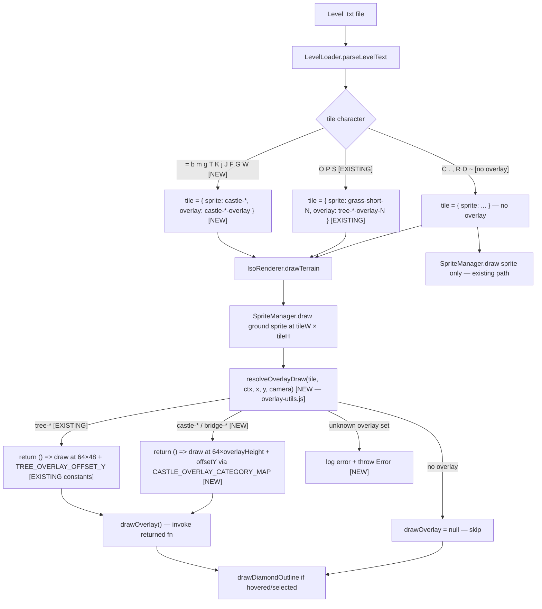

# Design Document: Castle Structure Overlays

## Overview

The castle-structure-overlays feature extends the existing tree overlay system to support 2.5D overlay rendering for castle and bridge structures. Currently, all castle and bridge sprites bake the ground surface and the structure into a single 64×32 isometric diamond tile. This design introduces transparent-background overlay sprites for each structure type — bridge surfaces, castle walls, towers, keeps, the gatehouse, and drawbridge segments — so that structures appear to stand up from the ground tile beneath them, matching the visual depth already achieved by tree overlays and unit sprites.

The feature follows the same four-area pipeline as the tree overlay system, plus one new utility module:

1. **Sprite generator** (`generate-iso-sprites-br-tl.js`) — new `Castle_Overlay_Generator` functions producing transparent-background castle structure overlay sprites
2. **Sprite constants** (`sprite-constants.js`) — new `CASTLE_OVERLAY_SPRITES` registry
3. **Level loader** (`level-loader.js`) — castle and bridge tile objects gain an `overlay` field alongside the existing `sprite` field
4. **Overlay utils** (`js/game-logic/lib/overlay-utils.js`) — new utility module; owns the overlay allowlist and returns a partially-applied draw function for each tile, keeping `drawTerrain` clean
5. **Renderer** (`iso-renderer.js`) — `drawTerrain` calls `resolveOverlayDraw` from overlay-utils; this feature adds the `CASTLE_OVERLAY_CATEGORY_MAP` and per-structure height/offset constants

Existing flat castle sprites (`castle-wall.png`, `castle-tower.png`, etc.) are kept for backward compatibility. Damaged variants of each structure are also given overlay sprites so that the 2.5D appearance is preserved when structures take damage. The bailey tile (`C`) receives no overlay because it is a ground-level surface with no vertical structure.

---

## Architecture

The system follows the existing pipeline architecture without introducing new abstractions. The data flow is:

```
Build time:
  generate-iso-sprites-br-tl.js
    ├─ generateCastleOverlay(structureType, damaged)   ← NEW (this spec)
    │    └─ writes castle-wall-overlay.png, castle-tower-overlay.png, etc.
    └─ generateTreeOverlay(variant, type, noiseGen)    ← EXISTING (tree-overlay-system spec)
         └─ writes tree-oak-overlay-*.png, tree-pine-overlay-*.png, etc.
  build-sprites.js
    └─ runs all generators → reads PNGs → packs into atlas

Runtime:
  LevelLoader.parseLevelText()
    ├─ =, b, m, g, T, K, j, J, F, G, W               ← NEW (this spec)
    │    → { sprite: 'castle-*', overlay: 'castle-*-overlay' }
    ├─ O, P, S                                         ← EXISTING (tree-overlay-system spec)
    │    → { sprite: 'grass-short-N', overlay: 'tree-*-overlay-N' }
    └─ C, ., ,, R, D, ~  → { sprite: '...' }  — no overlay
  IsoRenderer.drawTerrain()
    └─ resolveOverlayDraw(tile, ctx, x, y, camera)  ← NEW util (overlay-utils.js)
         ├─ tile.overlay = null/undefined → return null (pass through)
         ├─ tree-* overlay  → return draw fn using OVERLAY_HEIGHT/TREE_OVERLAY_OFFSET_Y  ← EXISTING constants
         ├─ castle-*/bridge-* overlay → return draw fn using CASTLE_OVERLAY_CATEGORY_MAP ← NEW
         └─ unknown overlay → log error + throw
    └─ drawOverlay?.()  — invoke the returned fn, or skip if null
```

> **Diagram note:** Nodes and edges labelled `[NEW]` are added by this spec. Nodes labelled `[EXISTING]` are already implemented by the tree-overlay-system spec and are shown here only for context.



---

## Components and Interfaces

### 1. Castle Overlay Generator (`generate-iso-sprites-br-tl.js`)

New exported functions are added alongside the existing `generateTreeOverlay`. Each function allocates a canvas of the correct height for its structure category, draws only the vertical structure elements using `CASTLE_COLORS` palette values, and leaves all other pixels at alpha=0.

**Canvas dimensions per structure category:**

| Category  | Width | Height | Structures                                                    |
|-----------|-------|--------|---------------------------------------------------------------|
| wall      | 64    | 48     | `castle-wall`, `castle-wall-damaged`                          |
| bridge    | 64    | 48     | `bridge-mm`, `castle-bridge-start`, `castle-bridge-mid`, `castle-bridge-gate` |
| tower     | 64    | 64     | `castle-tower`, `castle-tower-damaged`                        |
| keep      | 64    | 64     | `castle-keep-tl/bl/br/center` (all 4 quadrants, damaged too)  |
| gatehouse | 64    | 80     | `castle-gatehouse`, `castle-gatehouse-damaged`                |

```js
/**
 * Allocates a blank RGBA buffer of the given dimensions, initialized to all
 * zeros (fully transparent). Used as the starting canvas for castle overlay
 * sprite generation.
 *
 * @param {number} width  - Canvas width in pixels (always 64)
 * @param {number} height - Canvas height in pixels (48, 64, or 80)
 * @returns {Buffer} A width×height×4 byte buffer filled with zeros.
 */
function createCastleOverlayBuffer(width, height) {
    return Buffer.alloc(width * height * 4, 0);
}

/**
 * Writes one fully opaque pixel into a castle overlay buffer.
 * Coordinates outside the canvas bounds are silently ignored.
 *
 * @param {Buffer} buffer - The RGBA overlay buffer.
 * @param {number} width  - Canvas width (for stride calculation).
 * @param {number} x - Horizontal position (0 = left edge).
 * @param {number} y - Vertical position (0 = top edge).
 * @param {number} red   - Red channel value (0–255).
 * @param {number} green - Green channel value (0–255).
 * @param {number} blue  - Blue channel value (0–255).
 */
function setCastleOverlayPixel(buffer, width, x, y, red, green, blue) { ... }

/**
 * Generates a castle structure overlay sprite with a transparent background.
 * Only the structure's vertical body (walls, battlements, arch, portcullis,
 * planks) is drawn with alpha=255. The isometric ground diamond surface is
 * excluded (alpha=0).
 *
 * @param {'wall'|'tower'|'keep-tl'|'keep-bl'|'keep-br'|'keep-center'|
 *          'gatehouse'|'bridge-mm'|'bridge-start'|'bridge-mid'|'bridge-gate'} structureType
 * @param {boolean} damaged - Whether to draw the damaged variant appearance.
 * @returns {Buffer} RGBA pixel buffer at the correct canvas dimensions.
 */
function generateCastleOverlay(structureType, damaged) { ... }
```

The generator draws structure elements using `CASTLE_COLORS` values from `sprite-constants.js`:
- Stone walls/towers/keeps: `CASTLE_COLORS.wall`, `CASTLE_COLORS.wallLight`, `CASTLE_COLORS.wallDark`, `CASTLE_COLORS.wallMortar`
- Tower-specific shading: `CASTLE_COLORS.tower`, `CASTLE_COLORS.towerLight`, `CASTLE_COLORS.towerDark`
- Wooden drawbridge planks: `CASTLE_COLORS.wood`, `CASTLE_COLORS.woodLight`, `CASTLE_COLORS.woodDark`
- Iron portcullis bars: `CASTLE_COLORS.iron`, `CASTLE_COLORS.ironLight`
- Damaged variants use increased `CASTLE_COLORS.wallDark` / `CASTLE_COLORS.towerDark` coverage and reduced highlight pixels to convey structural damage.

A final `quantizeToPalette` pass (using `getPaletteForCategory('castle')`) is applied to all castle overlay buffers, matching the pattern used by the existing castle sprite generators.

---

### 2. Sprite Constants (`sprite-constants.js`)

A new `CASTLE_OVERLAY_SPRITES` registry is added alongside the existing `CASTLE_SPRITES` and `TREE_OVERLAY_SPRITES`:

```js
// ─── Castle Overlay Sprite Registry ─────────────────────────────────────────
// Transparent-background castle structure sprites drawn on top of ground tiles.
// Canvas dimensions vary by structure category (see design.md).

const CASTLE_OVERLAY_SPRITES = {
    // Walls (64×48)
    wall:                   'castle-wall-overlay',
    wallDamaged:            'castle-wall-damaged-overlay',
    // Towers (64×64)
    tower:                  'castle-tower-overlay',
    towerDamaged:           'castle-tower-damaged-overlay',
    // Keep quadrants (64×64)
    keepTopLeft:            'castle-keep-tl-overlay',
    keepTopLeftDamaged:     'castle-keep-tl-damaged-overlay',
    keepBotLeft:            'castle-keep-bl-overlay',
    keepBotLeftDamaged:     'castle-keep-bl-damaged-overlay',
    keepBotRight:           'castle-keep-br-overlay',
    keepBotRightDamaged:    'castle-keep-br-damaged-overlay',
    keepCenter:             'castle-keep-center-overlay',
    keepCenterDamaged:      'castle-keep-center-damaged-overlay',
    // Gatehouse (64×80)
    gatehouse:              'castle-gatehouse-overlay',
    gatehouseDamaged:       'castle-gatehouse-damaged-overlay',
    // Bridge surfaces (64×48) — no damaged variants
    bridgeMm:               'bridge-mm-overlay',
    bridgeStart:            'castle-bridge-start-overlay',
    bridgeMid:              'castle-bridge-mid-overlay',
    bridgeGate:             'castle-bridge-gate-overlay',
};
```

All existing `CASTLE_SPRITES` entries are retained unchanged. `CASTLE_OVERLAY_SPRITES` is added to `module.exports`.

---

### 3. Level Loader (`level-loader.js`)

The 11 castle/bridge switch cases are updated to produce tiles with both `sprite` and `overlay` fields. The `C` (bailey) case is updated to explicitly omit the `overlay` field. The `tileHash` function is not modified.

```js
// Bridge (cobblestone)
case '=': level.tiles.push({
    row, col, x, y,
    sprite: 'bridge-mm',
    overlay: CASTLE_OVERLAY_SPRITES.bridgeMm,
}); break;

// Castle bridge segments
case 'b': level.tiles.push({
    row, col, x, y,
    sprite: 'castle-bridge-start',
    overlay: CASTLE_OVERLAY_SPRITES.bridgeStart,
}); break;
case 'm': level.tiles.push({
    row, col, x, y,
    sprite: 'castle-bridge-mid',
    overlay: CASTLE_OVERLAY_SPRITES.bridgeMid,
}); break;
case 'g': level.tiles.push({
    row, col, x, y,
    sprite: 'castle-bridge-gate',
    overlay: CASTLE_OVERLAY_SPRITES.bridgeGate,
}); break;

// Castle structures
case 'T': level.tiles.push({
    row, col, x, y,
    sprite: 'castle-tower',
    overlay: CASTLE_OVERLAY_SPRITES.tower,
}); break;
case 'K': level.tiles.push({
    row, col, x, y,
    sprite: 'castle-keep-tl',
    overlay: CASTLE_OVERLAY_SPRITES.keepTopLeft,
}); break;
case 'j': level.tiles.push({
    row, col, x, y,
    sprite: 'castle-keep-bl',
    overlay: CASTLE_OVERLAY_SPRITES.keepBotLeft,
}); break;
case 'J': level.tiles.push({
    row, col, x, y,
    sprite: 'castle-keep-br',
    overlay: CASTLE_OVERLAY_SPRITES.keepBotRight,
}); break;
case 'F': level.tiles.push({
    row, col, x, y,
    sprite: 'castle-keep-center',
    overlay: CASTLE_OVERLAY_SPRITES.keepCenter,
}); break;
case 'G': level.tiles.push({
    row, col, x, y,
    sprite: 'castle-gatehouse',
    overlay: CASTLE_OVERLAY_SPRITES.gatehouse,
}); break;
case 'W': level.tiles.push({
    row, col, x, y,
    sprite: 'castle-wall',
    overlay: CASTLE_OVERLAY_SPRITES.wall,
}); break;

// Bailey — ground-level surface, no overlay
case 'C': level.tiles.push({
    row, col, x, y,
    sprite: `castle-bailey-${Math.floor(hash * 3) + 1}`,
}); break;

// Note: O, P, S (tree characters) are handled by the existing tree-overlay-system
// and already produce tiles with overlay fields (tree-*-overlay-N). They are
// unchanged by this spec.
```

Note: the existing `=` case currently maps to `bridge-mm` with no overlay; `b`, `m`, `g` currently all incorrectly map to `castle-bridge-mid`. This feature corrects those mappings as part of adding the overlay fields.

---

### 4. Overlay Utils (`js/game-logic/lib/overlay-utils.js`) [NEW]

A new utility module owns the overlay allowlist and returns a partially-applied draw function. This keeps all overlay-type knowledge out of `drawTerrain` and makes the system easy to extend.

**Responsibilities:**
- Maintain the allowlist of sprite name prefixes that are permitted to carry an overlay (`tree-` and `castle-` / `bridge-`)
- For a tile with `overlay` set, validate the overlay name against the allowlist and return a zero-argument draw function (a partially-applied closure over `ctx`, `overlayName`, `x`, `y`, `camera`)
- For a tile with no `overlay`, return `null` (caller skips the draw)
- For a tile whose overlay name is not on the allowlist, log a structured error and throw so the caller can handle it explicitly — no silent fallbacks

```js
/**
 * Resolves the overlay draw parameters for a tile and returns a partially-applied
 * draw function, or null if the tile has no overlay.
 *
 * Allowlisted overlay prefixes (for now): 'tree-', 'castle-', 'bridge-'
 *
 * @param {object} tile    - The tile object ({ overlay?, sprite, ... })
 * @param {object} ctx     - Canvas 2D rendering context
 * @param {number} x       - Tile center screen X
 * @param {number} y       - Tile center screen Y
 * @param {object} camera  - Camera state ({ tileW, tileH })
 * @returns {function|null} A zero-argument function that calls SpriteManager.draw
 *                          with the correct overlay parameters, or null if no overlay.
 * @throws {Error} If tile.overlay is set but the sprite name is not allowlisted.
 */
function resolveOverlayDraw(tile, ctx, x, y, camera) {
    if (!tile.overlay) {
        return null; // no overlay — caller passes through
    }

    const overlayName = tile.overlay;

    if (overlayName.startsWith('tree-')) {
        // Tree overlay — fixed 64×48, TREE_OVERLAY_OFFSET_Y
        return () => {
            const overlayX = x - OVERLAY_WIDTH / 2;
            const overlayY = (y - camera.tileH / 2) - (OVERLAY_HEIGHT - camera.tileH) + TREE_OVERLAY_OFFSET_Y;
            SpriteManager.draw(ctx, overlayName, overlayX, overlayY, OVERLAY_WIDTH, OVERLAY_HEIGHT);
        };
    }

    if (overlayName.startsWith('castle-') || overlayName.startsWith('bridge-')) {
        // Castle / bridge overlay — variable height from CASTLE_OVERLAY_CATEGORY_MAP
        const category = CASTLE_OVERLAY_CATEGORY_MAP[overlayName];
        if (!category) {
            // Sprite name matches the castle/bridge prefix but is not in the map —
            // this is a configuration error, not a runtime tile error.
            console.error(`[overlay-utils] Overlay sprite "${overlayName}" is not registered in CASTLE_OVERLAY_CATEGORY_MAP.`);
            throw new Error(`Unregistered castle overlay sprite: ${overlayName}`);
        }
        const { height: overlayHeight, offsetY: overlayOffsetY } = category;
        return () => {
            const overlayX = x - OVERLAY_WIDTH / 2;
            const overlayY = (y - camera.tileH / 2) - (overlayHeight - camera.tileH) + overlayOffsetY;
            SpriteManager.draw(ctx, overlayName, overlayX, overlayY, OVERLAY_WIDTH, overlayHeight);
        };
    }

    // Overlay is set but the sprite name is not on the allowlist — hard error
    console.error(`[overlay-utils] Overlay "${overlayName}" on sprite "${tile.sprite}" is not allowed. Only tree- and castle-/bridge- overlays are supported.`);
    throw new Error(`Overlay not allowed on sprite: ${tile.sprite} (overlay: ${overlayName})`);
}

module.exports = { resolveOverlayDraw };
```

The constants `OVERLAY_WIDTH`, `OVERLAY_HEIGHT`, `TREE_OVERLAY_OFFSET_Y`, and `CASTLE_OVERLAY_CATEGORY_MAP` are imported from `iso-renderer.js` (or a shared constants file if extracted). `SpriteManager` is imported from `sprites.js`.

---

### 5. IsoRenderer (`iso-renderer.js`)

**New constants** are added at the top of the module, alongside the existing `TREE_OVERLAY_OFFSET_Y`, `OVERLAY_WIDTH`, and `OVERLAY_HEIGHT`:

```js
// ─── Castle Overlay Height Constants ────────────────────────────────────────
/** Overlay canvas height for wall and bridge structure types (px). */
const WALL_OVERLAY_HEIGHT    = 48;
const BRIDGE_OVERLAY_HEIGHT  = 48;
/** Overlay canvas height for tower and keep structure types (px). */
const TOWER_OVERLAY_HEIGHT   = 64;
const KEEP_OVERLAY_HEIGHT    = 64;
/** Overlay canvas height for the gatehouse structure type (px). */
const GATEHOUSE_OVERLAY_HEIGHT = 80;

// ─── Castle Overlay Y-Offset Constants ──────────────────────────────────────
/** Pixels to shift each structure category's overlay upward.
 *  All start at 0 (matching TREE_OVERLAY_OFFSET_Y); tunable post-implementation. */
const WALL_OVERLAY_OFFSET_Y      = 0;
const BRIDGE_OVERLAY_OFFSET_Y    = 0;
const TOWER_OVERLAY_OFFSET_Y     = 0;
const KEEP_OVERLAY_OFFSET_Y      = 0;
const GATEHOUSE_OVERLAY_OFFSET_Y = 0;
```

**`CASTLE_OVERLAY_CATEGORY_MAP`** — maps every castle/bridge overlay sprite name to its `{ height, offsetY }` constants. Damaged variants are listed explicitly to avoid runtime string manipulation:

```js
const CASTLE_OVERLAY_CATEGORY_MAP = {
    'castle-wall-overlay':               { height: WALL_OVERLAY_HEIGHT,      offsetY: WALL_OVERLAY_OFFSET_Y },
    'castle-wall-damaged-overlay':       { height: WALL_OVERLAY_HEIGHT,      offsetY: WALL_OVERLAY_OFFSET_Y },
    'castle-tower-overlay':              { height: TOWER_OVERLAY_HEIGHT,     offsetY: TOWER_OVERLAY_OFFSET_Y },
    'castle-tower-damaged-overlay':      { height: TOWER_OVERLAY_HEIGHT,     offsetY: TOWER_OVERLAY_OFFSET_Y },
    'castle-keep-tl-overlay':            { height: KEEP_OVERLAY_HEIGHT,      offsetY: KEEP_OVERLAY_OFFSET_Y },
    'castle-keep-tl-damaged-overlay':    { height: KEEP_OVERLAY_HEIGHT,      offsetY: KEEP_OVERLAY_OFFSET_Y },
    'castle-keep-bl-overlay':            { height: KEEP_OVERLAY_HEIGHT,      offsetY: KEEP_OVERLAY_OFFSET_Y },
    'castle-keep-bl-damaged-overlay':    { height: KEEP_OVERLAY_HEIGHT,      offsetY: KEEP_OVERLAY_OFFSET_Y },
    'castle-keep-br-overlay':            { height: KEEP_OVERLAY_HEIGHT,      offsetY: KEEP_OVERLAY_OFFSET_Y },
    'castle-keep-br-damaged-overlay':    { height: KEEP_OVERLAY_HEIGHT,      offsetY: KEEP_OVERLAY_OFFSET_Y },
    'castle-keep-center-overlay':        { height: KEEP_OVERLAY_HEIGHT,      offsetY: KEEP_OVERLAY_OFFSET_Y },
    'castle-keep-center-damaged-overlay':{ height: KEEP_OVERLAY_HEIGHT,      offsetY: KEEP_OVERLAY_OFFSET_Y },
    'castle-gatehouse-overlay':          { height: GATEHOUSE_OVERLAY_HEIGHT, offsetY: GATEHOUSE_OVERLAY_OFFSET_Y },
    'castle-gatehouse-damaged-overlay':  { height: GATEHOUSE_OVERLAY_HEIGHT, offsetY: GATEHOUSE_OVERLAY_OFFSET_Y },
    'bridge-mm-overlay':                 { height: BRIDGE_OVERLAY_HEIGHT,    offsetY: BRIDGE_OVERLAY_OFFSET_Y },
    'castle-bridge-start-overlay':       { height: BRIDGE_OVERLAY_HEIGHT,    offsetY: BRIDGE_OVERLAY_OFFSET_Y },
    'castle-bridge-mid-overlay':         { height: BRIDGE_OVERLAY_HEIGHT,    offsetY: BRIDGE_OVERLAY_OFFSET_Y },
    'castle-bridge-gate-overlay':        { height: BRIDGE_OVERLAY_HEIGHT,    offsetY: BRIDGE_OVERLAY_OFFSET_Y },
};
```

**Updated `drawTerrain` overlay pass** — `drawTerrain` calls `resolveOverlayDraw` and invokes the returned function if present. All overlay-type logic is gone from `drawTerrain`:

```js
// After drawing the ground sprite:
const drawOverlay = resolveOverlayDraw(tile, ctx, x, y, camera);
if (drawOverlay) {
    drawOverlay();
}
```

`OVERLAY_WIDTH = 64` is shared by all overlay types (tree and castle). The positioning formula is identical for both — only `overlayHeight` and `overlayOffsetY` differ, and those are resolved inside `overlay-utils.js`.

---

### 6. SpriteManager (`sprites.js`)

The 18 castle overlay sprite names are appended to `spriteList` in a new section after the existing damaged castle sprites:

```js
// Castle overlay sprites (transparent background, drawn on top of castle ground tiles)
// Walls and bridges: 64×48 px
'castle-wall-overlay',
'castle-wall-damaged-overlay',
'bridge-mm-overlay',
'castle-bridge-start-overlay',
'castle-bridge-mid-overlay',
'castle-bridge-gate-overlay',
// Towers and keeps: 64×64 px
'castle-tower-overlay',
'castle-tower-damaged-overlay',
'castle-keep-tl-overlay',
'castle-keep-tl-damaged-overlay',
'castle-keep-bl-overlay',
'castle-keep-bl-damaged-overlay',
'castle-keep-br-overlay',
'castle-keep-br-damaged-overlay',
'castle-keep-center-overlay',
'castle-keep-center-damaged-overlay',
// Gatehouse: 64×80 px
'castle-gatehouse-overlay',
'castle-gatehouse-damaged-overlay',
```

All existing entries are retained unchanged.

### 7. Build Pipeline (`build-sprites.js`)

Three changes are made to `build-sprites.js`:

1. **Import `CASTLE_OVERLAY_SPRITES`** from `sprite-constants.js` and derive `CASTLE_OVERLAY_SPRITE_NAMES = Object.values(CASTLE_OVERLAY_SPRITES)`.

2. **Add `generate-castle-overlay-sprites.js`** to `GENERATOR_SCRIPTS` after `generate-damaged-castle-sprites.js`. This new script calls `generateCastleOverlay` for each of the 18 sprites and writes the PNGs to `OUTPUT_DIR`.

3. **Collect castle overlay buffers** in the sprite-collection step, after the damaged castle sprites block:

```js
// Castle overlay sprites (variable height: 48, 64, or 80 px)
for (const name of CASTLE_OVERLAY_SPRITE_NAMES) {
    const { buffer, width, height } = await readSpriteBuffer(name);
    spriteEntries.push({ name, buffer, width, height });
}
console.log(`  ✓ ${CASTLE_OVERLAY_SPRITE_NAMES.length} castle overlay sprites`);
```

4. **Pre-pack existence check** mirrors the existing tree overlay check:

```js
const missingCastleOverlays = CASTLE_OVERLAY_SPRITE_NAMES.filter(
    name => !fs.existsSync(path.join(OUTPUT_DIR, `${name}.png`))
);
if (missingCastleOverlays.length > 0) {
    for (const name of missingCastleOverlays) {
        logBuildError('build-sprites', `Castle overlay PNG missing before atlas pack: ${name}`, {
            sprite: name, stage: 'pre-pack',
            details: `Expected file at: ${path.join(OUTPUT_DIR, `${name}.png`)}`,
        });
    }
    throw new Error(`Pre-pack check failed: ${missingCastleOverlays.length} castle overlay PNG(s) missing`);
}
```

The 18 castle overlay sprites add approximately 18 × 64 × 64 × 4 ≈ 295 KB of raw pixel data before compression (using the largest canvas size as a conservative estimate), well within the 4 MB atlas limit.

---

## Data Models

### Tile Object (runtime)

```ts
interface Tile {
    row: number;
    col: number;
    x: number;          // screen pixel x (from hexToPixel)
    y: number;          // screen pixel y (from hexToPixel)
    sprite: string;     // ground sprite name (e.g. 'castle-wall', 'bridge-mm')
    overlay?: string;   // overlay sprite name (e.g. 'castle-wall-overlay'), absent for bailey/terrain
    covered?: boolean;  // existing field, unchanged
}
```

The `overlay` field is optional. Its absence is the signal to use the existing single-sprite code path. For castle tiles, `sprite` is always a flat 64×32 ground tile; `overlay` is the transparent-background structure sprite drawn on top.

### Castle Overlay Sprite Buffer (build time)

```
Width:    64 px  (OVERLAY_WIDTH — shared with tree overlays)
Height:   48 px  (walls, bridges)
          64 px  (towers, keeps)
          80 px  (gatehouse)
Channels: 4 (RGBA)
Alpha:    0   for all pixels outside the structure's vertical body
          255 for all pixels inside the structure's vertical body
```

The variable height allows taller structures to bleed further into the tile above. A 64-pixel-tall tower overlay extends 32 px above the 32 px tile surface; an 80-pixel gatehouse extends 48 px above.

### CASTLE_OVERLAY_SPRITES Registry

```
Key                      Value
──────────────────────────────────────────────────────
wall                     castle-wall-overlay
wallDamaged              castle-wall-damaged-overlay
tower                    castle-tower-overlay
towerDamaged             castle-tower-damaged-overlay
keepTopLeft              castle-keep-tl-overlay
keepTopLeftDamaged       castle-keep-tl-damaged-overlay
keepBotLeft              castle-keep-bl-overlay
keepBotLeftDamaged       castle-keep-bl-damaged-overlay
keepBotRight             castle-keep-br-overlay
keepBotRightDamaged      castle-keep-br-damaged-overlay
keepCenter               castle-keep-center-overlay
keepCenterDamaged        castle-keep-center-damaged-overlay
gatehouse                castle-gatehouse-overlay
gatehouseDamaged         castle-gatehouse-damaged-overlay
bridgeMm                 bridge-mm-overlay
bridgeStart              castle-bridge-start-overlay
bridgeMid                castle-bridge-mid-overlay
bridgeGate               castle-bridge-gate-overlay
```

Total: 18 entries (11 undamaged + 7 damaged).

### CASTLE_OVERLAY_CATEGORY_MAP (runtime, in iso-renderer.js)

```
Sprite name                          height  offsetY
──────────────────────────────────────────────────────
castle-wall-overlay                    48       0
castle-wall-damaged-overlay            48       0
castle-tower-overlay                   64       0
castle-tower-damaged-overlay           64       0
castle-keep-tl-overlay                 64       0
castle-keep-tl-damaged-overlay         64       0
castle-keep-bl-overlay                 64       0
castle-keep-bl-damaged-overlay         64       0
castle-keep-br-overlay                 64       0
castle-keep-br-damaged-overlay         64       0
castle-keep-center-overlay             64       0
castle-keep-center-damaged-overlay     64       0
castle-gatehouse-overlay               80       0
castle-gatehouse-damaged-overlay       80       0
bridge-mm-overlay                      48       0
castle-bridge-start-overlay            48       0
castle-bridge-mid-overlay              48       0
castle-bridge-gate-overlay             48       0
```

All `offsetY` values start at 0, matching the `TREE_OVERLAY_OFFSET_Y = 0` pattern. They are tunable post-implementation for visual alignment without changing the formula.

---

## Correctness Properties

*A property is a characteristic or behavior that should hold true across all valid executions of a system — essentially, a formal statement about what the system should do. Properties serve as the bridge between human-readable specifications and machine-verifiable correctness guarantees.*

### Property 1: Transparent background invariant

*For any* generated castle structure overlay sprite buffer (any of the 18 sprites), every pixel that lies outside the drawn structure's vertical body SHALL have alpha = 0.

**Validates: Requirements 10.1**

### Property 2: Palette fidelity of overlay pixels

*For any* generated castle structure overlay sprite buffer, every pixel with alpha > 0 SHALL have RGB values within ±15 per channel of at least one color in `getPaletteForCategory('castle')` (i.e. `PRIMARY_PALETTE + CASTLE_ACCENT_COLORS`, which includes `BORDER_COLOR`). This matches the quantization pass that the generator applies. Pixels with alpha 1–254 SHALL also satisfy this palette constraint (palette fidelity invariant).

**Validates: Requirements 10.2**

### Property 3: Castle tile produces ground and overlay fields

*For any* non-negative integer (row, col) position and any castle or bridge tile character (`=`, `b`, `m`, `g`, `T`, `K`, `j`, `J`, `F`, `G`, `W`), the tile object produced by `LevelLoader.parseLevelText` SHALL have `sprite` ∈ `Object.values(CASTLE_SPRITES)` and `overlay` ∈ `Object.values(CASTLE_OVERLAY_SPRITES)`.

**Validates: Requirements 10.3**

### Property 4: Non-overlay tile has no overlay field

*For any* non-negative integer (row, col) position and any character that produces no overlay (`.`, `,`, `R`, `D`, `~`, `C`), the tile object produced by `LevelLoader.parseLevelText` SHALL NOT have an `overlay` field (not present, not `undefined`, not `null`, not empty string).

Note: `O`, `P`, `S` (tree characters) are **not** in this set — they produce tree overlay sprites via the existing tree-overlay-system and their `overlay` field is expected to be present.

**Validates: Requirements 10.4**

### Property 5: Overlay draw sequence invariant

*For any* tile with an `overlay` field and any camera configuration with `tileW` and `tileH` in the range [1, 256] px, `IsoRenderer.drawTerrain` SHALL call `SpriteManager.draw` for `tile.sprite` before calling `SpriteManager.draw` for `tile.overlay`.

**Validates: Requirements 10.5**

### Property 6: Overlay dimensions invariant

*For any* tile with an `overlay` field (covering all 18 castle overlay sprite names) and any camera configuration, `IsoRenderer.drawTerrain` SHALL pass `OVERLAY_WIDTH` (64) and the per-structure overlay height constant (48, 64, or 80 depending on structure category) as the width and height arguments to the overlay `SpriteManager.draw` call — not `camera.tileW` or `camera.tileH`.

**Validates: Requirements 10.6**

### Property 7: Overlay positioning formula invariant

*For any* tile with an `overlay` field and any camera configuration with `tileW` and `tileH` in the range [1, 256] px, `IsoRenderer.drawTerrain` SHALL draw the overlay sprite at:
- X = `tileCenterX − 32`
- Y = `tileTopY − (overlayHeight − camera.tileH) + overlayOffsetY`

where `tileCenterX = x`, `tileTopY = y − camera.tileH / 2`, and `overlayHeight` / `overlayOffsetY` are the per-structure constants from `CASTLE_OVERLAY_CATEGORY_MAP` for that overlay sprite name.

**Validates: Requirements 10.7**

---

## Error Handling

### Build pipeline errors

- **Missing castle overlay PNG at pack time**: `readSpriteBuffer` already throws and calls `logBuildError` with a structured diagnostic when a PNG is not found. The new castle overlay sprites follow the same path. The pre-pack existence check (mirroring the tree overlay check) catches missing PNGs before `packAtlas()` is called, ensuring a clear error message identifying each missing file name.
- **`CASTLE_OVERLAY_SPRITES` undefined or empty at build time**: The build pipeline checks `Object.values(CASTLE_OVERLAY_SPRITES).length === 0` before running generators and exits with a non-zero code and a stderr message if the registry is missing or empty.
- **Generator script failure**: `runGenerator` already propagates non-zero exit codes as thrown errors. The new `generate-castle-overlay-sprites.js` script follows the same pattern.
- **Atlas size exceeded**: The existing 4 MB check in `main()` covers the enlarged atlas. 18 castle overlay sprites at the largest canvas size (64×80) add at most 18 × 64 × 80 × 4 ≈ 369 KB of raw pixel data before compression, well within the limit.

### Runtime errors

- **Missing castle overlay sprite in atlas**: `SpriteManager.draw` already falls back gracefully — if the sprite is not found in `this.images`, the draw call is silently skipped. The `createFallback` path is also available.
- **Unrecognized overlay sprite name in `drawTerrain`**: The `CASTLE_OVERLAY_CATEGORY_MAP` lookup returns `undefined` for unknown names. The renderer falls back to `WALL_OVERLAY_HEIGHT` / `WALL_OVERLAY_OFFSET_Y` and logs a `console.warn` identifying the unrecognized sprite name, so visual artifacts are bounded and diagnosable.
- **`tile.overlay` present but falsy**: The existing `if (tile.overlay)` guard in `drawTerrain` handles `undefined`, `null`, and empty string without throwing. This guard is unchanged.
- **Tile with overlay field but sprite not loaded**: Same fallback as above. The ground sprite draw will still succeed even if the overlay is missing from the atlas.

---

## Testing Strategy

### Unit tests

Unit tests cover specific examples, edge cases, and structural checks:

- Assert `CASTLE_OVERLAY_SPRITES` has exactly 18 entries with the expected names
- Assert `SpriteManager.spriteList` contains all 18 castle overlay names and retains all existing flat castle sprite names
- Assert `CASTLE_OVERLAY_CATEGORY_MAP` has exactly 18 entries and each entry has a numeric `height` and `offsetY`
- Assert `CASTLE_OVERLAY_CATEGORY_MAP` maps wall/bridge names to height 48, tower/keep names to height 64, and gatehouse names to height 80
- Assert `IsoRenderer` exports the five `*_OVERLAY_HEIGHT` constants and five `*_OVERLAY_OFFSET_Y` constants with the correct values
- Assert generated castle overlay buffers have the correct dimensions (64×48, 64×64, or 64×80 depending on type)
- Assert wall and tower overlay buffers are not byte-for-byte identical
- Assert undamaged and damaged variants of the same structure type are not byte-for-byte identical
- Assert `tileHash` returns known values for fixed inputs (backward-compatibility check, unchanged from tree overlay tests)
- Assert build pipeline exits non-zero and logs a structured error when a castle overlay PNG is missing
- Assert build pipeline exits non-zero and logs a structured error when `CASTLE_OVERLAY_SPRITES` is empty

### Property-based tests

Property-based testing is appropriate here because:
- The level loader's tile-production logic is a pure function over (character, row, col) inputs
- The renderer's draw-call ordering and positioning are pure functions over tile data and camera state
- The sprite generator's pixel-level invariants (transparency, palette) hold across all structure types and canvas positions

**Library**: [fast-check](https://github.com/dubzzz/fast-check) (MIT, JavaScript) — same library used by the tree overlay system

**Minimum iterations**: 100 per property test

Each property test is tagged with a comment referencing the design property:
```js
// Feature: castle-structure-overlays, Property N: <property text>
```

**Property 1 test** — Transparent background invariant:
Generate each of the 18 castle overlay buffers. For each buffer, use fast-check to generate random (x, y) coordinates within the canvas bounds (64 × overlayHeight). For any coordinate where the reference buffer has alpha=0, assert alpha=0. This verifies that no stray pixels are written outside the structure shape.

**Property 2 test** — Palette fidelity:
For each generated castle overlay buffer, use fast-check to generate random pixel indices. For any pixel with alpha > 0, assert its RGB values are within ±15 per channel of at least one color in `getPaletteForCategory('castle')` (which includes `BORDER_COLOR` via `PRIMARY_PALETTE`). This verifies the `quantizeToPalette` pass is applied correctly.

**Property 3 test** — Castle tile ground+overlay fields:
Use fast-check to generate arbitrary non-negative integer (row, col) pairs and arbitrary castle/bridge characters from `{=, b, m, g, T, K, j, J, F, G, W}`. For each combination, parse a single-tile level string and assert the resulting tile has `sprite` ∈ `Object.values(CASTLE_SPRITES)` and `overlay` ∈ `Object.values(CASTLE_OVERLAY_SPRITES)`.

**Property 4 test** — Non-overlay tile has no overlay:
Use fast-check to generate arbitrary non-negative integer (row, col) pairs and arbitrary non-overlay characters from `{., ,, R, D, ~, C, O, P, S}`. Assert the resulting tile has no `overlay` property (checked with `Object.prototype.hasOwnProperty`).

**Property 5 test** — Overlay draw sequence invariant:
Use fast-check to generate arbitrary tile objects with an `overlay` field (sampled from `Object.values(CASTLE_OVERLAY_SPRITES)`) and arbitrary camera configurations with `tileW`/`tileH` in [1, 256]. Mock `SpriteManager.draw` and assert: (a) the first call uses `tile.sprite`, (b) the second call uses `tile.overlay`.

**Property 6 test** — Overlay dimensions invariant:
Use fast-check to generate arbitrary tiles with overlay fields covering all 18 castle overlay sprite names and arbitrary camera configurations with `tileW`/`tileH` in [1, 256]. Mock `SpriteManager.draw` and assert the overlay draw call uses `width = 64` and `height = CASTLE_OVERLAY_CATEGORY_MAP[tile.overlay].height` — not `camera.tileW` or `camera.tileH`.

**Property 7 test** — Overlay positioning formula:
Use fast-check to generate arbitrary tile screen positions (`x`, `y`) and camera `tileW`/`tileH` values in [1, 256], and arbitrary overlay sprite names from `Object.values(CASTLE_OVERLAY_SPRITES)`. Mock `SpriteManager.draw` and assert the overlay draw call arguments satisfy:
- `drawX = x − 32`
- `drawY = (y − tileH/2) − (overlayHeight − tileH) + overlayOffsetY`

where `overlayHeight` and `overlayOffsetY` come from `CASTLE_OVERLAY_CATEGORY_MAP[overlayName]`.

### Integration tests

- Run the full build pipeline and verify all 18 castle overlay sprite names appear in `atlas.json` frames
- Run the build pipeline and verify all existing flat castle sprite names (`CASTLE_SPRITES`) still appear in `atlas.json`
- Run the build pipeline and verify all 7 tree overlay sprite names still appear in `atlas.json`
- Run the build pipeline and verify the atlas file size is below 4 MB
- Run the build pipeline with a missing castle overlay PNG and verify it exits non-zero with a stderr message identifying the missing file
