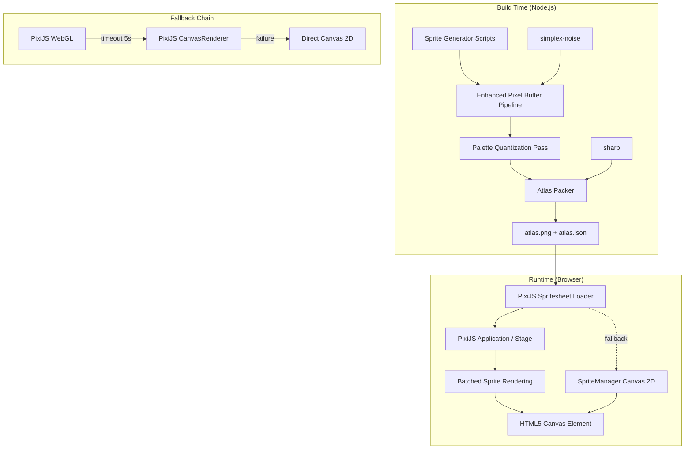
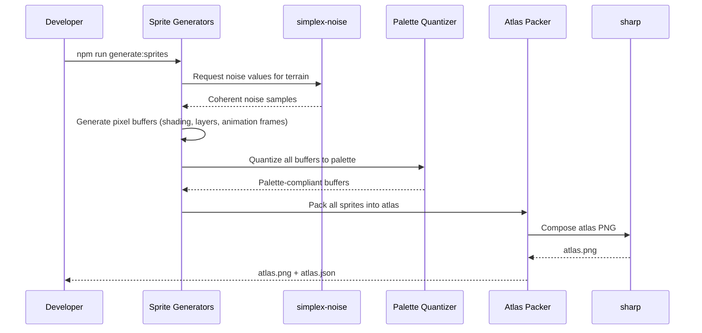

# Design Document: Enhanced Pixel Art Sprites

## Overview

This design enhances the BasicTowerDefense sprite pipeline to produce higher-fidelity pixel art while maintaining the established isometric 2.5D aesthetic. The enhancement spans two domains:

1. **Build-time sprite generation** — Upgrading the Node.js `sharp`-based pipeline with layered shading, simplex noise textures, animation frames, sprite atlas packing, enemy unit variants, damaged castle variants, and strict palette enforcement.
2. **Runtime rendering** — Replacing direct Canvas 2D drawing with PixiJS for hardware-accelerated sprite rendering, animation management, and atlas-based batching, with graceful fallback to Canvas 2D.

The existing architecture (seeded PRNG, pixel buffer manipulation, `sharp` PNG encoding) is preserved and extended rather than replaced. The `SpriteManager.draw()` API contract remains unchanged so that `game-iso.js` and `iso-renderer.js` require no modifications.

### Key Design Decisions

| Decision | Rationale |
|----------|-----------|
| PixiJS for runtime rendering | Hardware-accelerated WebGL with automatic Canvas fallback; mature spritesheet/animation support |
| `simplex-noise` for procedural textures | Lightweight, MIT-licensed, produces coherent noise suitable for terrain variation |
| Single sprite atlas with JSON metadata | Reduces HTTP requests and draw calls; power-of-two textures for WebGL compatibility |
| Palette quantization as final pass | Guarantees pixel-perfect palette adherence regardless of intermediate computation |
| Enemy palette with max 2 shared colors | Ensures instant visual differentiation on the battlefield |
| Damaged variants via pixel replacement | Allows direct sprite substitution without runtime shader effects |

## Architecture



### Build Pipeline Flow



## Components and Interfaces

### Build-Time Components

#### 1. `lib/noise-texture.js` (NEW)

Wraps `simplex-noise` to provide terrain-specific noise generation.

```javascript
/**
 * @param {number} x - Pixel x coordinate
 * @param {number} y - Pixel y coordinate
 * @param {number} scale - Noise frequency (lower = smoother)
 * @param {number} seed - Seed for deterministic output
 * @returns {number} Noise value in range [-1, 1]
 */
function terrainNoise(x, y, scale, seed) { ... }
```

#### 2. `lib/shading.js` (NEW)

Provides layered shading utilities for all sprite categories.

```javascript
/**
 * Applies directional lighting to a pixel buffer.
 * Light source: upper-left. Highlight on UL edges, shadow on BR edges.
 *
 * @param {Buffer} buffer - RGBA pixel buffer
 * @param {number} highlightPercent - Brightness increase (e.g., 0.2 = 20%)
 * @param {number} shadowPercent - Darkness increase (e.g., 0.2 = 20%)
 */
function applyDirectionalShading(buffer, highlightPercent, shadowPercent) { ... }

/**
 * Applies isometric face shading: top face lit, side face darkened.
 * @param {Buffer} buffer - RGBA pixel buffer
 * @param {number[]} topColor - Lit face palette color
 * @param {number[]} sideColor - Darker side face palette color
 */
function applyFaceShading(buffer, topColor, sideColor) { ... }
```

#### 3. `lib/dithering.js` (NEW)

Implements ordered (Bayer matrix) dithering for terrain transitions.

```javascript
/**
 * Applies ordered dithering in a border region between two terrain types.
 * @param {Buffer} buffer - RGBA pixel buffer
 * @param {number[]} colorA - First terrain palette color
 * @param {number[]} colorB - Second terrain palette color
 * @param {number} borderWidth - Width of dithering region in pixels (default: 4)
 * @param {'top'|'bottom'|'left'|'right'} edge - Which edge to dither
 */
function applyOrderedDithering(buffer, colorA, colorB, borderWidth, edge) { ... }
```

#### 4. `lib/palette-quantizer.js` (NEW)

Final-pass palette enforcement ensuring zero color distance.

```javascript
/**
 * Maps every non-transparent pixel to the nearest palette color.
 * Uses Euclidean distance in RGB space.
 *
 * @param {Buffer} buffer - RGBA pixel buffer (modified in place)
 * @param {number[][]} palette - Array of [r, g, b] palette colors
 * @returns {Buffer} The same buffer, quantized
 */
function quantizeToPalette(buffer, palette) { ... }

/**
 * Returns the full palette for a sprite category.
 * @param {'terrain'|'castle'|'unit'|'enemy'} category
 * @returns {number[][]} Combined palette (primary + category extensions)
 */
function getPaletteForCategory(category) { ... }
```

#### 5. `lib/atlas-packer.js` (NEW)

Bin-packing algorithm for sprite atlas generation.

```javascript
/**
 * Packs sprite frames into power-of-two atlas(es).
 *
 * @param {Array<{name: string, buffer: Buffer, width: number, height: number, frames?: number}>} sprites
 * @returns {{atlases: Buffer[], metadata: Object}} Atlas images and JSON metadata
 */
function packAtlas(sprites) { ... }
```

#### 6. `lib/animation-frames.js` (NEW)

Generates multi-frame animation sequences for water and flags.

```javascript
/**
 * Generates animation frames for water tiles.
 * @param {number} frameCount - Number of frames (3-8)
 * @param {number} seed - Base seed for deterministic generation
 * @returns {Buffer[]} Array of RGBA pixel buffers, one per frame
 */
function generateWaterFrames(frameCount, seed) { ... }
```

#### 7. `generate-enemy-sprites.js` (NEW)

Generates enemy unit variants with distinct palette and silhouette modifiers.

#### 8. `generate-damaged-castle-sprites.js` (NEW)

Generates damaged variants of all 10 castle structure sprites.

### Runtime Components

#### 9. `js/game-logic/pixi-renderer.js` (NEW)

PixiJS integration layer that wraps the existing SpriteManager API.

```javascript
/**
 * Initializes PixiJS with the existing canvas element.
 * Implements the fallback chain: WebGL → CanvasRenderer → Canvas 2D.
 *
 * @param {HTMLCanvasElement} canvas - The existing game canvas
 * @param {number} timeout - WebGL init timeout in ms (default: 5000)
 * @returns {Promise<PixiRenderer>}
 */
async function initPixiRenderer(canvas, timeout = 5000) { ... }

/**
 * Loads the sprite atlas using PixiJS Spritesheet.
 * Falls back to individual PNG loading on failure.
 *
 * @param {string} atlasImagePath - Path to atlas PNG
 * @param {string} atlasJsonPath - Path to atlas JSON metadata
 * @returns {Promise<void>}
 */
async function loadSpriteAtlas(atlasImagePath, atlasJsonPath) { ... }
```

#### 10. `js/game-logic/animation-controller.js` (NEW)

Manages animation frame cycling with a single shared timer per sprite type.

```javascript
/**
 * Registers an animated sprite type with its frame count and rate.
 * @param {string} spriteType - e.g., 'water', 'flag'
 * @param {number} frameCount - Number of animation frames
 * @param {number} intervalMs - Milliseconds per frame (100-2000, default 500)
 */
function registerAnimatedType(spriteType, frameCount, intervalMs = 500) { ... }

/**
 * Returns the current frame index for a sprite type.
 * All sprites of the same type return the same frame (shared timer).
 * @param {string} spriteType
 * @returns {number} Current frame index
 */
function getCurrentFrame(spriteType) { ... }
```

### Modified Components

#### 11. `js/game-logic/sprites.js` (MODIFIED)

The existing `SpriteManager` is extended to support atlas loading and PixiJS delegation while preserving the `draw(ctx, name, x, y, width, height)` signature.

```javascript
// New additions to SpriteManager:
SpriteManager.loadAtlas = async function(atlasPath, jsonPath) { ... }
SpriteManager.usePixiRenderer = function(pixiRenderer) { ... }

// draw() is modified internally to:
// 1. Floor x,y to integers (prevent sub-pixel blur)
// 2. Delegate to PixiJS if available, else use Canvas 2D
// 3. Handle animated sprites via animation-controller
```

### Interface Contracts

| Interface | Provider | Consumer | Contract |
|-----------|----------|----------|----------|
| `SpriteManager.draw(ctx, name, x, y, w?, h?)` | sprites.js | game-iso.js, iso-renderer.js | Unchanged API signature |
| `atlas.json` | atlas-packer.js | pixi-renderer.js | `{frames: {name: {x, y, w, h, atlasIndex?}}}` |
| `atlas.png` | atlas-packer.js | pixi-renderer.js | Power-of-two PNG, max 2048px per axis |
| Palette arrays | sprite-constants.js | palette-quantizer.js | `number[][]` of [r,g,b] tuples |
| Pixel buffers | All generators | palette-quantizer.js, sharp | `Buffer` of length W×H×4 (RGBA) |

## Data Models

### Sprite Atlas JSON Schema

```json
{
  "meta": {
    "version": "1.0",
    "image": "atlas-0.png",
    "size": { "w": 1024, "h": 1024 },
    "format": "RGBA8888"
  },
  "frames": {
    "grass-short-1": {
      "frame": { "x": 0, "y": 0, "w": 64, "h": 32 },
      "sourceSize": { "w": 64, "h": 32 },
      "atlasIndex": 0
    },
    "water-1-frame-0": {
      "frame": { "x": 65, "y": 0, "w": 64, "h": 32 },
      "sourceSize": { "w": 64, "h": 32 },
      "atlasIndex": 0
    },
    "enemy-knight": {
      "frame": { "x": 130, "y": 0, "w": 64, "h": 32 },
      "sourceSize": { "w": 64, "h": 32 },
      "atlasIndex": 0
    },
    "castle-wall-damaged": {
      "frame": { "x": 195, "y": 0, "w": 64, "h": 32 },
      "sourceSize": { "w": 64, "h": 32 },
      "atlasIndex": 0
    }
  },
  "animations": {
    "water": ["water-1-frame-0", "water-1-frame-1", "water-1-frame-2"]
  }
}
```

### Primary Palette Definition (16 colors max)

```javascript
const PRIMARY_PALETTE = [
  [95, 180, 72],    // grass green
  [75, 155, 55],    // grass dark
  [210, 165, 110],  // road tan
  [45, 120, 210],   // water blue
  [48, 130, 42],    // tree canopy
  [175, 162, 135],  // castle wall
  [155, 145, 120],  // castle tower
  [120, 78, 38],    // wood
  [55, 55, 58],     // iron
  [195, 175, 95],   // straw
  [25, 25, 22],     // border/outline
  [210, 175, 140],  // skin tone
  [180, 180, 190],  // armor silver
  [40, 60, 140],    // cape blue
  [200, 170, 50],   // gold accent
  [140, 138, 128],  // bridge stone
];
```

### Enemy Palette (distinct from player)

```javascript
const ENEMY_PALETTE = [
  [80, 30, 30],     // dark crimson body
  [120, 40, 35],    // blood red accent
  [45, 40, 50],     // shadow purple
  [60, 55, 45],     // dark olive
  [150, 50, 40],    // bright red highlight
  [35, 30, 28],     // near-black armor
  [100, 85, 70],    // weathered leather
  [170, 60, 50],    // banner red
];
```

### Animation Configuration

```javascript
const ANIMATION_CONFIG = {
  water: { frameCount: 4, intervalMs: 500, minFrames: 3, maxFrames: 8 },
  flag:  { frameCount: 3, intervalMs: 600, minFrames: 2, maxFrames: 6 },
};
```

## Correctness Properties

*A property is a characteristic or behavior that should hold true across all valid executions of a system — essentially, a formal statement about what the system should do. Properties serve as the bridge between human-readable specifications and machine-verifiable correctness guarantees.*

### Property 1: Sprite Dimension Invariant

*For any* generated sprite, its pixel buffer dimensions SHALL match the expected size for its category: 64×32 for terrain, castle, enemy, and damaged sprites; 32×32 for player unit sprites.

**Validates: Requirements 1.6, 3.6, 8.3, 9.3**

### Property 2: Palette Quantization Exactness

*For any* generated sprite (terrain, castle, unit, enemy, or damaged variant), every non-transparent pixel SHALL exactly match a color in the defined palette for that sprite's category (primary palette + category-specific extensions), with zero Euclidean color distance.

**Validates: Requirements 10.2, 2.5, 9.4**

### Property 3: Binary Alpha Invariant

*For any* generated sprite, every pixel SHALL have an alpha value of exactly 0 (fully transparent) or exactly 255 (fully opaque), with no intermediate alpha values.

**Validates: Requirements 10.5**

### Property 4: Grass Noise Uniqueness

*For any* two grass sprites generated with different seed values, the resulting pixel buffers SHALL differ in at least one non-transparent pixel position, and each grass sprite SHALL use at least 3 distinct palette colors.

**Validates: Requirements 1.2**

### Property 5: Water Animation Frame Difference

*For any* generated water animation sequence, the frame count SHALL be between 3 and 8 inclusive, and each consecutive frame pair SHALL differ in at least 10% of their non-transparent pixels.

**Validates: Requirements 1.3**

### Property 6: Directional Lighting Consistency

*For any* generated sprite with shading applied (terrain, castle, unit, enemy, damaged), the average luminance of pixels in the upper-left body region SHALL be at least 20% higher than the average luminance of pixels in the lower-right body region.

**Validates: Requirements 1.1, 3.3, 10.4**

### Property 7: Castle Outline Border

*For any* generated castle sprite (wall, tower, keep, gatehouse, bailey), every opaque pixel that is adjacent to a transparent pixel SHALL have the BORDER_COLOR value [25, 25, 22].

**Validates: Requirements 2.4**

### Property 8: Unit Silhouette Uniqueness

*For any* pair of different unit types (player or enemy), when both sprites are reduced to 1-bit masks at native resolution, the masks SHALL differ in at least one pixel position.

**Validates: Requirements 3.1, 3.5**

### Property 9: Unit Weapon Minimum Area

*For any* generated unit sprite (player or enemy), the weapon element SHALL occupy a contiguous region of at least 4×4 pixels (16 pixels minimum) that are colored differently from the body palette color.

**Validates: Requirements 3.2**

### Property 10: Atlas Non-Overlapping Packing

*For any* generated sprite atlas metadata, no two sprite frame rectangles SHALL overlap (intersection area = 0), and the minimum distance between any two adjacent frame edges SHALL be at least 1 pixel.

**Validates: Requirements 4.1**

### Property 11: Atlas Metadata Completeness

*For any* generated atlas JSON metadata, every sprite entry SHALL contain the fields: name (non-empty string), x (non-negative integer), y (non-negative integer), width (positive integer), and height (positive integer).

**Validates: Requirements 4.2**

### Property 12: Atlas Power-of-Two Dimensions

*For any* generated atlas image, both the width and height SHALL be powers of two (i.e., values in the set {256, 512, 1024, 2048}).

**Validates: Requirements 4.3**

### Property 13: Integer Pixel Alignment

*For any* draw call made by the Sprite_Renderer, the x and y coordinates passed to the underlying rendering API SHALL be integer values (equivalent to applying Math.floor to any fractional input).

**Validates: Requirements 5.2**

### Property 14: Animation Frame Rate Independence

*For any* configured animation interval in the range [100, 2000] milliseconds, animated sprites SHALL advance frames at the configured interval regardless of the game's rendering frame rate, and all sprites of the same type SHALL display the same frame index at any given time.

**Validates: Requirements 5.3, 7.5**

### Property 15: Enemy Palette Separation

*For any* generated enemy sprite, the set of colors used SHALL share no more than 2 colors with the player unit palette, ensuring immediate visual differentiation.

**Validates: Requirements 8.1**

### Property 16: Enemy Silhouette Differentiation

*For any* enemy unit type, its 1-bit silhouette mask SHALL differ from the corresponding player unit type's mask by at least one silhouette modifier region (helmet shape, banner element, or shield emblem area).

**Validates: Requirements 8.2**

### Property 17: Damaged Sprite Minimum Damage Area

*For any* damaged castle sprite variant, at least 15% of the stone block area pixels present in the undamaged version SHALL be replaced by damage indicators (cracks, gaps, or rubble-colored pixels).

**Validates: Requirements 9.2**

### Property 18: Draw Call Batching Bound

*For any* visible tile set rendered by the Runtime_Renderer, the number of draw calls issued per tile layer (ground, structure, unit, overlay) SHALL not exceed 10.

**Validates: Requirements 7.4**

### Property 19: Terrain Transition Dithering Palette Compliance

*For any* terrain transition edge with ordered dithering applied, all pixels within the 4-pixel dithering border region SHALL use only colors from the defined palette (no intermediate computed colors).

**Validates: Requirements 1.5**

## Error Handling

### Build-Time Errors — Fail Fast with Diagnostics

All build-time errors SHALL throw an `Error` and exit with a non-zero process exit code (`process.exit(1)`), causing the build to fail immediately. Each error SHALL log structured diagnostic information to stderr before exiting to aid debugging.

**Diagnostic log format:**
```
[SPRITE-BUILD-ERROR] <module>: <message>
  Sprite: <sprite-name>
  Stage: <generation|quantization|packing|encoding>
  Details: <context-specific info>
```

| Error Condition | Handling Strategy |
|----------------|-------------------|
| `simplex-noise` import failure | Throw `Error('simplex-noise module not found')`; log install instructions; `process.exit(1)` |
| `sharp` PNG encoding failure | Log sprite name, buffer dimensions, and sharp error message; throw Error; `process.exit(1)` |
| Atlas exceeds 2048px dimension | Automatically split into multiple atlas files (atlas-0.png, atlas-1.png, ...) — this is NOT an error |
| Palette quantization produces out-of-palette color | Throw `Error('Quantization failed')`; log pixel coordinates, computed color, nearest palette color, and distance; `process.exit(1)` |
| Buffer dimension mismatch | Throw `Error('Dimension mismatch')`; log expected vs actual dimensions and sprite name; `process.exit(1)` |
| Invalid sprite name (empty or duplicate) | Throw `Error('Invalid sprite name')`; log the offending name and the full sprite list; `process.exit(1)` |
| Atlas JSON serialization failure | Throw `Error('Atlas metadata serialization failed')`; log the metadata object keys and the serialization error; `process.exit(1)` |
| File write failure (permissions, disk full) | Throw `Error('File write failed')`; log target path and OS error; `process.exit(1)` |
| Seed collision (two sprites produce identical output) | Log warning to stderr with both sprite names and seed values; NOT fatal (build continues) |

**Build script contract:** The `npm run generate:sprites` script SHALL propagate any non-zero exit code from child generator processes, ensuring CI/CD pipelines detect sprite generation failures.

### Runtime Errors

| Error Condition | Handling Strategy |
|----------------|-------------------|
| PixiJS WebGL init timeout (>5s) | Fall back to PixiJS CanvasRenderer |
| PixiJS CanvasRenderer failure | Fall back to direct Canvas 2D via existing SpriteManager |
| Atlas PNG load failure | Fall back to individual PNG loading via `SpriteManager.loadAll()` |
| Atlas JSON parse failure | Fall back to individual PNG loading via `SpriteManager.loadAll()` |
| Missing sprite name in atlas | Log warning, return fallback placeholder (existing `createFallback()` behavior) |
| Animation frame index out of bounds | Wrap to frame 0 (modulo frame count) |
| Invalid animation interval (<100 or >2000ms) | Clamp to nearest valid bound and log warning |

### Graceful Degradation Principle

The system is designed with different error philosophies for build-time vs runtime:

- **Build-time: Fail fast, fail loud.** Any error during sprite generation throws, logs diagnostics, and exits non-zero. This ensures broken sprites never silently ship. The build pipeline is the safety net.
- **Runtime: Degrade gracefully.** Any single failure in the enhanced rendering pipeline results in fallback to the previous working behavior rather than a broken game state. The fallback chain ensures the game remains playable even if PixiJS, the atlas, or enhanced sprites are unavailable.

## Testing Strategy

### Property-Based Testing

This feature is well-suited for property-based testing because:
- Sprite generation is a pure function (seed → deterministic pixel buffer)
- Universal properties (palette compliance, dimensions, alpha values) must hold across all inputs
- The input space is large (many sprite types × seeds × configurations)

**Library**: [fast-check](https://github.com/dubzzz/fast-check) (MIT license, Node.js compatible)

**Configuration**:
- Minimum 100 iterations per property test
- Each test tagged with: `Feature: enhanced-pixel-art-sprites, Property {N}: {title}`

**Properties to implement as PBT**:
- Property 1 (Dimension Invariant)
- Property 2 (Palette Quantization)
- Property 3 (Binary Alpha)
- Property 4 (Grass Noise Uniqueness)
- Property 5 (Water Frame Difference)
- Property 6 (Directional Lighting)
- Property 7 (Castle Outline Border)
- Property 8 (Unit Silhouette Uniqueness)
- Property 9 (Weapon Minimum Area)
- Property 10 (Atlas Non-Overlapping)
- Property 11 (Atlas Metadata Completeness)
- Property 12 (Atlas Power-of-Two)
- Property 13 (Integer Pixel Alignment)
- Property 14 (Animation Frame Rate Independence)
- Property 15 (Enemy Palette Separation)
- Property 16 (Enemy Silhouette Differentiation)
- Property 17 (Damaged Minimum Damage Area)
- Property 18 (Draw Call Batching)
- Property 19 (Dithering Palette Compliance)

### Unit Tests (Example-Based)

Unit tests live in the `tests/` directory, mirroring the source structure. They use the Node.js built-in test runner (`node:test`).

- Atlas splitting when sprite count exceeds single-atlas capacity (Req 4.4)
- Exactly 5 enemy unit types produced with correct names (Req 8.4, 8.5)
- Exactly 10 damaged castle variants produced with correct names (Req 9.1, 9.5)
- PixiJS initialized with existing canvas element (Req 6.4)
- SpriteManager.draw() API backward compatibility (Req 5.4)
- Fallback from atlas to individual PNGs on load failure (Req 5.1, 6.7)
- Pinned dependency versions in package.json (Req 6.8)
- Build-time error handling: verify generators throw and exit non-zero on invalid inputs
- Build-time error diagnostics: verify error messages include sprite name, stage, and details

### Integration Tests (TBD)

Integration tests are deferred to a future iteration. The following are planned but not yet in scope:

- PixiJS WebGL → CanvasRenderer → Canvas 2D fallback chain (Req 5.5)
- Full sprite generation completes in <30 seconds (Req 7.3)
- Atlas file size under 4MB (Req 7.2)
- Damaged sprite rendered on startup as visual integration test (Req 9.7)
- PixiJS Spritesheet parses atlas within 5 seconds (Req 6.6)

### Test Organization

```
tests/
├── level-generators/
│   ├── lib/
│   │   ├── palette-quantizer.spec.js
│   │   ├── noise-texture.spec.js
│   │   ├── shading.spec.js
│   │   ├── dithering.spec.js
│   │   ├── atlas-packer.spec.js
│   │   └── animation-frames.spec.js
│   ├── generate-enemy-sprites.spec.js
│   └── generate-damaged-castle-sprites.spec.js
├── game-logic/
│   ├── pixi-renderer.spec.js
│   ├── animation-controller.spec.js
│   └── sprites.spec.js
property-tests/
├── sprite-dimensions.property.js
├── palette-compliance.property.js
├── alpha-binary.property.js
├── grass-uniqueness.property.js
├── water-frames.property.js
├── directional-lighting.property.js
├── castle-border.property.js
├── silhouette-uniqueness.property.js
├── weapon-area.property.js
├── atlas-packing.property.js
├── atlas-metadata.property.js
├── atlas-dimensions.property.js
├── pixel-alignment.property.js
├── animation-timing.property.js
├── enemy-palette.property.js
├── enemy-silhouette.property.js
├── damaged-area.property.js
├── draw-call-batching.property.js
└── dithering-palette.property.js
```
