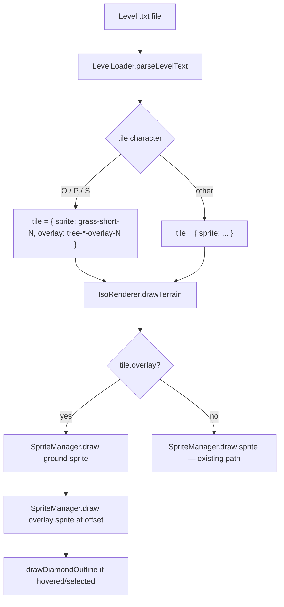

# Design Document: Tree Overlay System

## Overview

The tree-overlay-system separates tree tile rendering into two independent layers. Currently, tree sprites bake the grass base and tree canopy into a single 64×32 isometric diamond tile. This design introduces a two-pass rendering approach: the ground layer draws a grass sprite at the tile's base position, and the overlay layer draws a new transparent-background tree sprite on top, offset upward so the tree appears to stand on the tile and bleeds into the tile above.

This approach mirrors how unit sprites are already rendered — transparent-background images composited over terrain — giving trees the same visual depth and height as units. The existing `tree-1` through `tree-7` sprites and their level-loader mappings are preserved for backward compatibility.

The feature touches four areas of the codebase:

1. **Sprite generator** (`generate-iso-sprites-br-tl.js`) — new functions producing transparent-background tree overlay sprites
2. **Sprite constants** (`sprite-constants.js`) — new `TREE_OVERLAY_SPRITES` registry
3. **Level loader** (`level-loader.js`) — O/P/S tile objects gain an `overlay` field alongside `sprite`
4. **Renderer** (`iso-renderer.js`) — `drawTerrain` performs two-pass rendering for overlay tiles

---

## Architecture

The system follows the existing pipeline architecture without introducing new abstractions. The data flow is:

```
Build time:
  generate-iso-sprites-br-tl.js
    └─ generateTreeOverlay(variant, type, noiseGen)
         └─ writes tree-oak-overlay-*.png, tree-pine-overlay-*.png, tree-shrub-overlay-*.png
  build-sprites.js
    └─ runs overlay generator → reads PNGs → packs into atlas

Runtime:
  LevelLoader.parseLevelText()
    └─ O/P/S → { sprite: 'grass-short-N', overlay: 'tree-*-overlay-N' }
  IsoRenderer.drawTerrain()
    └─ tile.overlay?
         ├─ yes → draw tile.sprite (ground) → draw tile.overlay (tree, offset up)
         └─ no  → draw tile.sprite (existing path, unchanged)
```



---

## Components and Interfaces

### 1. Tree Overlay Generator (`generate-iso-sprites-br-tl.js`)

Two new exported functions are added alongside the existing `generateTree`:

```js
/**
 * Generates a tree overlay sprite with a transparent background.
 * Canvas is 64×48 pixels (OVERLAY_HEIGHT = 48).
 * Pixels outside the trunk+canopy shape have alpha = 0.
 *
 * @param {number} variant - Variant index (0–2 for oak, 0–1 for pine/shrub)
 * @param {'oak'|'pine'|'shrub'} treeType - Controls canopy shape
 * @param {function} noiseGen - Noise generator (x, y, scale) => [-1, 1]
 * @returns {Buffer} 64×48 RGBA pixel buffer
 */
function generateTreeOverlay(variant, treeType, noiseGen) { ... }
```

The overlay buffer uses a new `createOverlayBuffer()` helper that allocates `OVERLAY_WIDTH × OVERLAY_HEIGHT × 4` bytes (all zeros = fully transparent). Only trunk and canopy pixels are written with alpha=255. The existing `generateTree` function is unchanged.

**Canopy shape differentiation:**

| Type  | Shape                          | Canopy radius | Trunk offset |
|-------|--------------------------------|---------------|--------------|
| oak   | Rounded ellipse, 2 layers      | 11–13 px      | center-right |
| pine  | Pointed/conical, stacked rings | 8–10 px       | center       |
| shrub | Low, wide, flat ellipse        | 6–8 px        | center       |

All three types reuse the same palette colors and layered-canopy technique from `generateTree` (inner shadow zone, mid-tone fill, highlight rim), adapted for a transparent background by starting from an all-transparent buffer instead of a grass-filled diamond.

### 2. Sprite Constants (`sprite-constants.js`)

A new `TREE_OVERLAY_SPRITES` registry is added:

```js
const TREE_OVERLAY_SPRITES = {
    treeOakOverlay1:   'tree-oak-overlay-1',
    treeOakOverlay2:   'tree-oak-overlay-2',
    treeOakOverlay3:   'tree-oak-overlay-3',
    treePineOverlay1:  'tree-pine-overlay-1',
    treePineOverlay2:  'tree-pine-overlay-2',
    treeShrubOverlay1: 'tree-shrub-overlay-1',
    treeShrubOverlay2: 'tree-shrub-overlay-2',
};
```

All existing `TERRAIN_SPRITES` entries (`tree-1` through `tree-7`) are retained unchanged.

### 3. Level Loader (`level-loader.js`)

The `O`, `P`, and `S` switch cases are updated to produce tiles with both `sprite` and `overlay` fields. The `tileHash` function is not modified.

```js
// Before:
case 'O': level.tiles.push({ row, col, x, y, sprite: `tree-${Math.floor(hash * 3) + 1}` }); break;

// After:
case 'O': {
    const oakOverlays = [
        TREE_OVERLAY_SPRITES.treeOakOverlay1,
        TREE_OVERLAY_SPRITES.treeOakOverlay2,
        TREE_OVERLAY_SPRITES.treeOakOverlay3,
    ];
    level.tiles.push({
        row, col, x, y,
        sprite: `grass-short-${hash > 0.5 ? 2 : 1}`,
        overlay: oakOverlays[Math.floor(hash * 3)],
    });
    break;
}
case 'P': {
    const pineOverlays = [
        TREE_OVERLAY_SPRITES.treePineOverlay1,
        TREE_OVERLAY_SPRITES.treePineOverlay2,
    ];
    level.tiles.push({
        row, col, x, y,
        sprite: `grass-short-${hash > 0.5 ? 2 : 1}`,
        overlay: pineOverlays[Math.floor(hash * 2)],
    });
    break;
}
case 'S': {
    const shrubOverlays = [
        TREE_OVERLAY_SPRITES.treeShrubOverlay1,
        TREE_OVERLAY_SPRITES.treeShrubOverlay2,
    ];
    level.tiles.push({
        row, col, x, y,
        sprite: `grass-short-${hash > 0.5 ? 2 : 1}`,
        overlay: shrubOverlays[Math.floor(hash * 2)],
    });
    break;
}
```

All other cases are unchanged and produce tiles with no `overlay` field.

### 4. IsoRenderer (`iso-renderer.js`)

`drawTerrain` is updated to perform two-pass rendering when `tile.overlay` is present. A named constant `TREE_OVERLAY_OFFSET_Y` is defined at the top of the module.

```js
/** Pixels to shift the overlay sprite upward relative to the tile top-left corner.
 *  Aligns the tree base with the ground tile surface. */
const TREE_OVERLAY_OFFSET_Y = 0;

/** Native overlay sprite dimensions (must match the generator output). */
const OVERLAY_WIDTH = 64;
const OVERLAY_HEIGHT = 48;
```

Updated `drawTerrain` logic:

```js
drawTerrain(ctx, camera, tiles, state) {
    for (const tile of tiles) {
        if (tile.covered) continue;
        let { x, y } = camera.gridToScreen(tile.row, tile.col);

        const isSelected = state.selectedTile &&
            tile.row === state.selectedTile.row && tile.col === state.selectedTile.col;
        if (isSelected) y -= state.selectedLift;

        // Ground sprite — always drawn at standard tile dimensions
        SpriteManager.draw(ctx,
            tile.sprite,
            x - camera.tileW / 2,
            y - camera.tileH / 2,
            camera.tileW,
            camera.tileH);

        // Overlay sprite — drawn at native dimensions, offset upward
        if (tile.overlay) {
            const overlayX = x - OVERLAY_WIDTH / 2;
            const overlayY = (y - camera.tileH / 2)
                - (OVERLAY_HEIGHT - camera.tileH)
                + TREE_OVERLAY_OFFSET_Y;
            SpriteManager.draw(ctx, tile.overlay, overlayX, overlayY,
                OVERLAY_WIDTH, OVERLAY_HEIGHT);
        }

        // Hover / select outlines drawn after both sprites
        const isHovered = state.hoveredTile &&
            tile.row === state.hoveredTile.row && tile.col === state.hoveredTile.col;
        if (isHovered && !isSelected) {
            this.drawDiamondOutline(ctx, x, y, camera.tileW, camera.tileH,
                'rgba(255, 220, 80, 0.6)', 1.5);
        }
        if (isSelected) {
            this.drawDiamondOutline(ctx, x, y, camera.tileW, camera.tileH,
                'rgba(255, 255, 120, 0.9)', 2);
            this.drawDiamondOutline(ctx, x, y, camera.tileW, camera.tileH,
                'rgba(255, 255, 180, 0.3)', 4);
        }
    }
},
```

### 5. SpriteManager (`sprites.js`)

The seven overlay sprite names are appended to `spriteList`:

```js
// Tree overlay sprites (transparent background, drawn on top of grass ground tiles)
'tree-oak-overlay-1',
'tree-oak-overlay-2',
'tree-oak-overlay-3',
'tree-pine-overlay-1',
'tree-pine-overlay-2',
'tree-shrub-overlay-1',
'tree-shrub-overlay-2',
```

### 6. Build Pipeline (`build-sprites.js`)

The overlay generator script is added to `GENERATOR_SCRIPTS` before the atlas-packing step. The overlay sprite names are read from `TREE_OVERLAY_SPRITES` and added to the sprite entries collection alongside terrain sprites. A pre-pack existence check verifies all seven overlay PNGs are present in `OUTPUT_DIR` before calling `packAtlas()`.

---

## Data Models

### Tile Object (runtime)

```ts
interface Tile {
    row: number;
    col: number;
    x: number;          // screen pixel x (from hexToPixel)
    y: number;          // screen pixel y (from hexToPixel)
    sprite: string;     // ground sprite name (e.g. 'grass-short-1')
    overlay?: string;   // overlay sprite name (e.g. 'tree-oak-overlay-2'), absent for non-tree tiles
    covered?: boolean;  // existing field, unchanged
}
```

The `overlay` field is optional. Its absence is the signal to use the existing single-sprite code path.

### Overlay Sprite Buffer (build time)

```
Width:    64 px  (OVERLAY_WIDTH  = TILE_WIDTH)
Height:   48 px  (OVERLAY_HEIGHT = 48, extends 16 px above the 32 px tile)
Channels: 4 (RGBA)
Alpha:    0 for all pixels outside trunk+canopy shape
          255 for all pixels inside trunk+canopy shape
```

The 16-pixel upward extension (48 − 32 = 16) allows the tree canopy to bleed into the tile above, matching the visual depth of unit sprites.

### TREE_OVERLAY_SPRITES Registry

```
Key                  Value
─────────────────────────────────────
treeOakOverlay1      tree-oak-overlay-1
treeOakOverlay2      tree-oak-overlay-2
treeOakOverlay3      tree-oak-overlay-3
treePineOverlay1     tree-pine-overlay-1
treePineOverlay2     tree-pine-overlay-2
treeShrubOverlay1    tree-shrub-overlay-1
treeShrubOverlay2    tree-shrub-overlay-2
```

---

## Correctness Properties

*A property is a characteristic or behavior that should hold true across all valid executions of a system — essentially, a formal statement about what the system should do. Properties serve as the bridge between human-readable specifications and machine-verifiable correctness guarantees.*

### Property 1: Transparent background invariant

*For any* generated tree overlay sprite buffer (oak, pine, or shrub, any variant), every pixel that lies outside the drawn trunk and canopy region SHALL have alpha = 0.

**Validates: Requirements 1.2**

### Property 2: Palette fidelity of overlay pixels

*For any* generated tree overlay sprite buffer, every opaque pixel (alpha = 255) SHALL have RGB values within a small tolerance of one of the defined palette colors after the quantization pass.

**Validates: Requirements 1.4**

### Property 3: Tree tile produces ground and overlay fields

*For any* (row, col) position and any tree character (O, P, or S), the tile object produced by `LevelLoader.parseLevelText` SHALL have `sprite` ∈ `{grass-short-1, grass-short-2}` and `overlay` ∈ `Object.values(TREE_OVERLAY_SPRITES)`.

**Validates: Requirements 3.1, 3.2, 3.3**

### Property 4: Non-tree tile has no overlay field

*For any* (row, col) position and any non-tree character (`.`, `,`, `R`, `D`, `~`, `=`, castle characters, etc.), the tile object produced by `LevelLoader.parseLevelText` SHALL NOT have an `overlay` field.

**Validates: Requirements 3.4, 6.4**

### Property 5: Overlay draw sequence and position

*For any* tile with an `overlay` field and any camera configuration, `IsoRenderer.drawTerrain` SHALL call `SpriteManager.draw` for the ground sprite before calling `SpriteManager.draw` for the overlay sprite, and the overlay draw call SHALL use native overlay dimensions (`OVERLAY_WIDTH × OVERLAY_HEIGHT`) rather than `camera.tileW × camera.tileH`.

**Validates: Requirements 4.1, 4.2, 4.5**

### Property 6: Diamond outline drawn after both sprites

*For any* selected or hovered tile that has an `overlay` field, `IsoRenderer.drawTerrain` SHALL call `drawDiamondOutline` only after both the ground sprite draw call and the overlay sprite draw call have been made for that tile.

**Validates: Requirements 4.4**

### Property 7: Overlay positioning formula

*For any* tile with an `overlay` field and any camera configuration, the overlay sprite SHALL be drawn at:
- X = `tileCenterX − OVERLAY_WIDTH / 2`
- Y = `tileTopY − (OVERLAY_HEIGHT − camera.tileH) + TREE_OVERLAY_OFFSET_Y`

where `tileTopY = y − camera.tileH / 2` and `tileCenterX = x`.

**Validates: Requirements 5.2, 5.3**

---

## Error Handling

### Build pipeline errors

- **Missing overlay PNG at pack time**: `readSpriteBuffer` already throws and calls `logBuildError` with a structured diagnostic when a PNG is not found. The new overlay sprites follow the same path — no additional error handling is needed beyond the pre-pack existence check.
- **Generator script failure**: `runGenerator` already propagates non-zero exit codes as thrown errors. The overlay generator script follows the same pattern.
- **Atlas size exceeded**: The existing 4 MB check in `main()` covers the enlarged atlas. Seven 64×48 sprites add approximately 7 × 64 × 48 × 4 = ~86 KB of raw pixel data before compression, well within the limit.

### Runtime errors

- **Missing overlay sprite in atlas**: `SpriteManager.draw` already falls back gracefully — if the sprite is not found in `this.images`, the draw call is silently skipped. The fallback `createFallback` path is also available.
- **Tile with overlay field but sprite not loaded**: Same fallback as above. The ground sprite draw will still succeed even if the overlay is missing.
- **`tile.overlay` present but falsy**: The `if (tile.overlay)` guard in `drawTerrain` handles `undefined`, `null`, and empty string without throwing.

---

## Testing Strategy

### Unit tests

Unit tests cover specific examples, edge cases, and structural checks:

- Assert `TREE_OVERLAY_SPRITES` has exactly 7 entries with the expected names
- Assert `SpriteManager.spriteList` contains all 7 overlay names and retains `tree-1` through `tree-7`
- Assert `IsoRenderer.TREE_OVERLAY_OFFSET_Y` is defined and is a number
- Assert `tileHash` returns known values for fixed inputs (backward-compatibility check)
- Assert generated overlay buffers have dimensions 64×48
- Assert oak, pine, and shrub buffers are not byte-for-byte identical
- Assert build pipeline exits non-zero and logs a structured error when an overlay PNG is missing

### Property-based tests

Property-based testing is appropriate here because:
- The level loader's tile-production logic is a pure function over (character, row, col) inputs
- The renderer's draw-call ordering is a pure function over tile data and camera state
- The sprite generator's pixel-level invariants (transparency, palette) hold across all variants and positions

**Library**: [fast-check](https://github.com/dubzzz/fast-check) (MIT, JavaScript)

**Minimum iterations**: 100 per property test

Each property test is tagged with a comment referencing the design property:
```js
// Feature: tree-overlay-system, Property N: <property text>
```

**Property 1 test** — Transparent background invariant:
Generate each of the 7 overlay buffers. For each buffer, use fast-check to generate random (x, y) coordinates within the 64×48 canvas. For any coordinate outside the drawn tree region (determined by checking alpha=0 in the reference buffer), assert alpha=0.

**Property 2 test** — Palette fidelity:
For each generated overlay buffer, use fast-check to generate random pixel indices. For any pixel with alpha=255, assert its RGB values are within tolerance (±15 per channel) of at least one color in `PRIMARY_PALETTE`.

**Property 3 test** — Tree tile ground+overlay fields:
Use fast-check to generate arbitrary (row, col) integer pairs. For each tree character (O, P, S), parse a single-tile level string and assert the resulting tile has `sprite` ∈ `{grass-short-1, grass-short-2}` and `overlay` ∈ `Object.values(TREE_OVERLAY_SPRITES)`.

**Property 4 test** — Non-tree tile has no overlay:
Use fast-check to generate arbitrary (row, col) pairs and arbitrary non-tree characters. Assert the resulting tile has no `overlay` property.

**Property 5 test** — Overlay draw sequence and dimensions:
Use fast-check to generate arbitrary tile objects with an `overlay` field and arbitrary camera configurations. Mock `SpriteManager.draw` and assert: (a) the first call uses `tile.sprite`, (b) the second call uses `tile.overlay` with `OVERLAY_WIDTH × OVERLAY_HEIGHT` dimensions.

**Property 6 test** — Outline drawn after sprites:
Use fast-check to generate arbitrary selected/hovered tiles with overlays. Mock `SpriteManager.draw` and `IsoRenderer.drawDiamondOutline`. Assert `drawDiamondOutline` is called only after both `draw` calls.

**Property 7 test** — Overlay positioning formula:
Use fast-check to generate arbitrary tile screen positions and camera `tileW`/`tileH` values. Assert the x and y arguments passed to `SpriteManager.draw` for the overlay match the formulas in Property 7.

### Integration tests

- Run the full build pipeline and verify all 7 overlay sprite names appear in `atlas.json` frames
- Run the build pipeline and verify `tree-1` through `tree-7` still appear in `atlas.json`
- Run the build pipeline and verify the atlas file size is below 4 MB
