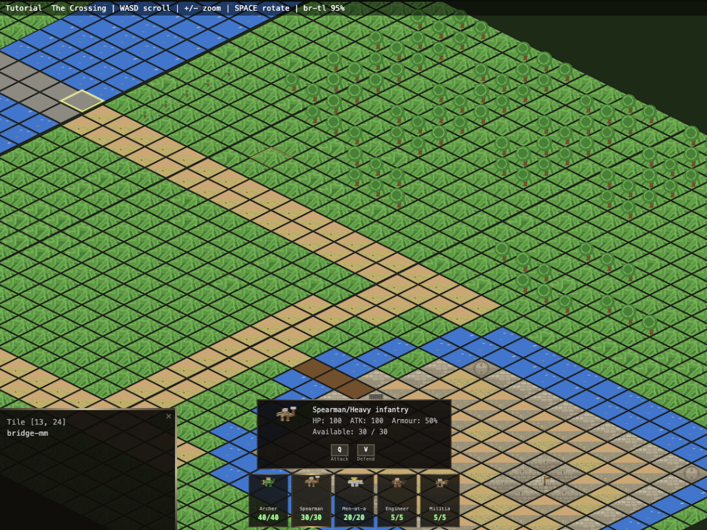

# Bulwark - A turn-based isometric tower defense browser game

> ⚠️ **WORK IN PROGRESS** — Game mechanics, win/fail states, and AI are not yet implemented. Currently the isometric map rendering, level generation, and camera systems are functional.



A turn-based medieval tower defense game rendered in isometric 2.5D with procedurally generated pixel art sprites. Defend your castle from invading forces by strategically placing defenses and managing resources.

---

## Table of Contents

### Play It
- [The Game](#the-game)
- [Controls](#controls-isometric-view)
- [HUD Layout](#hud-layout)
- [Your Army](#your-army)
- [Enemy Forces](#enemy-forces)
- [Visual Style](#visual-style)

### Develop It
- [Development Philosophy](#development-philosophy)
- [Dependencies](#dependencies)
- [Quick Start](#quick-start)
- [NPM Scripts](#npm-scripts)
- [Project Structure](#project-structure)
- [Testing](#testing)
- [Level File Format](#level-file-format)
- [Elevation Files](#elevation-files)
- [Enhanced Sprite Pipeline](#enhanced-sprite-pipeline)
- [Architecture Documentation](#architecture-documentation)
- [Enemy Goal / Playstyle](#enemy-goal--playstyle)
  - [How Enemies Navigate the Map](#how-enemies-navigate-the-map)
  - [Tile Movement Costs](#tile-movement-costs)
  - [Shared Enemy Intelligence and the Last-Seen Registry](#shared-enemy-intelligence-and-the-last-seen-registry)
  - [Engagement Zone Intelligence — The Enemy Learns](#engagement-zone-intelligence--the-enemy-learns)
  - [Enemy View Distance and Woodland Ambushes](#enemy-view-distance-and-woodland-ambushes)
  - [Tree Tiles — Passability and Ambush Potential](#tree-tiles--passability-and-ambush-potential)
  - [Unit-Specific Pathfinding Behaviors](#unit-specific-pathfinding-behaviors)

---

# Play It

## The Game

Enemies enter from the top of the map and march along dirt roads toward your stronghold. The terrain features:

- **Dirt roads** — enemy paths (where to place defenses)
- **River** — natural barrier flowing through the center
- **Stone bridge** — chokepoint where the road crosses the river
- **Forest** — provides cover, blocks line of sight, can be set ablaze
- **Open grassland** — good for tower/defense placement
- **Castle** — walls, towers, gatehouse, keep with flag (protect this!)

The game is turn-based with two phases per turn:
1. **Setup phase** — move a pawn/resource, place defenses
2. **Action phase** — attack, perform actions on adjacent tiles

Win/fail conditions: TBC

### Controls (Isometric View)

| Key | Action |
|-----|--------|
| WASD / Arrow keys | Scroll camera |
| + / = | Zoom in |
| - | Zoom out |
| Mouse wheel | Zoom in/out |
| Spacebar | Rotate viewpoint (BR→TL ↔ BL→TR), re-centers on keep |
| Mouse hover (map) | Highlights tile with gold border |
| Left click (map) | Select tile (lifts slightly), click again to deselect |
| Left click (unit bar) | Select unit type, shows detail panel with stats |
| Q | Attack action (when unit selected) |
| V | Defend action (when unit selected) |

### HUD Layout

- **Top bar**: Level name, controls hint, viewpoint, zoom %
- **Bottom center**: Unit bar — shows all available unit types with sprite, name, and remaining count. Click to select.
- **Detail panel** (above unit bar): Appears when a unit type is selected. Shows sprite, name, HP, ATK, Armour %, available count, and action buttons (Q/V).
- **Bottom-left panel**: Tile info — appears when a map tile is clicked. Shows tile coordinates and type. Closeable with ✕.

## Your Army

You command a medieval garrison defending the keep. Each unit type has distinct strengths — deploy them wisely based on terrain and enemy approach.

---

### ⚔️ Archer / Crossbowman
 

| Stat | Value |
|------|-------|
| Available | 40 |
| Health | 100 |
| Attack | 90 |
| Defense | 0.80 (20% damage reduction) |

The backbone of castle defense. Archers rain arrows from walls and elevated positions, exploiting height advantage. Crossbowmen trade fire rate for armor-piercing bolts. Place them on walls, towers, or behind cover for maximum effectiveness. Vulnerable in melee.

---

### 🛡️ Spearman / Heavy Infantry
 

| Stat | Value |
|------|-------|
| Available | 30 |
| Health | 100 |
| Attack | 100 |
| Defense | 0.50 (50% damage reduction) |

The shield wall. Spearmen hold chokepoints — gates, bridges, breaches — where their long reach stops enemies cold. Heavy infantry with shields absorb charges and protect archers behind them. Essential at every entry point the enemy might exploit.

---

### 👑 Men-at-Arms (Knight)


| Stat | Value |
|------|-------|
| Available | 20 |
| Health | 100 |
| Attack | 130 |
| Defense | 0.40 (60% damage reduction) |

Your elite shock troops. Heavily armored knights deal devastating damage and shrug off most attacks. Use them to plug breaches, lead counter-attacks, or crush enemy siege crews. Expensive and few — deploy them where the battle is fiercest.

---

### 🔧 Engineer / Siege Crew


| Stat | Value |
|------|-------|
| Available | 5 |
| Health | 100 |
| Attack | 50 |
| Defense | 0.85 (15% damage reduction) |

Builders and operators. Engineers repair damaged walls, operate ballistae and mangonels, pour boiling pitch, and maintain defenses. Weak in combat but invaluable for keeping your castle standing. Protect them at all costs.

---

### 🏚️ Militia / Watchmen


| Stat | Value |
|------|-------|
| Available | 5 |
| Health | 100 |
| Attack | 60 |
| Defense | 0.90 (10% damage reduction) |

Local levies armed with whatever's at hand. Militia patrol quiet sections, serve as early warning, and provide manpower reserves. They won't hold against a determined assault, but they buy time for your real soldiers to respond.

---

## Enemy Forces

From the north marches the army of a rival castle — a bitter lord who claims your lands as his own. His forces wear dark crimson and black, their banners stained with old blood. They are disciplined, ruthless, and hungry for conquest.

---

### 🗡️ Enemy Knight


The vanguard. Clad in blackened plate with a spiked helm, the enemy knight is a battering ram in human form. He leads the charge through your gates, cutting down anything in his path. His armor turns most arrows — you'll need spearmen or your own knights to stop him.

---

### 🏹 Enemy Archer


Lean and quick, enemy archers carry tattered war-banners on their backs — trophies from castles they've already burned. They hang back behind the main assault, picking off your engineers and exposed defenders from range. Silence them early or your walls will fall unmanned.

---

### 🔱 Enemy Spearman


Shield-bearers with round iron bosses emblazoned on their guards. Enemy spearmen form the backbone of the assault — they lock shields at your chokepoints and push forward relentlessly. Their reach keeps your cavalry at bay. Break their formation or they'll hold the bridge forever.

---

### 🪓 Enemy Militia


Conscripts and desperate men, recognizable by their crude horned helmets. What they lack in skill they make up in numbers. The enemy lord throws them at your walls first — expendable bodies to soak arrows and tire your defenders before the real assault begins. Don't underestimate a mob.

---

### 🏗️ Enemy Siege


The real threat. Siege crews push iron-capped battering rams toward your gates, war-banners with skull emblems flying overhead. If they reach your walls, the stone will crack. Every turn they survive is a turn closer to breach. Prioritize them above all else — send your knights, rain fire, do whatever it takes.

---

## Visual Style

The game uses a classic isometric (2.5D) perspective — flat diamond tiles viewed from the bottom-right looking toward the top-left. Each tile is a 64×32px diamond with terrain texture, thin border, and transparent outside. The map supports elevation via a linked `.elevation.txt` file, creating subtle terraced steps across the landscape.

Two viewpoints are available:
- **Isometric** (`index.html`) — default, with camera scroll (WASD/arrows) and zoom (+/-/mousewheel)
- **Top-down hex** (`index-topdown.html`) — flat hexagonal grid view

---

# Develop It

## Development Philosophy

This project is built using **specification-driven development** powered by [Kiro](https://kiro.dev) AI agents. Features move through a structured pipeline — requirements → design → implementation tasks — before any code is written. Each feature lives as a spec under `.kiro/specs/`, giving the development process a clear paper trail from intent to implementation.

### Kiro Agent Hooks

Automated agent hooks run continuously alongside development to maintain correctness and keep documentation in sync with the codebase:

| Hook | Trigger | Purpose |
|------|---------|---------|
| **Sync Documentation** | JS file saved | Updates README docs at the same directory level to reflect code changes, keeping living documentation always current with the source |
| **Generate Spec Tests** | JS file edited | Scans `js/` recursively and generates comprehensive `.spec.js` test files under `tests/`, mirroring the source folder structure |
| **Delete Spec Tests** | JS file deleted | Cleans up orphaned test files when their corresponding source file is removed |
| **Test Coverage Gap Report** | Agent task completes | Analyzes all production code against the test suite and writes a timestamped coverage report to `tests/reports/` with metrics and recommendations |

This means documentation never drifts from the code, test coverage is continuously generated and monitored, and the spec-based workflow ensures features are well-defined before implementation begins. The hooks act as a quality safety net — every code change triggers documentation updates and test generation automatically.

## Dependencies

### Runtime

| Package | Version | Purpose |
|---------|---------|---------|
| [pixi.js](https://pixijs.com/) | 7.4.2 | 2D WebGL/Canvas rendering engine — handles sprite batching, texture management, and the isometric scene graph in the browser |
| [sharp](https://sharp.pixelplumbing.com/) | 0.33.0 | High-performance image processing in Node.js — used by the sprite generators to create, composite, and export PNG sprite sheets and atlas textures |
| [simplex-noise](https://github.com/jwagner/simplex-noise.js) | 4.0.3 | Deterministic simplex noise generation — drives procedural terrain variation (grass, water) so seeded sprites are unique but reproducible |

### Development

| Package | Version | Purpose |
|---------|---------|---------|
| [fast-check](https://github.com/dubzzz/fast-check) | 3.23.2 | Property-based testing framework — validates universal correctness invariants (palette compliance, alpha binary, atlas packing) across all generated sprites |

### Built-in / No External Dependency

- **Test runner** — Node.js built-in `node:test` (no Mocha/Jest needed)
- **HTTP server** — `npx serve` for local development (no install required)
- **Browser rendering** — HTML5 Canvas API for the game viewport (pixi.js wraps this)

## Quick Start

### Prerequisites

- Node.js (v16+)

### Setup

```bash
git clone https://github.com/JohnStrong/BasicGenAITowerDefense.git
cd BasicGenAITowerDefense

npm run init
npm start
```

Open `http://localhost:8000` in your browser.

## NPM Scripts

| Command | Description |
|---------|-------------|
| `npm run init` | Install deps, generate sprites + level |
| `npm start` | Start local server on port 8000 |
| `npm run generate` | Regenerate all sprites and level |
| `npm run generate:sprites` | Regenerate sprite PNGs |
| `npm run generate:level` | Regenerate tutorial level |
| `npm run generate:random` | Generate random level to candidates/ |
| `npm run generate:preview` | Render level to PNG |
| `npm test` | Run all unit tests (node:test) |
| `npm run test:properties` | Run property-based tests (fast-check) |

## Project Structure

```
Bulwark/
├── index.html                  # Game entry (isometric 2.5D)
├── index-topdown.html          # Alternative top-down hex view
├── package.json
├── docs/
│   ├── game-logic.md           # Game code documentation
│   └── generators.md           # Generator code documentation
├── levels/
│   ├── manifest.txt            # Level load order
│   ├── level1.txt              # Tutorial level
│   ├── level1.elevation.txt    # Elevation map (step heights per column)
│   └── candidates/             # Random generator output
├── assets/
│   └── sprites/                # Isometric PNGs (64×32 terrain/castle, 32×32 units)
├── tests/
│   ├── game-logic/             # Unit tests for browser game logic
│   └── level-generators/
│       ├── *.spec.js           # Unit tests for each generator script
│       └── lib/
│           ├── palette.spec.js         # Palette definitions & category lookup
│           ├── fill-patterns.spec.js   # Diamond fill operations
│           ├── pixel-utils.spec.js     # Core drawing primitives
│           ├── sprite-constants.spec.js# Shared constants
│           ├── unit-body.spec.js       # Unit figure drawing
│           └── weapons.spec.js         # Weapon drawing functions
├── property-tests/             # Property-based tests (fast-check)
│   ├── README.md                               # Property index and authoring guide
│   ├── setup.property.js                       # Shared helpers and arbitraries
│   ├── palette-compliance.property.js          # P2: Palette quantization exactness
│   ├── alpha-binary.property.js                # P3: Binary alpha invariant
│   ├── water-frames.property.js                # P5: Water animation frame difference
│   ├── flag-frames.property.js                 # P5 (flag): Flag animation frame difference
│   ├── atlas-packing.property.js               # P10: Atlas non-overlapping packing
│   ├── atlas-metadata.property.js              # P11: Atlas metadata completeness
│   ├── atlas-dimensions.property.js            # P12: Atlas power-of-two dimensions
│   ├── pixel-alignment.property.js             # P13: Integer pixel alignment (drawSprite floors coords)
│   ├── animation-timing.property.js            # P14: Animation frame rate independence
│   ├── enemy-palette.property.js               # P15: Enemy palette separation
│   ├── enemy-silhouette.property.js            # P16: Enemy silhouette differentiation
│   ├── damaged-area.property.js                # P17: Damaged sprite minimum damage area
│   ├── draw-call-batching.property.js          # P18: Draw call batching bound (≤10 per layer)
│   ├── dithering-palette.property.js           # P19: Terrain transition dithering palette compliance
│   ├── sprite-dimensions.property.js           # P1: Sprite dimension invariant
│   ├── grass-uniqueness.property.js            # P4: Grass noise uniqueness
│   ├── directional-lighting.property.js        # P6: Directional lighting consistency
│   ├── castle-border.property.js               # P7: Castle outline border
│   ├── silhouette-uniqueness.property.js       # P8: Unit silhouette uniqueness
│   ├── weapon-area.property.js                 # P9: Unit weapon minimum area
│   └── tilehash-bias.property.js               # Documents known tileHash output bias
└── js/
    ├── game-logic/
    │   ├── utils.js            # Hex/iso geometry, constants, loaders
    │   ├── sprites.js          # Sprite loading, atlas support, PixiJS delegation, Canvas 2D fallback
    │   ├── level-loader.js     # Text file → tile grid parser + elevation
    │   ├── game.js             # Top-down hex renderer
    │   ├── animation-controller.js  # Shared frame-cycling timers for animated sprite types
    │   ├── pixi-renderer.js    # PixiJS WebGL/Canvas renderer with atlas loading + draw-call budgeting
    │   └── game-iso.js         # Isometric 2.5D renderer (default)
    └── level-generators/
        ├── generate-iso-sprites-br-tl.js  # Terrain sprites (BR→TL viewpoint) + tree/castle overlay generators
        ├── generate-castle-sprites.js     # Castle structure sprites
        ├── generate-castle-overlay-sprites.js # Castle structure overlay sprites (20 transparent-bg sprites, variable height)
        ├── generate-unit-sprites.js       # Army unit sprites (32×32, enhanced pipeline)
        ├── generate-enemy-sprites.js      # Enemy unit sprites (64×32, ENEMY_PALETTE)
        ├── generate-damaged-castle-sprites.js # Damaged castle variants (64×32, ≥15% damage)
        ├── generate-smooth-sprites.js     # Legacy hex sprites (kept for top-down)
        ├── generate-tutorial-level.js     # Tutorial level generator
        ├── generate-random-level.js       # Seeded random level generator
        ├── render-level-preview.js        # Level → PNG renderer
        └── lib/
            ├── sprite-constants.js  # Tile dims, output path, color palettes, sprite names (TERRAIN_SPRITES, CASTLE_SPRITES, CASTLE_OVERLAY_SPRITES, TREE_OVERLAY_SPRITES, UNIT_SPRITES)
            ├── pixel-utils.js       # createBuffer, setPixel, isInsideDiamond, seededRandom
            ├── fill-patterns.js     # fillDiamond, fillDiamondWithSpeckle, drawStoneBlocks
            ├── palette.js           # Enhanced palette definitions & category lookup
            ├── noise-texture.js     # Simplex noise wrapper for terrain variation
            ├── shading.js           # Directional, face, and shadow-edge shading
            ├── dithering.js         # 4×4 Bayer matrix ordered dithering
            ├── palette-quantizer.js # Final-pass palette enforcement (Euclidean RGB)
            ├── atlas-packer.js      # Bin-packing into power-of-two sprite atlases
            ├── animation-frames.js  # Multi-frame water and flag animation generation
            ├── unit-body.js         # drawUnit — legacy humanoid figure (not used by enhanced generator)
            └── weapons.js           # drawWeapon — legacy weapon functions (not used by enhanced generator)
```

## Testing

Tests use the Node.js built-in test runner (`node:test`). Unit tests mirror the source structure under `tests/`. Property-based tests (using [fast-check](https://github.com/dubzzz/fast-check)) live in `property-tests/` and validate universal correctness properties across all generated sprites.

```bash
# Run all unit tests
npm test

# Run property-based tests
npm run test:properties

# Run a single test file
node --test tests/level-generators/lib/palette.spec.js
```

Key test areas:
- **Palette compliance** — verifies color counts, channel ranges, enemy/player palette separation, and category lookup behavior
- **Sprite dimensions** — ensures all generated sprites match expected sizes (64×32 terrain/castle, 32×32 units)
- **Alpha invariant** — confirms all pixels are fully opaque or fully transparent (no partial alpha)
- **Animation frames** — validates frame counts and inter-frame pixel differences
- **Atlas packing** — verifies no two sprite frames overlap and minimum 1-pixel padding between adjacent frames
- **Atlas metadata** — ensures every sprite entry contains required fields (name, x, y, width, height) with correct types
- **Atlas dimensions** — confirms all atlas images use power-of-two dimensions (256, 512, 1024, or 2048) and all frames fit within bounds
- **Integer pixel alignment** — verifies `drawSprite` floors any fractional x/y coordinate to an integer before passing it to the renderer, preventing sub-pixel blur on pixel art (Property 13)
- **Draw-call batching** — confirms the per-layer draw-call budget (max 10 per layer per frame) is enforced independently across all four tile layers, and that counters reset correctly each frame (Property 18)
- **Animation timing** — validates that animated sprites advance frames at the configured interval independent of render rate, that all sprites of the same type share one frame index, and that out-of-range intervals are clamped rather than rejected (Property 14)
- **Damaged sprite area** — verifies each damaged castle variant replaces at least 15% of the stone block area with damage (cracks, missing blocks, rubble)
- **Build pipeline overlay check** — verifies the pre-pack existence check throws with a structured `[SPRITE-BUILD-ERROR]` diagnostic and exits non-zero when any of the seven tree overlay PNGs are absent from `OUTPUT_DIR`, and that all overlay sprite names from `TREE_OVERLAY_SPRITES` are included in the entries passed to `packAtlas()`; also verifies the same guard for all 20 castle structure overlay PNGs (`CASTLE_OVERLAY_SPRITES`) and that the build exits non-zero when `CASTLE_OVERLAY_SPRITES` is undefined or empty

## Level File Format

Levels are plain text files where each character represents an isometric tile.

| Char | Element |
|------|---------|
| `.` | Grass |
| `,` | Flowers |
| `O` | Oak tree |
| `P` | Pine tree |
| `S` | Shrub |
| `R` | Rock |
| `D` | Road (dirt) |
| `~` | Water |
| `=` | Bridge (cobblestone) |
| `b` | Castle bridge start (road→wood) |
| `m` | Castle bridge mid (wood planks) |
| `g` | Castle bridge gate (wood→stone) |
| `T` | Tower (round stone) |
| `K/j/J` | Keep (TL/BL/BR tiles) |
| `F` | Keep center (flag — protect this!) |
| `G` | Gatehouse (portcullis) |
| `W` | Wall (full stone) |
| `C` | Bailey (dirt+hay floor, 3 variants) |

## Elevation Files

Each level can have a `.elevation.txt` file (e.g., `level1.elevation.txt`) that defines per-column height offsets for the isometric staircase effect:

```
; Positive = step down, Negative = step up
0-9:0
10-19:2
20-29:4
30-39:2
40-49:0
50-59:-2
```

## Enhanced Sprite Pipeline

The sprite generation system is being upgraded with a layered pixel art pipeline that adds:

- **Palette enforcement** — A strict 16-color primary palette shared across terrain, castle, and unit sprites, with a separate 8-color enemy palette (max 2 shared colors). Castle sprites get up to 4 additional accent colors. All sprites pass through a final quantization step guaranteeing pixel-perfect palette adherence.
- **Procedural noise** — Simplex noise for terrain variation (grass, water) ensuring no two seeded sprites are identical.
- **Directional shading** — Upper-left light source applied consistently across all sprite categories.
- **Ordered dithering** — 4×4 Bayer matrix dithering on terrain transition edges (configurable border width, default 4px). Blends two palette colors per edge (`top`, `bottom`, `left`, `right`) without introducing any intermediate computed colors. Transparent pixels are preserved.
- **Animation frames** — Multi-frame sequences for water (3–8 frames) and castle flags.
- **Sprite atlas** — All sprites packed into power-of-two atlas PNGs with JSON metadata for efficient runtime loading.
- **Enemy sprites** — 5 distinct enemy unit types with visual differentiation from player units.
- **Damaged castle variants** — 10 damaged versions of castle structures showing cracks, missing blocks, and rubble debris. Each variant replaces at least 15% of the stone block area with damage indicators. Generated by `generate-damaged-castle-sprites.js` using the same enhanced stone block base as undamaged sprites, with multi-phase damage application (cracks → missing blocks → rubble → extra passes until threshold met).
- **Castle structure overlays** — 20 transparent-background overlay sprites for castle and bridge structures, produced by `generate-castle-overlay-sprites.js`. Canvas height varies by structure category: walls and bridges are 64×48, towers and keeps are 64×64, and the gatehouse is 64×80. At runtime, `IsoRenderer.drawTerrain` draws the flat ground tile first, then the overlay on top, giving castle structures a 2.5D appearance that matches tree overlays and unit sprites. Damaged variants (`castle-wall-damaged-overlay`, `castle-tower-damaged-overlay`, etc.) are included so the layered appearance is preserved when structures take damage. A shared isometric wall-face overlay (`castle-iso-wall-overlay` and `castle-iso-wall-damaged-overlay`) draws the stone wall face along the diamond's bottom-left and bottom-right edges and is applied across castle structure tiles. All castle/bridge tile characters (`=`, `b`, `m`, `g`, `T`, `K`, `j`, `J`, `F`, `G`, `W`) carry an `overlay` field in their tile objects.

The palette definitions live in `js/level-generators/lib/palette.js` and export:
- `PRIMARY_PALETTE` (16 colors) — terrain, castle, and unit sprites
- `ENEMY_PALETTE` (8 colors) — enemy units, visually distinct from player palette
- `CASTLE_ACCENT_COLORS` (4 colors) — weathering and highlight effects for castle sprites
- `BORDER_COLOR` — dark outline for sprite edges
- `ANIMATION_CONFIG` — frame counts and timing for water and flag animations
- `getPaletteForCategory(category)` — returns the combined palette for a sprite category

## Architecture Documentation

- **[js/game-logic/README.md](js/game-logic/README.md)** — How the browser game code works: PixiJS renderer initialisation, sprite atlas loading, animation controller, SpriteManager delegation, level loader, unit manager, game loop, and how they connect
- **[js/game-logic/lib/README.md](js/game-logic/lib/README.md)** — Reusable engine modules: isometric camera, input handling, renderer, and HUD system
- **[docs/game-loop-living-doc.md](docs/game-loop-living-doc.md)** — Game design document: turn phases, unit stats, combat rules, and implementation status
- **[js/level-generators/README.md](js/level-generators/README.md)** — How the Node.js sprite and level generators work: algorithms, palettes, seeded random

---

## Enemy Goal / Playstyle

### How Enemies Navigate the Map

Enemy units are not scripted along a fixed path — they use **A\* pathfinding** over the hex grid to find their own optimal route toward the castle every turn.

**What enemies know from the start.** At the beginning of each wave, every enemy unit is given a **terrain briefing** — a static snapshot of the battlefield showing where the grass, roads, water, bridges, forests, and castle structures are. They know roughly where to go from the moment they spawn. This is the `WorldKnowledgeMap`, and it never changes during play. Crucially, it contains zero information about player deployments: no unit positions, no built defenses, no blocked bridges.

**What enemies discover as they advance.** Player unit positions are unknown until an enemy gets close enough to see them (subject to the view distance rules below). The first enemy to spot a player unit reports it to the whole force — from that point every active enemy knows the last observed location of that unit and routes accordingly.

**Two-phase assault.** Enemies operate in two phases separated by the castle breach state.

- **Phase 1 — Assault the perimeter.** Enemies path toward the outer ring of passable tiles adjacent to the castle walls, towers, and gatehouse. The interior is not yet a target.
- **Phase 2 — Storm the keep.** Once the castle is breached, every unit immediately retargets the keep tiles. Until then, the castle walls serve as a genuine information barrier — enemies know the castle is there but cannot route to the keep until they've broken through.

Each turn, A\* uses the WorldKnowledgeMap as the base cost graph, then applies a **DynamicCostOverlay** layered on top — encoding everything the enemy force has observed. Player units they have spotted add a combat cost of `3` at their last known position. Water near those units adds cost `4` if visible to at least one enemy. Terrain with no observed threats uses its base cost.

---

### Tile Movement Costs

Every tile has a base movement cost. The pathfinder always takes the cheapest available route, so the cost table directly shapes where enemies walk.

| Tile | Character(s) | Base Cost | Notes |
|------|-------------|----------|-------|
| Grass | `.` | 1 | Standard open terrain |
| Flowers | `,` | 1 | Same cost as grass |
| Dirt road | `D` | 1 | Preferred route |
| Cobblestone bridge | `=` | 1 | River crossing |
| Castle bridge | `b`, `m`, `g` | 1 | Drawbridge approach |
| Bailey (courtyard) | `C` | 1 | Interior courtyard tiles |
| Water | `~` | 2 | Passable but slow |
| Water under fire | `~` (in threat zone) | 4 | See Shared Intelligence below |
| Player unit (combat) | any terrain | 3 | Enemies can choose to fight |
| Oak / Pine / Shrub | `O`, `P`, `S` | 1 or ∞ | Tree-eligible units only (see below) |
| Rock | `R` | ∞ | Impassable for all |
| Castle wall | `W` | ∞ | Cannot be moved onto |
| Tower | `T` | ∞ | Impassable — future: destroyable |
| Gatehouse | `G` | ∞ | Impassable — future: destroyable |
| Keep tiles | `K`, `j`, `J`, `F` | ∞ | Phase 2 target, not traversable |

**The cost ordering the enemies reason with:**

```
open ground / road / bridge  = 1   ← always preferred
open water                   = 2   ← tolerable if necessary
fight a player unit          = 3   ← chosen when routing costs more
water under player fire      = 4   ← last resort
walls / keep / rock          = ∞   ← never passable
```

---

### Shared Enemy Intelligence and the Last-Seen Registry

Enemies act as a coordinated force, but their collective intelligence is limited to what they have physically observed.

**Terrain is pre-briefed.** Every enemy knows the static layout of the battlefield from the moment they spawn — where grass, roads, water, bridges, and forests are, and where the castle is. They use this to navigate purposefully from the start.

**Player units must be spotted.** Enemy units have no advance knowledge of where the player's garrison is deployed. A bridge may look clear in their terrain briefing — they'll route toward it assuming it's passable. If an enemy gets close enough to see a player unit blocking the bridge, it reports that position to the entire enemy force. From that turn onward, every active enemy routes with that blockade in mind.

**Last-seen positions persist — but not forever.** If the player moves a unit out of the enemy's line of sight between turns, the enemy force remembers where it was *last seen*. They continue factoring that position into their cost calculations — they can't know it has moved. Only a fresh sighting updates their information. This makes repositioning defenders mid-battle genuinely useful: enemies may keep routing around a ghost for a turn or two before adjusting.

However, stale intelligence expires. If a position hasn't been re-confirmed by any enemy sighting for **10 cost-turns** (roughly 10 real seconds at game speed), the registry entry is removed. Enemies stop treating that tile as dangerous and will risk routing through it again. A defending unit that successfully hides for 10 turns can re-emerge somewhere unexpected — or the player can exploit the intelligence gap to make a gap in enemy routing that the enemy eventually stops respecting.

**Deaths clear the record.** If a player unit is killed, the enemy force immediately stops treating its last-known tile as dangerous. Dead units generate no lingering threat.

**Threat-zone water.** Water tiles within 3 hex steps of a last-seen player unit position are penalised to cost `4` — but only if at least one enemy unit currently has line of sight to that water. Enemies behind a forest can't see across the tree line, so they won't penalise water they can't observe.

In practical terms: block both bridges and the enemy column will route toward the water if they can't see why the bridges are expensive. The moment the lead unit crests a hill and spots your defenders, the whole force knows — and adjusts.

---

### Engagement Zone Intelligence — The Enemy Learns

Beyond individual sightings, the enemy force develops a longer-term memory of the battlefield through an **EngagementZoneRegistry**. This is persistent across the entire wave and is never cleared by sighting expiry.

**How zones form.** Every time a player unit is spotted, the EnemyManager checks whether that sighting location falls within 6 hex steps of any existing zone's centre. If yes, it updates that zone — incrementing its observation count and refreshing its timestamp. If no, a new zone is created. Over time, areas where your defenders repeatedly intercept enemy units accumulate into recognised danger zones.

**Two strategies for dealing with a zone.** Each turn, the manager evaluates every active zone (one confirmed within the last 10 turns) and chooses:

**Strategy 1 — Avoid.** The manager applies a heavy cost penalty (`+5`) to all tiles within the zone's radius. A* then naturally routes units around the hotspot if any viable alternative path exists. This is always the preferred strategy. Enemies learn to respect a well-defended chokepoint and hunt for a safer way through.

**Strategy 2 — Engage.** Only triggered when avoidance fails — when the cheapest path still runs through the zone even with the penalty applied. The manager then assesses whether it can commit a strike force large enough to plausibly overpower the estimated defenders. The threshold is 1.5× the estimated combined HP of the player units last observed in the zone. If the math checks out, a subset of the highest-HP enemy units is reassigned as a strike force targeting the zone centre directly.

**Army preservation.** No more than 40% of the total active enemy HP can be committed to strike forces in a single turn. This cap exists to prevent the enemy from feeding its entire army into one engagement and getting outflanked. If multiple zones simultaneously demand engagement forces and the budget runs out, later zones fall back to avoidance instead.

**Dormant zones don't penalise.** Once a zone goes more than 10 turns without a confirmed sighting, it becomes dormant and stops affecting pathfinding. The zone record is retained for historical tracking, but enemies stop routing around it — they'll approach that area again until a new sighting re-activates it. This means a defender who successfully repositions gains a brief window of free movement before the zone is re-established.

---

### Enemy View Distance and Woodland Ambushes

Each enemy unit sees up to **3 hex steps in each of the six hex directions** when on open terrain. This is the range at which they spot player units, identify dangerous water, and reason about their costs.

**Tree tiles shorten sight.** If the immediate neighbor in a given direction is a tree tile (oak, pine, or shrub), the enemy can only see **1 hex step** in that direction — the canopy blocks their view. Each direction is checked independently:

- An enemy moving along a road with forest to its northwest and northeast can still see 3 steps in the other four directions, but only 1 step toward the trees.
- An enemy unit that has entered a tree tile (archers and cavalry can do this) is moving **blind in all directions** — sight is capped at 1 hex in every direction. They see only their immediate 6 neighbors.

**What this enables for the player:**

Forests are natural ambush positions. Place an archer inside a tree cluster and the enemy column marching past on the road won't register the threat in their cost calculations — the trees block the sight line. Your archer fires; the enemies see the unit now that it's 1 hex away, but by then it may be too late to reroute.

The same logic applies to the water penalty: enemy units in or near woodland can't see across the tree line, so they won't penalise water on the far side. A river crossing that looks safe to a blind enemy column becomes a kill zone once they step into the clearing.

**Summary by terrain context:**

| Enemy context | Sight in open directions | Sight toward a tree-adjacent direction |
|---|---|---|
| On open terrain, no adjacent trees | 3 hex steps | — |
| On open terrain, tree in one direction | 3 hex steps | 1 hex step |
| Inside a tree tile | 1 hex step (all directions) | 1 hex step |

---

### Tree Tiles — Passability and Ambush Potential

Tree tiles (`O` oak, `P` pine, `S` shrub) interact with the AI in two distinct ways: **passability** (can the enemy move there?) and **sight occlusion** (can the enemy see past them?).

**Passability** depends on unit type, for the same tactical reason described above — infantry and siege engines avoid trees to reduce ambush risk; archers and cavalry are agile enough to push through.

| Enemy Type | Tree Tiles (O, P, S) |
|------------|---------------------|
| Infantry | **Impassable** — routes around all trees |
| Archer | **Passable** (cost 1) — can move through woodland |
| Cavalry | **Passable** (cost 1) — agile enough to navigate cover |
| Siege Engine | **Impassable** — too slow and bulky for forest terrain |

**Sight occlusion** applies to all enemy types. A tree tile in a given direction reduces sight in that direction from 3 hex steps to 1 — regardless of whether the enemy can actually enter the tree. An infantry unit marching past a forest can only see 1 step *into* the tree line; it can still see 3 steps across open ground on its other sides.

This means player unit placement inside forests is genuinely hidden from approaching enemies until they get within 1 hex — at which point the ambush fires. The enemy AI won't penalise water on the far side of a forest it can't see through, and it won't reroute away from an archer it hasn't spotted yet.

Note that tree passability stacks with the combat cost system. If a player unit is inside a forest, archers and cavalry will still path through trees — but they must be within sight range to "know" the unit is there. If they can't see it, the tile appears to them as ordinary woodland (cost 1), not a combat tile (cost 3).

---

### Unit-Specific Pathfinding Behaviors

> 🚧 **Placeholder — to be expanded as combat and AI mechanics are implemented.**

Each enemy unit type will develop distinct tactical behaviors beyond basic pathfinding. This section will document them as they are built out.

| Enemy Type | Movement Points/Turn | Planned Behavior Notes |
|------------|---------------------|----------------------|
| Infantry | 2 | — |
| Archer | 2 | — |
| Cavalry | 3 | — |
| Siege Engine | 1 | — |
