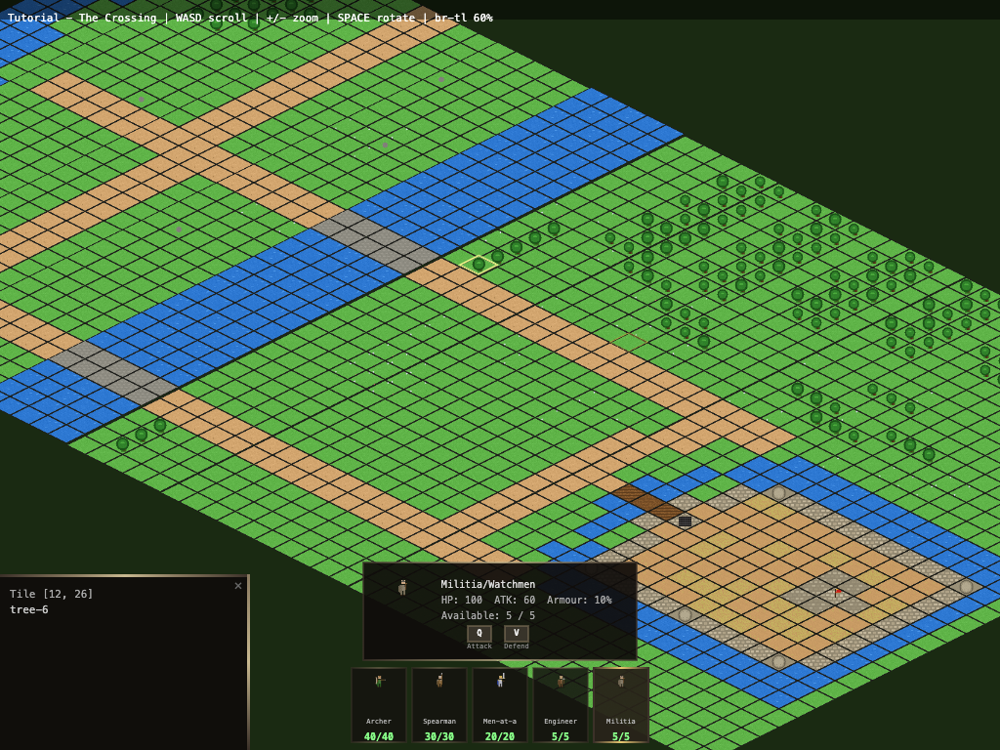
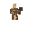
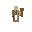
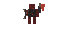
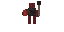
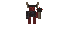
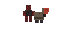

# Bulwark - A turn-based isometric tower defense browser game

> ⚠️ **WORK IN PROGRESS** — Game mechanics, win/fail states, and AI are not yet implemented. Currently the isometric map rendering, level generation, and camera systems are functional.



A turn-based medieval tower defense game rendered in isometric 2.5D with procedurally generated pixel art sprites. Defend your castle from invading forces by strategically placing defenses and managing resources.

---

## Table of Contents

### Play It
- [The Game](#the-game)
- [Controls](#controls-isometric-view)
- [HUD Layout](#hud-layout)
- [Your Army](#your-army)
- [Enemy Forces](#enemy-forces)
- [Visual Style](#visual-style)

### Develop It
- [Development Philosophy](#development-philosophy)
- [Dependencies](#dependencies)
- [Quick Start](#quick-start)
- [NPM Scripts](#npm-scripts)
- [Project Structure](#project-structure)
- [Testing](#testing)
- [Level File Format](#level-file-format)
- [Elevation Files](#elevation-files)
- [Enhanced Sprite Pipeline](#enhanced-sprite-pipeline)
- [Architecture Documentation](#architecture-documentation)

---

# Play It

## The Game

Enemies enter from the top of the map and march along dirt roads toward your stronghold. The terrain features:

- **Dirt roads** — enemy paths (where to place defenses)
- **River** — natural barrier flowing through the center
- **Stone bridge** — chokepoint where the road crosses the river
- **Forest** — provides cover, blocks line of sight, can be set ablaze
- **Open grassland** — good for tower/defense placement
- **Castle** — walls, towers, gatehouse, keep with flag (protect this!)

The game is turn-based with two phases per turn:
1. **Setup phase** — move a pawn/resource, place defenses
2. **Action phase** — attack, perform actions on adjacent tiles

Win/fail conditions: TBC

### Controls (Isometric View)

| Key | Action |
|-----|--------|
| WASD / Arrow keys | Scroll camera |
| + / = | Zoom in |
| - | Zoom out |
| Mouse wheel | Zoom in/out |
| Spacebar | Rotate viewpoint (BR→TL ↔ BL→TR), re-centers on keep |
| Mouse hover (map) | Highlights tile with gold border |
| Left click (map) | Select tile (lifts slightly), click again to deselect |
| Left click (unit bar) | Select unit type, shows detail panel with stats |
| Q | Attack action (when unit selected) |
| V | Defend action (when unit selected) |

### HUD Layout

- **Top bar**: Level name, controls hint, viewpoint, zoom %
- **Bottom center**: Unit bar — shows all available unit types with sprite, name, and remaining count. Click to select.
- **Detail panel** (above unit bar): Appears when a unit type is selected. Shows sprite, name, HP, ATK, Armour %, available count, and action buttons (Q/V).
- **Bottom-left panel**: Tile info — appears when a map tile is clicked. Shows tile coordinates and type. Closeable with ✕.

## Your Army

You command a medieval garrison defending the keep. Each unit type has distinct strengths — deploy them wisely based on terrain and enemy approach.

---

### ⚔️ Archer / Crossbowman
 

| Stat | Value |
|------|-------|
| Available | 40 |
| Health | 100 |
| Attack | 90 |
| Defense | 0.80 (20% damage reduction) |

The backbone of castle defense. Archers rain arrows from walls and elevated positions, exploiting height advantage. Crossbowmen trade fire rate for armor-piercing bolts. Place them on walls, towers, or behind cover for maximum effectiveness. Vulnerable in melee.

---

### 🛡️ Spearman / Heavy Infantry
 

| Stat | Value |
|------|-------|
| Available | 30 |
| Health | 100 |
| Attack | 100 |
| Defense | 0.50 (50% damage reduction) |

The shield wall. Spearmen hold chokepoints — gates, bridges, breaches — where their long reach stops enemies cold. Heavy infantry with shields absorb charges and protect archers behind them. Essential at every entry point the enemy might exploit.

---

### 👑 Men-at-Arms (Knight)


| Stat | Value |
|------|-------|
| Available | 20 |
| Health | 100 |
| Attack | 130 |
| Defense | 0.40 (60% damage reduction) |

Your elite shock troops. Heavily armored knights deal devastating damage and shrug off most attacks. Use them to plug breaches, lead counter-attacks, or crush enemy siege crews. Expensive and few — deploy them where the battle is fiercest.

---

### 🔧 Engineer / Siege Crew


| Stat | Value |
|------|-------|
| Available | 5 |
| Health | 100 |
| Attack | 50 |
| Defense | 0.85 (15% damage reduction) |

Builders and operators. Engineers repair damaged walls, operate ballistae and mangonels, pour boiling pitch, and maintain defenses. Weak in combat but invaluable for keeping your castle standing. Protect them at all costs.

---

### 🏚️ Militia / Watchmen


| Stat | Value |
|------|-------|
| Available | 5 |
| Health | 100 |
| Attack | 60 |
| Defense | 0.90 (10% damage reduction) |

Local levies armed with whatever's at hand. Militia patrol quiet sections, serve as early warning, and provide manpower reserves. They won't hold against a determined assault, but they buy time for your real soldiers to respond.

---

## Enemy Forces

From the north marches the army of a rival castle — a bitter lord who claims your lands as his own. His forces wear dark crimson and black, their banners stained with old blood. They are disciplined, ruthless, and hungry for conquest.

---

### 🗡️ Enemy Knight


The vanguard. Clad in blackened plate with a spiked helm, the enemy knight is a battering ram in human form. He leads the charge through your gates, cutting down anything in his path. His armor turns most arrows — you'll need spearmen or your own knights to stop him.

---

### 🏹 Enemy Archer


Lean and quick, enemy archers carry tattered war-banners on their backs — trophies from castles they've already burned. They hang back behind the main assault, picking off your engineers and exposed defenders from range. Silence them early or your walls will fall unmanned.

---

### 🔱 Enemy Spearman


Shield-bearers with round iron bosses emblazoned on their guards. Enemy spearmen form the backbone of the assault — they lock shields at your chokepoints and push forward relentlessly. Their reach keeps your cavalry at bay. Break their formation or they'll hold the bridge forever.

---

### 🪓 Enemy Militia


Conscripts and desperate men, recognizable by their crude horned helmets. What they lack in skill they make up in numbers. The enemy lord throws them at your walls first — expendable bodies to soak arrows and tire your defenders before the real assault begins. Don't underestimate a mob.

---

### 🏗️ Enemy Siege


The real threat. Siege crews push iron-capped battering rams toward your gates, war-banners with skull emblems flying overhead. If they reach your walls, the stone will crack. Every turn they survive is a turn closer to breach. Prioritize them above all else — send your knights, rain fire, do whatever it takes.

---

## Visual Style

The game uses a classic isometric (2.5D) perspective — flat diamond tiles viewed from the bottom-right looking toward the top-left. Each tile is a 64×32px diamond with terrain texture, thin border, and transparent outside. The map supports elevation via a linked `.elevation.txt` file, creating subtle terraced steps across the landscape.

Two viewpoints are available:
- **Isometric** (`index.html`) — default, with camera scroll (WASD/arrows) and zoom (+/-/mousewheel)
- **Top-down hex** (`index-topdown.html`) — flat hexagonal grid view

---

# Develop It

## Development Philosophy

This project is built using **specification-driven development** powered by [Kiro](https://kiro.dev) AI agents. Features move through a structured pipeline — requirements → design → implementation tasks — before any code is written. Each feature lives as a spec under `.kiro/specs/`, giving the development process a clear paper trail from intent to implementation.

### Kiro Agent Hooks

Automated agent hooks run continuously alongside development to maintain correctness and keep documentation in sync with the codebase:

| Hook | Trigger | Purpose |
|------|---------|---------|
| **Sync Documentation** | JS file saved | Updates README docs at the same directory level to reflect code changes, keeping living documentation always current with the source |
| **Generate Spec Tests** | JS file edited | Scans `js/` recursively and generates comprehensive `.spec.js` test files under `tests/`, mirroring the source folder structure |
| **Delete Spec Tests** | JS file deleted | Cleans up orphaned test files when their corresponding source file is removed |
| **Test Coverage Gap Report** | Agent task completes | Analyzes all production code against the test suite and writes a timestamped coverage report to `tests/reports/` with metrics and recommendations |

This means documentation never drifts from the code, test coverage is continuously generated and monitored, and the spec-based workflow ensures features are well-defined before implementation begins. The hooks act as a quality safety net — every code change triggers documentation updates and test generation automatically.

## Dependencies

### Runtime

| Package | Version | Purpose |
|---------|---------|---------|
| [pixi.js](https://pixijs.com/) | 7.4.2 | 2D WebGL/Canvas rendering engine — handles sprite batching, texture management, and the isometric scene graph in the browser |
| [sharp](https://sharp.pixelplumbing.com/) | 0.33.0 | High-performance image processing in Node.js — used by the sprite generators to create, composite, and export PNG sprite sheets and atlas textures |
| [simplex-noise](https://github.com/jwagner/simplex-noise.js) | 4.0.3 | Deterministic simplex noise generation — drives procedural terrain variation (grass, water) so seeded sprites are unique but reproducible |

### Development

| Package | Version | Purpose |
|---------|---------|---------|
| [fast-check](https://github.com/dubzzz/fast-check) | 3.23.2 | Property-based testing framework — validates universal correctness invariants (palette compliance, alpha binary, atlas packing) across all generated sprites |

### Built-in / No External Dependency

- **Test runner** — Node.js built-in `node:test` (no Mocha/Jest needed)
- **HTTP server** — `npx serve` for local development (no install required)
- **Browser rendering** — HTML5 Canvas API for the game viewport (pixi.js wraps this)

## Quick Start

### Prerequisites

- Node.js (v16+)

### Setup

```bash
git clone https://github.com/JohnStrong/BasicGenAITowerDefense.git
cd BasicGenAITowerDefense

npm run init
npm start
```

Open `http://localhost:8000` in your browser.

## NPM Scripts

| Command | Description |
|---------|-------------|
| `npm run init` | Install deps, generate sprites + level |
| `npm start` | Start local server on port 8000 |
| `npm run generate` | Regenerate all sprites and level |
| `npm run generate:sprites` | Regenerate sprite PNGs |
| `npm run generate:level` | Regenerate tutorial level |
| `npm run generate:random` | Generate random level to candidates/ |
| `npm run generate:preview` | Render level to PNG |
| `npm test` | Run all unit tests (node:test) |
| `npm run test:properties` | Run property-based tests (fast-check) |

## Project Structure

```
Bulwark/
├── index.html                  # Game entry (isometric 2.5D)
├── index-topdown.html          # Alternative top-down hex view
├── package.json
├── docs/
│   ├── game-logic.md           # Game code documentation
│   └── generators.md           # Generator code documentation
├── levels/
│   ├── manifest.txt            # Level load order
│   ├── level1.txt              # Tutorial level
│   ├── level1.elevation.txt    # Elevation map (step heights per column)
│   └── candidates/             # Random generator output
├── assets/
│   └── sprites/                # Isometric PNGs (64×32 terrain/castle, 32×32 units)
├── tests/
│   ├── game-logic/             # Unit tests for browser game logic
│   └── level-generators/
│       ├── *.spec.js           # Unit tests for each generator script
│       └── lib/
│           ├── palette.spec.js         # Palette definitions & category lookup
│           ├── fill-patterns.spec.js   # Diamond fill operations
│           ├── pixel-utils.spec.js     # Core drawing primitives
│           ├── sprite-constants.spec.js# Shared constants
│           ├── unit-body.spec.js       # Unit figure drawing
│           └── weapons.spec.js         # Weapon drawing functions
├── property-tests/             # Property-based tests (fast-check)
│   ├── README.md                               # Property index and authoring guide
│   ├── setup.property.js                       # Shared helpers and arbitraries
│   ├── palette-compliance.property.js          # P2: Palette quantization exactness
│   ├── alpha-binary.property.js                # P3: Binary alpha invariant
│   ├── water-frames.property.js                # P5: Water animation frame difference
│   ├── flag-frames.property.js                 # P5 (flag): Flag animation frame difference
│   ├── atlas-packing.property.js               # P10: Atlas non-overlapping packing
│   ├── atlas-metadata.property.js              # P11: Atlas metadata completeness
│   ├── atlas-dimensions.property.js            # P12: Atlas power-of-two dimensions
│   ├── pixel-alignment.property.js             # P13: Integer pixel alignment (drawSprite floors coords)
│   ├── animation-timing.property.js            # P14: Animation frame rate independence
│   ├── enemy-palette.property.js               # P15: Enemy palette separation
│   ├── enemy-silhouette.property.js            # P16: Enemy silhouette differentiation
│   ├── damaged-area.property.js                # P17: Damaged sprite minimum damage area
│   ├── draw-call-batching.property.js          # P18: Draw call batching bound (≤10 per layer)
│   ├── dithering-palette.property.js           # P19: Terrain transition dithering palette compliance
│   ├── sprite-dimensions.property.js           # P1: Sprite dimension invariant
│   ├── grass-uniqueness.property.js            # P4: Grass noise uniqueness
│   ├── directional-lighting.property.js        # P6: Directional lighting consistency
│   ├── castle-border.property.js               # P7: Castle outline border
│   ├── silhouette-uniqueness.property.js       # P8: Unit silhouette uniqueness
│   ├── weapon-area.property.js                 # P9: Unit weapon minimum area
│   └── tilehash-bias.property.js               # Documents known tileHash output bias
└── js/
    ├── game-logic/
    │   ├── utils.js            # Hex/iso geometry, constants, loaders
    │   ├── sprites.js          # Sprite loading, atlas support, PixiJS delegation, Canvas 2D fallback
    │   ├── level-loader.js     # Text file → tile grid parser + elevation
    │   ├── game.js             # Top-down hex renderer
    │   ├── animation-controller.js  # Shared frame-cycling timers for animated sprite types
    │   ├── pixi-renderer.js    # PixiJS WebGL/Canvas renderer with atlas loading + draw-call budgeting
    │   └── game-iso.js         # Isometric 2.5D renderer (default)
    └── level-generators/
        ├── generate-iso-sprites-br-tl.js  # Terrain sprites (BR→TL viewpoint)
        ├── generate-castle-sprites.js     # Castle structure sprites
        ├── generate-unit-sprites.js       # Army unit sprites (32×32, enhanced pipeline)
        ├── generate-enemy-sprites.js      # Enemy unit sprites (64×32, ENEMY_PALETTE)
        ├── generate-damaged-castle-sprites.js # Damaged castle variants (64×32, ≥15% damage)
        ├── generate-smooth-sprites.js     # Legacy hex sprites (kept for top-down)
        ├── generate-tutorial-level.js     # Tutorial level generator
        ├── generate-random-level.js       # Seeded random level generator
        ├── render-level-preview.js        # Level → PNG renderer
        └── lib/
            ├── sprite-constants.js  # Tile dims, output path, color palettes, sprite names
            ├── pixel-utils.js       # createBuffer, setPixel, isInsideDiamond, seededRandom
            ├── fill-patterns.js     # fillDiamond, fillDiamondWithSpeckle, drawStoneBlocks
            ├── palette.js           # Enhanced palette definitions & category lookup
            ├── noise-texture.js     # Simplex noise wrapper for terrain variation
            ├── shading.js           # Directional, face, and shadow-edge shading
            ├── dithering.js         # 4×4 Bayer matrix ordered dithering
            ├── palette-quantizer.js # Final-pass palette enforcement (Euclidean RGB)
            ├── atlas-packer.js      # Bin-packing into power-of-two sprite atlases
            ├── animation-frames.js  # Multi-frame water and flag animation generation
            ├── unit-body.js         # drawUnit — legacy humanoid figure (not used by enhanced generator)
            └── weapons.js           # drawWeapon — legacy weapon functions (not used by enhanced generator)
```

## Testing

Tests use the Node.js built-in test runner (`node:test`). Unit tests mirror the source structure under `tests/`. Property-based tests (using [fast-check](https://github.com/dubzzz/fast-check)) live in `property-tests/` and validate universal correctness properties across all generated sprites.

```bash
# Run all unit tests
npm test

# Run property-based tests
npm run test:properties

# Run a single test file
node --test tests/level-generators/lib/palette.spec.js
```

Key test areas:
- **Palette compliance** — verifies color counts, channel ranges, enemy/player palette separation, and category lookup behavior
- **Sprite dimensions** — ensures all generated sprites match expected sizes (64×32 terrain/castle, 32×32 units)
- **Alpha invariant** — confirms all pixels are fully opaque or fully transparent (no partial alpha)
- **Animation frames** — validates frame counts and inter-frame pixel differences
- **Atlas packing** — verifies no two sprite frames overlap and minimum 1-pixel padding between adjacent frames
- **Atlas metadata** — ensures every sprite entry contains required fields (name, x, y, width, height) with correct types
- **Atlas dimensions** — confirms all atlas images use power-of-two dimensions (256, 512, 1024, or 2048) and all frames fit within bounds
- **Integer pixel alignment** — verifies `drawSprite` floors any fractional x/y coordinate to an integer before passing it to the renderer, preventing sub-pixel blur on pixel art (Property 13)
- **Draw-call batching** — confirms the per-layer draw-call budget (max 10 per layer per frame) is enforced independently across all four tile layers, and that counters reset correctly each frame (Property 18)
- **Animation timing** — validates that animated sprites advance frames at the configured interval independent of render rate, that all sprites of the same type share one frame index, and that out-of-range intervals are clamped rather than rejected (Property 14)
- **Damaged sprite area** — verifies each damaged castle variant replaces at least 15% of the stone block area with damage (cracks, missing blocks, rubble)
- **Build pipeline overlay check** — verifies the pre-pack existence check throws with a structured `[SPRITE-BUILD-ERROR]` diagnostic and exits non-zero when any of the seven tree overlay PNGs are absent from `OUTPUT_DIR`, and that all overlay sprite names from `TREE_OVERLAY_SPRITES` are included in the entries passed to `packAtlas()`

## Level File Format

Levels are plain text files where each character represents an isometric tile.

| Char | Element |
|------|---------|
| `.` | Grass |
| `,` | Flowers |
| `O` | Oak tree |
| `P` | Pine tree |
| `S` | Shrub |
| `R` | Rock |
| `D` | Road (dirt) |
| `~` | Water |
| `=` | Bridge (cobblestone) |
| `b` | Castle bridge start (road→wood) |
| `m` | Castle bridge mid (wood planks) |
| `g` | Castle bridge gate (wood→stone) |
| `T` | Tower (round stone) |
| `K/j/J` | Keep (TL/BL/BR tiles) |
| `F` | Keep center (flag — protect this!) |
| `G` | Gatehouse (portcullis) |
| `W` | Wall (full stone) |
| `C` | Bailey (dirt+hay floor, 3 variants) |

## Elevation Files

Each level can have a `.elevation.txt` file (e.g., `level1.elevation.txt`) that defines per-column height offsets for the isometric staircase effect:

```
; Positive = step down, Negative = step up
0-9:0
10-19:2
20-29:4
30-39:2
40-49:0
50-59:-2
```

## Enhanced Sprite Pipeline

The sprite generation system is being upgraded with a layered pixel art pipeline that adds:

- **Palette enforcement** — A strict 16-color primary palette shared across terrain, castle, and unit sprites, with a separate 8-color enemy palette (max 2 shared colors). Castle sprites get up to 4 additional accent colors. All sprites pass through a final quantization step guaranteeing pixel-perfect palette adherence.
- **Procedural noise** — Simplex noise for terrain variation (grass, water) ensuring no two seeded sprites are identical.
- **Directional shading** — Upper-left light source applied consistently across all sprite categories.
- **Ordered dithering** — 4×4 Bayer matrix dithering on terrain transition edges (configurable border width, default 4px). Blends two palette colors per edge (`top`, `bottom`, `left`, `right`) without introducing any intermediate computed colors. Transparent pixels are preserved.
- **Animation frames** — Multi-frame sequences for water (3–8 frames) and castle flags.
- **Sprite atlas** — All sprites packed into power-of-two atlas PNGs with JSON metadata for efficient runtime loading.
- **Enemy sprites** — 5 distinct enemy unit types with visual differentiation from player units.
- **Damaged castle variants** — 10 damaged versions of castle structures showing cracks, missing blocks, and rubble debris. Each variant replaces at least 15% of the stone block area with damage indicators. Generated by `generate-damaged-castle-sprites.js` using the same enhanced stone block base as undamaged sprites, with multi-phase damage application (cracks → missing blocks → rubble → extra passes until threshold met).

The palette definitions live in `js/level-generators/lib/palette.js` and export:
- `PRIMARY_PALETTE` (16 colors) — terrain, castle, and unit sprites
- `ENEMY_PALETTE` (8 colors) — enemy units, visually distinct from player palette
- `CASTLE_ACCENT_COLORS` (4 colors) — weathering and highlight effects for castle sprites
- `BORDER_COLOR` — dark outline for sprite edges
- `ANIMATION_CONFIG` — frame counts and timing for water and flag animations
- `getPaletteForCategory(category)` — returns the combined palette for a sprite category

## Architecture Documentation

- **[js/game-logic/README.md](js/game-logic/README.md)** — How the browser game code works: PixiJS renderer initialisation, sprite atlas loading, animation controller, SpriteManager delegation, level loader, unit manager, game loop, and how they connect
- **[js/game-logic/lib/README.md](js/game-logic/lib/README.md)** — Reusable engine modules: isometric camera, input handling, renderer, and HUD system
- **[docs/game-loop-living-doc.md](docs/game-loop-living-doc.md)** — Game design document: turn phases, unit stats, combat rules, and implementation status
- **[js/level-generators/README.md](js/level-generators/README.md)** — How the Node.js sprite and level generators work: algorithms, palettes, seeded random
