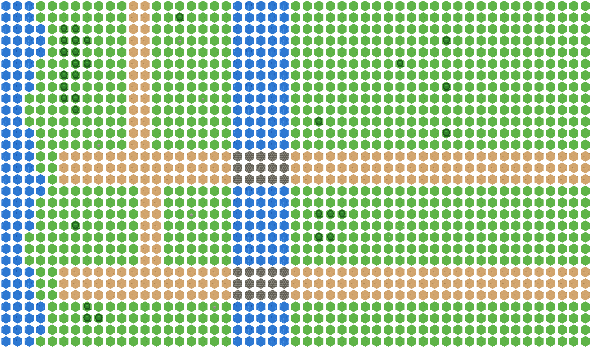

# Medieval Tower Defense

> ⚠️ **WORK IN PROGRESS** — Game mechanics, win/fail states, and AI are not yet implemented. Currently the map rendering and level generation systems are functional.



A turn-based medieval tower defense game with procedurally generated pixel art sprites, built with vanilla JS and HTML5 Canvas. Defend your castle from invading forces by strategically placing defenses and managing resources.

## The Game

Enemies enter from the top of the map and march along dirt roads toward your stronghold. The terrain features:

- **Dirt roads** — enemy paths (where to place defenses)
- **River** — natural barrier flowing through the center of the map
- **Stone bridge** — chokepoint where the road crosses the river
- **Forest** — provides cover, blocks line of sight, can be set ablaze
- **Open grassland** — good for tower/defense placement

The game is turn-based with two phases per turn:
1. **Setup phase** — move a pawn/resource, place defenses
2. **Action phase** — attack, perform actions on adjacent tiles

Win/fail conditions: TBC

## Project Structure

```
BasicTowerDefense/
├── index.html                  # Game entry point
├── package.json                # Node.js config
├── docs/
│   ├── game-logic.md           # Game code documentation
│   ├── generators.md           # Generator code documentation
│   └── level1-preview.png      # Rendered map preview
├── levels/
│   ├── manifest.txt            # Level load order
│   ├── level1.txt              # Tutorial level (fully commented)
│   └── candidates/             # Random generator output (for review)
├── assets/
│   └── sprites/                # 32x32 PNG sprite images (34 files)
└── js/
    ├── game-logic/             # Browser-side game code
    │   ├── utils.js            # Constants (TILE_SIZE) and loaders
    │   ├── sprites.js          # Sprite loading and rendering
    │   ├── level-loader.js     # Text file level parser
    │   └── game.js             # Main game loop and renderer
    └── level-generators/       # Node.js generation scripts
        ├── generate-smooth-sprites.js  # All 34 sprite PNGs
        ├── generate-tutorial-level.js  # Tutorial level (level1.txt)
        ├── generate-random-level.js    # Seeded random level generator
        └── render-level-preview.js     # Renders level to PNG for docs
```

## Developer Guide

### Prerequisites

- Node.js (v16+)

### Quick Start

```bash
# Clone the repository
git clone https://github.com/JohnStrong/BasicGenAITowerDefense.git
cd BasicGenAITowerDefense

# Install dependencies, generate all sprites + level, then start the server
npm run init
npm start
```

Open `http://localhost:8000` in your browser.

`npm run init` only needs to be run once (or whenever you want to regenerate sprites from scratch). After that, just use `npm start` to launch the game.

### NPM Scripts

| Command | Description |
|---------|-------------|
| `npm run init` | Full setup: install deps, generate sprites + level |
| `npm start` | Start local server on port 8000 |
| `npm run generate` | Regenerate all sprites and level map |
| `npm run generate:sprites` | Regenerate only sprite PNGs |
| `npm run generate:level` | Regenerate tutorial level (level1.txt) |
| `npm run generate:random` | Generate a random level to candidates/ |
| `npm run generate:preview` | Render level1 to docs/level1-preview.png |
| `npm run serve` | Start server (alias for start) |

### Generating Random Levels

```bash
# Random seed (uses timestamp)
npm run generate:random

# Specific seed for reproducible maps
node js/level-generators/generate-random-level.js 42
node js/level-generators/generate-random-level.js 999
```

Output goes to `levels/candidates/`. Review the files, then promote to the game:
```bash
cp levels/candidates/2026-05-19_seed-42.txt levels/level2.txt
# Add 'level2.txt' to levels/manifest.txt
```

### Level File Format

Levels are plain text files where each character represents a tile. See `levels/level1.txt` for a fully commented example.

| Char | Element |
|------|---------|
| `.` | Grass (green meadow) |
| `,` | Grass with flowers |
| `O` | Tree (dark green canopy) |
| `R` | Rock decoration |
| `D` | Road full (dirt) |
| `L` | Road left-edge (grass\|road) |
| `r` | Road right-edge (road\|grass) |
| `U` | Road top-edge (grass above) |
| `u` | Road bottom-edge (grass below) |
| `1/2/3/4` | Road corners (TL/TR/BL/BR) |
| `~` | Water vertical flow |
| `w` | Water horizontal flow |
| `)` | Right bank (water\|grass) |
| `(` | Left bank (grass\|water) |
| `{^}` | Bridge top row (wall + road) |
| `[=]` | Bridge middle row (cobblestone) |
| `<_>` | Bridge bottom row (road + wall) |

### Architecture Documentation

- **[docs/game-logic.md](docs/game-logic.md)** — How the browser-side game code works (sprites, level loader, renderer)
- **[docs/generators.md](docs/generators.md)** — How the Node.js sprite and level generators work (algorithms, seeded random, noise)
