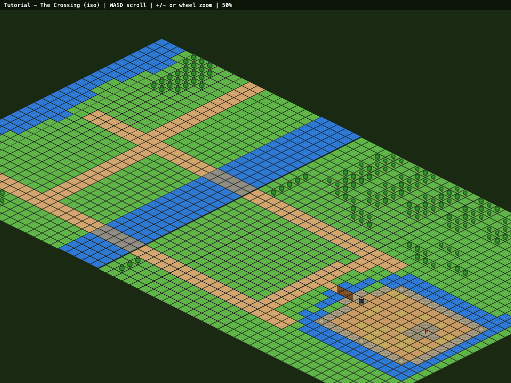

# Medieval Tower Defense

> ⚠️ **WORK IN PROGRESS** — Game mechanics, win/fail states, and AI are not yet implemented. Currently the isometric map rendering, level generation, and camera systems are functional.



A turn-based medieval tower defense game rendered in isometric 2.5D with procedurally generated pixel art sprites. Built with vanilla JS and HTML5 Canvas. Defend your castle from invading forces by strategically placing defenses and managing resources.

## The Game

Enemies enter from the top of the map and march along dirt roads toward your stronghold. The terrain features:

- **Dirt roads** — enemy paths (where to place defenses)
- **River** — natural barrier flowing through the center
- **Stone bridge** — chokepoint where the road crosses the river
- **Forest** — provides cover, blocks line of sight, can be set ablaze
- **Open grassland** — good for tower/defense placement
- **Castle** — walls, towers, gatehouse, keep with flag (protect this!)

The game is turn-based with two phases per turn:
1. **Setup phase** — move a pawn/resource, place defenses
2. **Action phase** — attack, perform actions on adjacent tiles

Win/fail conditions: TBC


### Controls (Isometric View)

| Key | Action |
|-----|--------|
| WASD / Arrow keys | Scroll camera |
| + / = | Zoom in |
| - | Zoom out |
| Mouse wheel | Zoom in/out |
| Spacebar | Rotate viewpoint (BR→TL ↔ BL→TR), re-centers on keep |

## Project Structure

```
BasicTowerDefense/
├── index.html                  # Game entry (isometric 2.5D)
├── index-topdown.html          # Alternative top-down hex view
├── package.json
├── docs/
│   ├── game-logic.md           # Game code documentation
│   └── generators.md           # Generator code documentation
├── levels/
│   ├── manifest.txt            # Level load order
│   ├── level1.txt              # Tutorial level
│   ├── level1.elevation.txt    # Elevation map (step heights per column)
│   └── candidates/             # Random generator output
├── assets/
│   └── sprites/                # 64x32 isometric diamond PNGs
└── js/
    ├── game-logic/
    │   ├── utils.js            # Hex/iso geometry, constants, loaders
    │   ├── sprites.js          # Sprite loading and rendering
    │   ├── level-loader.js     # Text file → tile grid parser + elevation
    │   ├── game.js             # Top-down hex renderer
    │   └── game-iso.js         # Isometric 2.5D renderer (default)
    └── level-generators/
        ├── generate-iso-sprites-br-tl.js  # Terrain sprites (BR→TL viewpoint)
        ├── generate-castle-sprites.js     # Castle structure sprites
        ├── generate-smooth-sprites.js     # Legacy hex sprites (kept for top-down)
        ├── generate-tutorial-level.js     # Tutorial level generator
        ├── generate-random-level.js       # Seeded random level generator
        └── render-level-preview.js        # Level → PNG renderer
```

## Visual Style

The game uses a classic isometric (2.5D) perspective — flat diamond tiles viewed from the bottom-right looking toward the top-left. Each tile is a 64×32px diamond with terrain texture, thin border, and transparent outside. The map supports elevation via a linked `.elevation.txt` file, creating subtle terraced steps across the landscape.

Two viewpoints are available:
- **Isometric** (`index.html`) — default, with camera scroll (WASD/arrows) and zoom (+/-/mousewheel)
- **Top-down hex** (`index-topdown.html`) — flat hexagonal grid view

## Developer Guide

### Prerequisites

- Node.js (v16+)

### Quick Start

```bash
git clone https://github.com/JohnStrong/BasicGenAITowerDefense.git
cd BasicGenAITowerDefense

npm run init
npm start
```

Open `http://localhost:8000` in your browser.

### NPM Scripts

| Command | Description |
|---------|-------------|
| `npm run init` | Install deps, generate sprites + level |
| `npm start` | Start local server on port 8000 |
| `npm run generate` | Regenerate all sprites and level |
| `npm run generate:sprites` | Regenerate sprite PNGs |
| `npm run generate:level` | Regenerate tutorial level |
| `npm run generate:random` | Generate random level to candidates/ |
| `npm run generate:preview` | Render level to PNG |

### Level File Format

Levels are plain text files where each character represents an isometric tile.

| Char | Element |
|------|---------|
| `.` | Grass |
| `,` | Flowers |
| `O` | Oak tree |
| `P` | Pine tree |
| `S` | Shrub |
| `R` | Rock |
| `D` | Road (dirt) |
| `~` | Water |
| `=` | Bridge (cobblestone) |
| `b` | Castle bridge start (road→wood) |
| `m` | Castle bridge mid (wood planks) |
| `g` | Castle bridge gate (wood→stone) |
| `T` | Tower (round stone) |
| `K/j/J` | Keep (TL/BL/BR tiles) |
| `F` | Keep center (flag — protect this!) |
| `G` | Gatehouse (portcullis) |
| `W` | Wall (full stone) |
| `C` | Bailey (dirt+hay floor, 3 variants) |

### Elevation Files

Each level can have a `.elevation.txt` file (e.g., `level1.elevation.txt`) that defines per-column height offsets for the isometric staircase effect:

```
; Positive = step down, Negative = step up
0-9:0
10-19:2
20-29:4
30-39:2
40-49:0
50-59:-2
```

### Architecture Documentation

- **[docs/game-logic.md](docs/game-logic.md)** — Game code (sprites, level loader, renderers)
- **[docs/generators.md](docs/generators.md)** — Sprite and level generators
