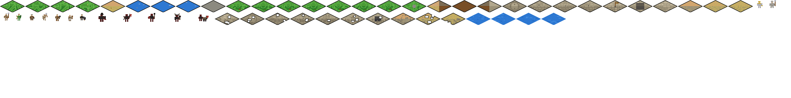

# Level & Sprite Generators

Node.js scripts that produce the game's PNG sprites and level text files. Run these at build time — individual generators write PNGs to `assets/sprites/`, the unified build pipeline packs them into atlas files at `generated/assets/atlas/`, and level generators write to `levels/`.

## Table of Contents

- [File Overview](#file-overview)
- [build-sprites.js](#build-spritesjs)
- [generate-iso-sprites-br-tl.js](#generate-iso-sprites-br-tljs)
- [generate-castle-sprites.js](#generate-castle-spritesjs)
- [generate-unit-sprites.js](#generate-unit-spritesjs)
- [generate-tutorial-level.js](#generate-tutorial-leveljs)
- [generate-random-level.js](#generate-random-leveljs)
- [render-level-preview.js](#render-level-previewjs)
- [generate-enemy-sprites.js](#generate-enemy-spritesjs)
- [generate-damaged-castle-sprites.js](#generate-damaged-castle-spritesjs)
- [lib/noise-texture.js — Procedural Noise](#libnoise-texturejs--procedural-noise)
- [lib/shading.js — Directional Lighting](#libshadingjs--directional-lighting)
- [lib/dithering.js — Ordered Dithering](#libditheringjs--ordered-dithering)
- [lib/palette-quantizer.js — Palette Enforcement](#libpalette-quantizerjs--palette-enforcement)
- [lib/atlas-packer.js — Sprite Atlas Generation](#libatlas-packerjs--sprite-atlas-generation)
- [lib/animation-frames.js — Animation Generation](#libanimation-framesjs--animation-generation)
- [lib/palette.js — Enhanced Palette System](#libpalettejs--enhanced-palette-system)
- [NPM Scripts](#npm-scripts)

---

## File Overview

| File | What it does |
|------|-------------|
| `build-sprites.js` | Unified build pipeline — orchestrates all generators, collects PNGs, packs atlas, outputs to `generated/assets/atlas/` |
| `generate-iso-sprites-br-tl.js` | Generates all terrain sprites (grass, road, water, trees, rock) **and** 7 tree overlay sprites (64×48, transparent background) **and** 18 castle structure overlay sprites (variable height: 64×48 walls/bridges, 64×64 towers/keeps, 64×80 gatehouse) with enhanced pipeline (noise, shading, dithering, quantization) |
| `generate-castle-sprites.js` | Generates castle structure sprites (walls, tower, keep, bailey) with enhanced pipeline (stone courses, crenellations, shading, quantization) |
| `generate-unit-sprites.js` | Generates army unit sprites (32×32, enhanced pipeline: unique silhouettes, weapons, directional shading, palette quantization) |
| `generate-enemy-sprites.js` | Generates 5 enemy unit sprites (64×32, ENEMY_PALETTE, unique silhouette modifiers, directional shading, palette quantization) |
| `generate-damaged-castle-sprites.js` | Generates 10 damaged castle variants (64×32, cracks/missing blocks/rubble, ≥15% damage area, CASTLE_PALETTE quantization) |
| `generate-castle-overlay-sprites.js` | Generates 18 castle structure overlay sprites (transparent background, variable height: 64×48 walls/bridges, 64×64 towers/keeps, 64×80 gatehouse) — produced by the castle-structure-overlays spec |
| `generate-tutorial-level.js` | Generates the tutorial level map (level1.txt) |
| `generate-random-level.js` | Generates random levels from a seed (Needs work) |
| `generate-smooth-sprites.js` | Legacy hex sprites (kept for top-down view) |
| `render-level-preview.js` | Renders a level to a PNG image for documentation |

### Shared library (`lib/`)

| File | What it exports |
|------|----------------|
| `lib/sprite-constants.js` | Single source of truth: tile dimensions, output path, all color palettes (terrain, castle, unit), sprite name registries (`TERRAIN_SPRITES`, `CASTLE_SPRITES`, `UNIT_SPRITES`, `TREE_OVERLAY_SPRITES`, `CASTLE_OVERLAY_SPRITES`) |
| `lib/pixel-utils.js` | Core drawing primitives: `createBuffer()`, `setPixel()`, `isInsideDiamond()`, `seededRandom()`, `resetSeed()`, `drawEdgeBorder()` |
| `lib/fill-patterns.js` | Shared diamond fill operations: `fillDiamond()`, `fillDiamondWithSpeckle()`, `drawStoneBlocks()` |
| `lib/weapons.js` | `drawWeapon()` dispatcher + individual weapon drawing functions — legacy, not used by enhanced unit generator |
| `lib/unit-body.js` | `drawUnit()` — legacy full humanoid figure assembly, not used by enhanced unit generator |
| `lib/palette.js` | Enhanced palette system: `PRIMARY_PALETTE` (16 colors), `ENEMY_PALETTE` (8 colors), `CASTLE_ACCENT_COLORS` (4 colors), `BORDER_COLOR`, `ANIMATION_CONFIG`, `getPaletteForCategory()` |
| `lib/noise-texture.js` | Simplex noise wrapper: `terrainNoise(x, y, scale, seed)` for deterministic terrain variation |
| `lib/shading.js` | Directional lighting: `applyDirectionalShading()`, `applyFaceShading()`, `applyShadowEdge()` — upper-left light source |
| `lib/dithering.js` | Ordered dithering: `applyOrderedDithering()` using 4×4 Bayer matrix for terrain transition edges |
| `lib/palette-quantizer.js` | Final-pass palette enforcement: `quantizeToPalette(buffer, palette)` — Euclidean RGB nearest-color mapping |
| `lib/atlas-packer.js` | Sprite atlas bin-packing: `packAtlas(sprites)` — power-of-two output with JSON metadata |
| `lib/animation-frames.js` | Multi-frame generation: `generateWaterFrames()`, `generateFlagFrames()` for animated sprites |

To add a new sprite, change a texture tone, or rename a sprite file — edit `lib/sprite-constants.js`.
All generators import their colors and names from there.

#### Sprite name registries in `lib/sprite-constants.js`

| Registry | Count | Description |
|----------|-------|-------------|
| `TERRAIN_SPRITES` | 17 | Flat 64×32 terrain tiles (grass, road, water, trees, rock, bridge) |
| `CASTLE_SPRITES` | 13 | Flat 64×32 castle structure tiles (wall, tower, keep, gatehouse, bailey, bridge segments) |
| `UNIT_SPRITES` | 9 | 32×32 player army unit sprites |
| `TREE_OVERLAY_SPRITES` | 7 | 64×48 transparent-background tree overlay sprites (oak, pine, shrub variants) |
| `CASTLE_OVERLAY_SPRITES` | 18 | Transparent-background castle structure overlay sprites (variable height: 48, 64, or 80 px) |

`CASTLE_OVERLAY_SPRITES` keys and their canvas dimensions:

| Key | Sprite name | Canvas |
|-----|-------------|--------|
| `wall` | `castle-wall-overlay` | 64×48 |
| `wallDamaged` | `castle-wall-damaged-overlay` | 64×48 |
| `tower` | `castle-tower-overlay` | 64×64 |
| `towerDamaged` | `castle-tower-damaged-overlay` | 64×64 |
| `keepTopLeft` | `castle-keep-tl-overlay` | 64×64 |
| `keepTopLeftDamaged` | `castle-keep-tl-damaged-overlay` | 64×64 |
| `keepBotLeft` | `castle-keep-bl-overlay` | 64×64 |
| `keepBotLeftDamaged` | `castle-keep-bl-damaged-overlay` | 64×64 |
| `keepBotRight` | `castle-keep-br-overlay` | 64×64 |
| `keepBotRightDamaged` | `castle-keep-br-damaged-overlay` | 64×64 |
| `keepCenter` | `castle-keep-center-overlay` | 64×64 |
| `keepCenterDamaged` | `castle-keep-center-damaged-overlay` | 64×64 |
| `gatehouse` | `castle-gatehouse-overlay` | 64×80 |
| `gatehouseDamaged` | `castle-gatehouse-damaged-overlay` | 64×80 |
| `bridgeMm` | `bridge-mm-overlay` | 64×48 |
| `bridgeStart` | `castle-bridge-start-overlay` | 64×48 |
| `bridgeMid` | `castle-bridge-mid-overlay` | 64×48 |
| `bridgeGate` | `castle-bridge-gate-overlay` | 64×48 |

For the enhanced sprite pipeline's palette quantization and color enforcement, use `lib/palette.js`.

---

## build-sprites.js

The unified sprite build pipeline. This is what `npm run generate:sprites` executes. It orchestrates all individual generators, collects their output, generates water animation frames, packs everything into a sprite atlas, and writes the final atlas files.

```bash
node js/level-generators/build-sprites.js
```

### Pipeline steps

| Step | Action | Output |
|------|--------|--------|
| 1 | Run all generator scripts as child processes | Individual PNGs in `assets/sprites/` |
| 2 | Read all generated PNGs as raw RGBA buffers | In-memory sprite entries |
| 3 | Generate water animation frames (in-process) | Additional sprite entry with multiple frames |
| 4 | Pack all sprites into atlas via `packAtlas()` | Atlas buffer(s) + JSON metadata |
| 5 | Write atlas PNG files | `generated/assets/atlas/atlas-0.png` (+ additional if needed) |
| 6 | Write atlas JSON metadata | `generated/assets/atlas/atlas.json` |
| 7 | Verify atlas file size < 4MB | Throws on violation |

### Generator scripts (executed in order)

1. `generate-iso-sprites-br-tl.js` — terrain sprites
2. `generate-castle-sprites.js` — castle structure sprites
3. `generate-unit-sprites.js` — player army unit sprites
4. `generate-enemy-sprites.js` — enemy unit sprites
5. `generate-damaged-castle-sprites.js` — damaged castle variants

### Output directory

Atlas files are written to `generated/assets/atlas/`:

```
generated/
└── assets/
    └── atlas/
        ├── atlas-0.png    ← packed sprite atlas (power-of-two dimensions)
        └── atlas.json     ← frame metadata + animation sequences
```

This directory is created automatically if it doesn't exist. The `generated/` folder separates build artifacts from source-controlled assets.

### Sprites packed into the atlas

| Category | Count | Dimensions | Naming |
|----------|-------|------------|--------|
| Terrain | 17 | 64×32 | `grass-short-1`, `road-full`, `water-1`, etc. |
| Tree overlays | 7 | 64×48 | `tree-oak-overlay-1`, `tree-pine-overlay-1`, `tree-shrub-overlay-1`, etc. |
| Castle | 13 | 64×32 | `castle-wall`, `castle-tower`, etc. |
| Castle overlays | 18 | 64×48 / 64×64 / 64×80 | `castle-wall-overlay`, `castle-tower-overlay`, `castle-gatehouse-overlay`, etc. |
| Units | 9 | 32×32 | `unit-knight`, `unit-archer`, etc. |
| Enemy | 5 | 64×32 | `enemy-knight`, `enemy-archer`, etc. |
| Damaged castle | 10 | 64×32 | `castle-wall-damaged`, `castle-tower-damaged`, etc. |
| Water animation | 1 entry (multi-frame) | 64×32 per frame | `water-anim` → individual frame entries |

Castle overlay canvas heights vary by structure category: walls and bridges are 64×48, towers and keeps are 64×64, and the gatehouse is 64×80.

### Error handling

All generator failures propagate non-zero exit codes. On any failure, structured diagnostics are logged to stderr:

```
[SPRITE-BUILD-ERROR] <module>: <message>
  Sprite: <sprite name>
  Stage: <generation|packing|encoding|pipeline>
  Details: <additional context>
```

### Constraints enforced

- Atlas file size must be under 4MB (Requirement 7.2)
- All sprites must have valid PNG files before packing
- Atlas dimensions are power-of-two (256, 512, 1024, or 2048)
- JSON metadata serialization must succeed

---

## generate-iso-sprites-br-tl.js

Generates terrain sprites, tree overlay sprites, and castle structure overlay sprites. Viewpoint: bottom-right → top-left.

```bash
node js/level-generators/generate-iso-sprites-br-tl.js
```

### Imports from `lib/sprite-constants.js`

| Import | Purpose |
|--------|---------|
| `TERRAIN_COLORS` | Color palette for terrain sprites (grass, road, water, etc.) |
| `CASTLE_COLORS` | Color palette for castle structure overlay sprites (walls, towers, keeps, gatehouse, bridges) |
| `TERRAIN_SPRITES` | Canonical sprite name registry for flat terrain tiles |
| `TREE_OVERLAY_SPRITES` | Canonical sprite name registry for tree overlay sprites |
| `CASTLE_OVERLAY_SPRITES` | Canonical sprite name registry for castle structure overlay sprites |

`CASTLE_COLORS` and `CASTLE_OVERLAY_SPRITES` are used by `generateCastleOverlay()` and `createCastleOverlayBuffer()` / `setCastleOverlayPixel()` to produce the 18 castle structure overlay sprites defined in the castle-structure-overlays spec.

### What it produces

#### Terrain sprites (64×32 flat isometric diamonds — 17 total)

| Sprite | Description |
|--------|-------------|
| `grass-short-1/2` | Green meadow with simplex noise texture (3 palette colors) |
| `grass-flowers-1/2` | Noise-textured meadow with cross-shaped flower clusters |
| `road-full` | Sandy dirt road with crack details and left-edge dithering |
| `water-1/2/3` | Blue water with ripple highlights and right-edge dithering |
| `bridge-mm` | Grey cobblestone with offset block pattern |
| `tree-1` through `tree-7` | Trees with 2 overlapping canopy layers (inner shadow + highlight rim) |
| `rock` | Grey stone on noise-textured grass base |

All terrain sprites receive face shading (lit top, darker side), a 1-pixel shadow edge (bottom-right), and a final palette quantization pass.

#### Tree overlay sprites (64×48 transparent-background — 7 total)

These are the second-layer sprites used by the tree-overlay-system. Unlike terrain sprites, they have a fully transparent background (alpha=0 outside the tree shape) and a taller canvas (48px instead of 32px) so the canopy can bleed upward into the tile above.

| Sprite | Description |
|--------|-------------|
| `tree-oak-overlay-1/2/3` | Rounded ellipse canopy, 2 layers, canopy radius 11–13 px |
| `tree-pine-overlay-1/2` | Pointed/conical stacked rings, radius 8–10 px |
| `tree-shrub-overlay-1/2` | Low wide flat ellipse, radius 6–8 px |

All overlay sprites use the same palette colors and layered-canopy technique as `generateTree`, adapted for a transparent background. A final `quantizeToPalette` pass is applied.

### How sprites are built (enhanced pipeline)

#### Terrain sprites (64×32)

Each sprite starts as an empty 64×32 buffer. The generator applies a multi-stage pipeline:

1. **Base fill** — Fills pixels inside the diamond shape using simplex noise to select from 3+ palette colors (`GRASS_COLORS` array), creating natural variation per seed
2. **Detail pass** — Draws sprite-specific elements (cracks, ripples, flower clusters, canopy layers, bark)
3. **Face shading** — `applyFaceShading()` applies isometric lighting: lit top face (brighter palette color), darker side face
4. **Shadow edge** — `applyShadowEdge()` adds a 1-pixel dark shadow along the bottom-right perimeter
5. **Ordered dithering** — `applyOrderedDithering()` blends two palette colors in a 4-pixel border strip on transition edges (bottom, left, or right depending on sprite type)
6. **Edge border** — `drawEdgeBorder()` draws a thin dark border on outermost diamond pixels
7. **Palette quantization** — `quantizeToPalette()` maps every non-transparent pixel to the nearest color in the terrain palette (final pass, guarantees palette compliance)
8. **PNG export** — Writes as PNG via `sharp`

#### Tree overlay sprites (64×48)

Each overlay sprite starts from `createOverlayBuffer()` — a 64×48 buffer initialized to all zeros (fully transparent). Only trunk and canopy pixels are written with alpha=255:

1. **Transparent base** — `createOverlayBuffer()` allocates a `OVERLAY_WIDTH × OVERLAY_HEIGHT × 4` byte buffer (all zeros)
2. **Trunk** — Drawn using `PRIMARY_PALETTE[7]` (wood color), positioned based on tree type
3. **Canopy layers** — Type-specific shape (ellipse, conical rings, or flat ellipse) with inner shadow zone, mid-tone fill, and highlight rim
4. **Palette quantization** — `quantizeToPalette()` final pass using the terrain palette

### Overlay sprite constants

| Constant | Value | Description |
|----------|-------|-------------|
| `OVERLAY_WIDTH` | `64` | Width of tree overlay sprites in pixels (matches `TILE_WIDTH`) |
| `OVERLAY_HEIGHT` | `48` | Height of tree overlay sprites in pixels (extends 16 px above the 32 px tile) |

### Key functions

| Function | Description |
|----------|-------------|
| `generateGrass(variant, noiseGen)` | Noise-driven grass with 3 palette colors + full shading pipeline |
| `generateTree(variant, noiseGen)` | Grass base → ground shadow → bark trunk → 2 overlapping canopy layers |
| `generateFlowers(variant, noiseGen)` | Noise grass base + cross-shaped flower clusters in palette colors |
| `generateRoad()` / `generateWater(variant)` / `generateBridge()` | Full shading + quantization pipeline |
| `generateTreeOverlay(variant, treeType, noiseGen)` | Transparent-background tree overlay sprite (64×48); `treeType` is `'oak'`, `'pine'`, or `'shrub'` |
| `createOverlayBuffer()` | Allocates a blank 64×48 RGBA buffer (all zeros = fully transparent); starting canvas for tree overlay generation |
| `setOverlayPixel(buffer, x, y, r, g, b)` | Writes one opaque pixel into a 64×48 overlay buffer; bounds-checked, color-clamped |
| `createCastleOverlayBuffer(width, height)` | Allocates a blank `width×height×4` RGBA buffer (all zeros = fully transparent); starting canvas for castle structure overlay generation; `height` is 48, 64, or 80 depending on structure category |
| `setCastleOverlayPixel(buffer, width, x, y, r, g, b)` | Writes one fully opaque pixel into a castle overlay buffer at `(x, y)`; silently ignores out-of-bounds coordinates; derives canvas height from `buffer.length / (width * 4)` |
| `createTerrainNoiseGenerator(seed)` | Creates a deterministic noise function from `lib/noise-texture.js` |
| `getPaletteForCategory('terrain')` | Returns the 16-color primary palette for quantization |
| `isInsideDiamond(x, y)` | Returns true if pixel is inside the diamond: `\|x-32\|/32 + \|y-16\|/16 <= 1` |

### Canopy shape differentiation (overlay sprites)

| Type | Shape | Canopy radius | Trunk offset |
|------|-------|---------------|--------------|
| `oak` | Rounded ellipse, 2 layers | 11–13 px (varies by variant) | Center-right |
| `pine` | Pointed/conical, 4 stacked rings (bottom widest) | 8–10 px (varies by variant) | Center |
| `shrub` | Low wide flat ellipse (half-height) | 6–8 px wide, 3–4 px tall | Center |

### Overlay vs. terrain tree comparison

| Property | `tree-1` through `tree-7` | `tree-*-overlay-*` |
|----------|--------------------------|---------------------|
| Canvas size | 64×32 | 64×48 |
| Background | Grass-filled diamond | Fully transparent (alpha=0) |
| Purpose | Legacy single-pass rendering | Two-pass rendering (ground + overlay) |
| Backward compat | Yes — unchanged | New; requires level loader `overlay` field |

---

## generate-castle-sprites.js

Generates 13 castle structure sprites (64×32 diamonds, same format as terrain). Enhanced with the full sprite pipeline: stone block patterns, crenellation detail, keep details (window slits, flag), 1-pixel dark outline, face shading, shadow edge, and palette quantization.

```bash
node js/level-generators/generate-castle-sprites.js
```

### What it produces

| Sprite | Description |
|--------|-------------|
| `castle-bridge-start/mid/gate` | Wooden drawbridge planks with face shading |
| `castle-tower` | Round stone tower with 4 alternating merlon/crenel crenellations |
| `castle-keep-tl/bl/br` | Keep quadrant tiles (enhanced stone blocks + window slits) |
| `castle-keep-center` | Keep center with layered stone, flag pole, and 7×5 waving red+gold flag |
| `castle-gatehouse` | Enhanced stone courses with dark archway and iron portcullis grate |
| `castle-wall` | Full stone curtain wall with 6+ horizontal courses and staggered masonry |
| `castle-bailey-1/2/3` | Dirt+hay floor (3 density variants) with face shading |

### Enhanced sprite pipeline (applied to all castle sprites)

Every castle sprite now passes through the same multi-stage pipeline as terrain sprites:

1. **Base fill / detail** — Sprite-specific geometry (stone blocks, planks, tower circle, etc.)
2. **Face shading** — `applyFaceShading()` applies isometric lighting (lit top face, darker side face)
3. **Shadow edge** — `applyShadowEdge()` adds a 1-pixel dark shadow along the bottom-right perimeter
4. **Edge border** — `drawEdgeBorder()` draws a 1-pixel dark outline (BORDER_COLOR) on all outer-perimeter pixels bordering transparent pixels
5. **Palette quantization** — `quantizeToPalette(buffer, CASTLE_PALETTE)` maps every non-transparent pixel to the nearest color in the castle palette (PRIMARY_PALETTE + CASTLE_ACCENT_COLORS = 20 colors)

### Key functions

- `drawEnhancedStoneBlocks(buffer, stoneColor, stoneLightColor, mortarColor, seed)` — fills diamond with enhanced masonry: 6+ horizontal courses (5px course height = 4 stone + 1 mortar), staggered block offsets on alternating rows, 2+ pixels of per-block color variation. Replaces the old `drawStoneBlocks` from `lib/fill-patterns.js` for castle sprites.
- `generateTower()` — concentric stone circle + 4 merlon/crenel crenellation shapes (3×3 raised blocks with 2px gaps)
- `generateKeepTopLeft/BottomLeft/BottomRight()` — enhanced stone blocks + 1×3 dark window slit rectangles + full shading pipeline
- `generateKeepCenter()` — enhanced stone base + flag pole + 7×5 waving red flag with gold trim edges (exceeds 3×5 minimum)
- `generateGatehouse()` — enhanced stone courses + dark archway + vertical iron bars (3px spacing) + horizontal crossbars
- `generateWall()` — enhanced stone block pattern with full shading pipeline
- `generateBailey1/2/3()` — dirt base with increasing straw density + face shading + quantization

---

## generate-unit-sprites.js

Generates 9 army unit sprites (32×32 native resolution, transparent background — units overlay terrain). Enhanced with unique silhouette shapes per unit type, weapon elements (min 4×4 pixels), directional lighting, and palette quantization.

```bash
node js/level-generators/generate-unit-sprites.js
```

### What it produces

| Sprite | Unit | Weapon | Silhouette features |
|--------|------|--------|---------------------|
| `unit-knight` | Men-at-arms | Sword (2×8 blade + 4×2 crossguard) | Broad shoulders, pauldrons, wide stance |
| `unit-heavy-infantry` | Heavy infantry | Pike (2×14 shaft + 4×4 blade) | Very broad torso, great helm, armor skirt |
| `unit-spearman` | Spearman | Spear (2×12 shaft + 4×4 head) | Tall upright figure, shield arm extended |
| `unit-archer` | Archer | Bow (curved arc + string + arrow) | Lean figure, hood, quiver on back |
| `unit-crossbowman` | Crossbowman | Crossbow (8×2 bar + 2×4 stock) | Stocky figure, wide hat, belt |
| `unit-skirmisher` | Skirmisher | Javelin (angled 2×8 shaft + 4×4 tip) | Crouched throwing stance, bandana, pouch |
| `unit-engineer` | Engineer | Hammer (1×6 handle + 4×4 head) | Stout figure, apron, tool belt |
| `unit-militia` | Militia | Club (2×7 stick + 4×3 knob) | Hunched figure, ragged cloak, boots |
| `unit-artillery` | Artillery crew | Ramrod (1×8 rod + 3×2 handle) | Figure beside cannon device |

### Code structure

The unit sprite generator is self-contained (no longer uses `lib/unit-body.js` or `lib/weapons.js`):

```
generate-unit-sprites.js          ← orchestrator (iterates units, writes PNGs)
  ├── lib/
  │   ├── sprite-constants.js     ← UNIT_PALETTES, UNIT_SPRITES, OUTPUT_DIR
  │   ├── shading.js              ← applyDirectionalShading() — upper-left lighting
  │   ├── palette-quantizer.js    ← quantizeToPalette() — final palette enforcement
  │   └── palette.js              ← getPaletteForCategory('unit') — 16-color palette
  └── (self-contained)
      ├── getSilhouette(unitType)     ← unique body shape per unit type
      ├── drawSilhouette(buffer, ...) ← fills body parts with palette colors + noise
      └── drawWeaponElement(buffer, ...)  ← weapon-specific pixel art (min 4×4)
```

### How units are drawn (enhanced pipeline)

Each unit is rendered at 32×32 native resolution (half the terrain tile size). The figure occupies roughly 14×28 pixels centered on the canvas. The generation pipeline has 4 stages:

1. **Silhouette rendering** — `drawSilhouette()` fills body part rectangles with palette-appropriate colors plus per-pixel noise (±40) for texture variation
2. **Weapon drawing** — `drawWeaponElement()` adds the unit's weapon on top of the body (each weapon occupies at least 4×4 pixels / 16 pixel area)
3. **Directional shading** — `applyDirectionalShading(buffer, 32, 32, 0.25, 0.25)` brightens upper-left edges by 25% and darkens lower-right edges by 25%
4. **Palette quantization** — `quantizeToPalette(buffer, unitPalette)` maps every opaque pixel to the nearest color in the 16-color primary palette

#### Glossary of terms used in the code

| Term | Meaning |
|------|---------|
| `UNIT_SIZE` | Always `32`. Native resolution for all unit sprites. |
| `cx` / `cy` | Center of the 32×32 canvas. Always `16`. All silhouette parts are offset from this anchor. |
| `buffer` | Pixel buffer — a flat `Buffer` of length `32 × 32 × 4` bytes (RGBA per pixel). Starts fully transparent. |
| `setPixel(buffer, x, y, r, g, b)` | Writes one opaque pixel at (x, y). Bounds-checked, color-clamped to [0, 255]. |
| `fillRect(buffer, x, y, w, h, r, g, b)` | Fills a rectangular region with a solid color. |
| `seededRandom()` | Returns a deterministic float 0–1. Same seed = same sprite every time. |
| `resetSeed(value)` | Sets the PRNG state so subsequent `seededRandom()` calls are reproducible. |
| `palette` | Object with 4 color arrays: `body`, `cape`, `accent`, `skin`. Each is `[r, g, b]`. |
| `silhouette` | Object mapping body part names to `{x, y, w, h}` rectangles relative to the 32×32 canvas. |

---

#### Silhouette system

Each unit type has a unique silhouette defined in `getSilhouette(unitType)`. A silhouette is an object mapping body part names to `{x, y, w, h}` rectangles. The part names determine which palette color is used:

| Part name pattern | Palette color used |
|-------------------|--------------------|
| `head` | `palette.skin` |
| `helm`, `hood`, `hat`, `cap`, `bandana`, `pauldron` | `palette.accent` |
| `cape`, `cloak`, `quiver`, `pouch` | `palette.cape` |
| Everything else (torso, arms, legs, etc.) | `palette.body` |

**Example: Knight silhouette** (broad-shouldered, armored figure with wide stance)

```js
{
  head:      { x: 14, y: 4,  w: 4, h: 4 },   // skin color
  helmet:    { x: 13, y: 3,  w: 6, h: 3 },   // accent color (gold)
  torso:     { x: 12, y: 8,  w: 8, h: 7 },   // body color (silver)
  leftArm:   { x: 10, y: 9,  w: 2, h: 6 },   // body color
  rightArm:  { x: 20, y: 9,  w: 2, h: 6 },   // body color
  leftLeg:   { x: 13, y: 15, w: 3, h: 6 },   // body color
  rightLeg:  { x: 17, y: 15, w: 3, h: 6 },   // body color
  pauldrons: { x: 11, y: 8,  w: 10, h: 2 },  // accent color (gold)
}
```

Each unit type has a distinct silhouette shape designed to be recognizable even at 16×16 (50% scale). Key differentiators:

| Unit | Distinguishing shape features |
|------|-------------------------------|
| Knight | Wide pauldrons (10px), broad stance |
| Archer | Lean torso (6px wide), quiver on back, hood |
| Spearman | Tall figure (extends to y:-14), shield on left arm |
| Crossbowman | Stocky (7px wide torso), wide hat, belt |
| Heavy Infantry | Widest torso (10px), great helm (6×4), armor skirt |
| Skirmisher | Crouched (head at y:-10), throwing arm raised, pouch |
| Engineer | Stout with apron overlay, cap |
| Militia | Hunched, ragged cloak, prominent boots |
| Artillery | Offset figure (left side), cannon device (6×6) on right |

---

#### Weapon elements

`drawWeaponElement(buffer, unitType, palette)` draws each unit's weapon using `setPixel` and `fillRect`. Every weapon occupies at least 4×4 pixels (16 pixel minimum area) to ensure visibility at small scales.

| Weapon | Unit | Composition | Bounding area |
|--------|------|-------------|---------------|
| Sword | Knight | 2×8 silver blade + 4×2 gold crossguard | 2×8 + 4×2 = 24px |
| Bow | Archer | Curved arc (2×9 via sin) + string (1×9) + arrow (5×1) | ~30px |
| Spear | Spearman | 2×12 brown shaft + 4×4 silver head | 24 + 16 = 40px |
| Crossbow | Crossbowman | 8×2 horizontal bar + 2×4 stock + 4×1 bolt | 16 + 8 + 4 = 28px |
| Hammer | Engineer | 1×6 brown handle + 4×4 grey head | 6 + 16 = 22px |
| Pike | Heavy Infantry | 2×14 brown shaft + 4×4 silver blade | 28 + 16 = 44px |
| Javelin | Skirmisher | Angled 2×8 shaft + 4×4 silver tip | 16 + 16 = 32px |
| Club | Militia | 2×7 brown stick + 4×3 dark knob | 14 + 12 = 26px |
| Ramrod | Artillery | 1×8 grey rod + 3×2 handle + 5×4 cannon detail | 8 + 6 + 20 = 34px |

**Weapon colors:**
- Silver metal: `(180, 180, 190)` — blades, tips, heads
- Brown wood: `(120, 78, 38)` — shafts, handles, bow staves
- Dark iron: `(55, 55, 58)` — crossbow stock, cannon, ramrod
- Gold: `(200, 170, 50)` — knight's crossguard
- Bowstring: `(195, 175, 95)`

### Color palettes per unit

Each unit has 4 colors that define its look (defined in `lib/sprite-constants.js` under `UNIT_PALETTES`):

| Unit | Body | Cape | Accent | Skin |
|------|------|------|--------|------|
| Knight | Silver (180,180,190) | Blue (40,60,140) | Gold (200,170,50) | Warm (210,175,140) |
| Heavy Infantry | Grey (140,140,145) | Red-brown (100,50,50) | Tan (160,155,140) | Warm (200,165,130) |
| Spearman | Brown (130,100,60) | Dark brown (90,75,50) | Silver (170,170,170) | Warm (195,160,125) |
| Archer | Green (60,110,50) | Dark green (45,90,40) | Brown (140,100,50) | Warm (205,170,135) |
| Crossbowman | Brown (100,75,45) | Dark brown (80,60,35) | Grey (130,130,130) | Warm (200,165,130) |
| Skirmisher | Tan (150,130,90) | Khaki (120,105,70) | Dark (100,90,70) | Warm (210,175,140) |
| Engineer | Brown (110,80,50) | Dark brown (85,65,40) | Tan (160,140,100) | Warm (195,160,125) |
| Militia | Grey-brown (130,120,100) | Dull (110,100,80) | Dark (90,85,75) | Warm (205,170,135) |
| Artillery | Near-black (60,55,50) | Charcoal (45,42,38) | Tan (140,130,110) | Warm (200,165,130) |

### Transparent background

Unlike terrain sprites, units have NO grass base and NO diamond border. The 32×32 buffer starts fully transparent (alpha=0 everywhere). Only the pixels that make up the figure and weapon get alpha=255. This means units overlay terrain tiles cleanly when drawn on top.

### Key functions (exported for testing)

| Function | Signature | Description |
|----------|-----------|-------------|
| `generateUnitSprite` | `(unitType, palette, seedValue) → Buffer` | Full pipeline: silhouette → weapon → shading → quantize |
| `getSilhouette` | `(unitType) → object` | Returns body part rectangles for a unit type |
| `drawSilhouette` | `(buffer, unitType, palette, seedValue)` | Fills silhouette parts with palette colors + noise |
| `drawWeaponElement` | `(buffer, unitType, palette)` | Draws weapon pixels (min 4×4 area) |
| `createUnitBuffer` | `() → Buffer` | Creates a 32×32 transparent RGBA buffer |
| `setPixel` | `(buffer, x, y, r, g, b)` | Bounds-checked, color-clamped pixel write |
| `fillRect` | `(buffer, x, y, w, h, r, g, b)` | Fills a rectangular region |
| `UNIT_SIZE` | `32` | Native resolution constant |

### Seed-based determinism

Each unit is generated with a unique seed (`20000 + index * 200`). The seed controls:
- Per-pixel noise variation in `drawSilhouette()` (±40 per channel)
- 1–2 extra detail pixels placed at seed-dependent offsets
- Reproducible output: same seed always produces the same sprite

---

## generate-tutorial-level.js

Generates `levels/level1.txt` — the hand-crafted tutorial map.

```bash
node js/level-generators/generate-tutorial-level.js
```

Builds a 50×30+ character grid with coastline, river, bridges, roads, forest clusters, castle, and flower meadows. Uses imperative placement (not random).

---

## generate-random-level.js

Generates random levels using a seed for reproducibility.

```bash
node js/level-generators/generate-random-level.js [seed]
# No seed = uses timestamp
```

### How it works

1. Derives biome weights from the seed (forest density, water width, road count)
2. Draws coastline (left edge, jagged via noise)
3. Carves roads (random walk downward, then turns right)
4. Places forest clusters (same tree type per cluster, elliptical shape, different quadrants)
5. Scatters shrubs along river banks
6. Adds flower patches and rocks
7. Writes to `levels/candidates/{timestamp}_seed-{seed}.txt`

### Promoting a candidate to the game

```bash
cp levels/candidates/2026-05-20_seed-42.txt levels/level2.txt
# Then add 'level2.txt' to levels/manifest.txt
```

---

## render-level-preview.js

Renders any level file to a PNG image using the actual game sprites.

```bash
node js/level-generators/render-level-preview.js [level-file] [output-file]
# Default: levels/level1.txt → docs/level1-preview.png
```

Uses the same character→sprite mapping as the game's level loader, drawing each tile at its grid position. Useful for documentation screenshots without running a browser.

---

## generate-enemy-sprites.js

Generates 5 enemy unit sprites (64×32 isometric diamonds). These are visually distinct from player units via a separate 8-color ENEMY_PALETTE and unique silhouette modifiers (different helmets, banners, shield emblems).

```bash
node js/level-generators/generate-enemy-sprites.js
```

### What it produces

| Sprite | Description |
|--------|-------------|
| `enemy-knight` | Blackened plate armor, spiked helm, heavy build |
| `enemy-archer` | Lean figure with tattered war-banner on back |
| `enemy-spearman` | Shield-bearer with round iron boss emblem |
| `enemy-militia` | Crude horned helmet, ragged appearance |
| `enemy-siege` | Siege crew with iron-capped battering ram, skull banner |

### Enhanced sprite pipeline

Each enemy sprite passes through the same multi-stage pipeline as player units:

1. **Silhouette rendering** — Unique body shape per enemy type with at least one silhouette modifier (helmet, banner, or shield emblem)
2. **Directional shading** — Upper-left light source applied consistently
3. **Palette quantization** — `quantizeToPalette(buffer, ENEMY_PALETTE)` enforces the 8-color enemy palette

### Palette separation

The ENEMY_PALETTE shares no more than 2 colors with the player unit palette, ensuring enemies are immediately distinguishable on the battlefield. Enemy sprites use dark crimson and black tones.

### Key constraints

- 64×32 tile dimensions (same as terrain/castle)
- Transparent backgrounds (alpha = 0 outside figure)
- Legible at 50% native resolution (32×16)
- Deterministic output (seeded PRNG)

---

## generate-damaged-castle-sprites.js

Generates 10 damaged variants of castle structure sprites (64×32 isometric diamonds). Each variant shows battle damage — cracks, missing stone blocks, and rubble debris — replacing at least 15% of the original stone block area.

```bash
node js/level-generators/generate-damaged-castle-sprites.js
```

### What it produces

| Sprite | Base structure | Damage features |
|--------|---------------|-----------------|
| `castle-wall-damaged` | Stone curtain wall | Crack lines through masonry, missing block gaps |
| `castle-tower-damaged` | Round stone tower | Crumbling top, cracks through circular stonework |
| `castle-keep-tl-damaged` | Keep top-left | Partially destroyed window slit, stone damage |
| `castle-keep-bl-damaged` | Keep bottom-left | Cracked window slit, rubble accumulation |
| `castle-keep-br-damaged` | Keep bottom-right | Stone block removal, crack patterns |
| `castle-keep-center-damaged` | Keep center (flag) | Broken flag pole (shorter), crumbling stone |
| `castle-gatehouse-damaged` | Gatehouse | Collapsed arch, bent/broken iron bars |
| `castle-bailey-1-damaged` | Bailey (dirt floor) | Scattered rubble on dirt |
| `castle-bailey-2-damaged` | Bailey (dirt+straw) | Debris mixed into straw |
| `castle-bailey-3-damaged` | Bailey (dense straw) | Rubble clusters in straw |

### How damage is applied

Each sprite starts with the same enhanced stone block base as its undamaged counterpart (same `drawEnhancedStoneBlocks` function), then damage is applied in phases until the 15% threshold is met:

1. **Phase 1: Cracks** (~5–8% coverage) — Dark jagged lines running diagonally/vertically through stone blocks. 1–2 pixels wide, random-walk path with horizontal jitter.
2. **Phase 2: Missing blocks** (~5–8% coverage) — Rectangular sections removed (made transparent) or filled with rubble-colored pixels. 4–9px wide, 3–6px tall.
3. **Phase 3: Rubble debris** (fills remaining gap) — Scattered stone fragment clusters at the bottom half of the sprite. 3–7px cluster size, 70% fill density.
4. **Phase 4: Extra passes** — If still below 15% threshold after phases 1–3, additional crack/block/rubble passes are applied (up to 10 iterations).

After damage application, the standard castle pipeline completes the sprite:
- `applyFaceShading()` — isometric lighting
- `applyShadowEdge()` — 1-pixel bottom-right shadow
- `drawEdgeBorder()` — dark outline on perimeter
- `quantizeToPalette(buffer, CASTLE_PALETTE)` — palette enforcement (PRIMARY_PALETTE + CASTLE_ACCENT_COLORS = 20 colors)

### Damage colors

All damage colors are drawn from the CASTLE_COLORS palette (no new colors introduced):

| Purpose | Color source | RGB |
|---------|-------------|-----|
| Crack lines | `CASTLE_COLORS.wallDark` | [125, 115, 95] |
| Rubble (light) | `CASTLE_COLORS.wallMortar` | [145, 135, 112] |
| Rubble (dark) | `CASTLE_COLORS.towerDark` | [105, 98, 80] |
| Missing blocks | Transparent (alpha = 0) | — |

### Key functions (exported for testing)

| Function | Signature | Description |
|----------|-----------|-------------|
| `generateDamagedCastleSprite` | `(type, seedValue) → Buffer` | Dispatches to type-specific generator |
| `generateDamagedWall` | `(seedValue) → Buffer` | Damaged wall variant |
| `generateDamagedTower` | `(seedValue) → Buffer` | Damaged tower variant |
| `generateDamagedKeepTL` | `(seedValue) → Buffer` | Damaged keep top-left |
| `generateDamagedKeepBL` | `(seedValue) → Buffer` | Damaged keep bottom-left |
| `generateDamagedKeepBR` | `(seedValue) → Buffer` | Damaged keep bottom-right |
| `generateDamagedKeepCenter` | `(seedValue) → Buffer` | Damaged keep center (broken flag) |
| `generateDamagedGatehouse` | `(seedValue) → Buffer` | Damaged gatehouse (collapsed arch) |
| `generateDamagedBailey1` | `(seedValue) → Buffer` | Damaged bailey variant 1 |
| `generateDamagedBailey2` | `(seedValue) → Buffer` | Damaged bailey variant 2 |
| `generateDamagedBailey3` | `(seedValue) → Buffer` | Damaged bailey variant 3 |
| `applyCracks` | `(buffer, seedValue, crackCount) → number` | Applies crack damage, returns pixels modified |
| `applyMissingBlocks` | `(buffer, seedValue, blockCount) → number` | Removes/fills block sections |
| `applyRubbleDebris` | `(buffer, seedValue, rubbleCount) → number` | Scatters rubble clusters |
| `applyDamage` | `(buffer, seedValue, totalOpaquePixels)` | Orchestrates all damage phases to meet 15% threshold |
| `countOpaquePixels` | `(buffer) → number` | Counts non-transparent pixels inside diamond |

### Constants (exported)

| Constant | Value | Description |
|----------|-------|-------------|
| `DAMAGED_CASTLE_TYPES` | Array (10 entries) | Name, type key, and seed for each variant |
| `CASTLE_PALETTE` | `getPaletteForCategory('castle')` | 20-color palette used for quantization |
| `MIN_DAMAGE_PERCENT` | `0.15` | Minimum fraction of stone area that must show damage |

### Seed-based determinism

Each damaged variant has a unique base seed (50000–50900, spaced by 100). Damage functions use seed offsets (+1000, +2000, +3000, etc.) to ensure crack placement, block removal, and rubble scatter are all independently reproducible. Same seed always produces the same damaged sprite.

### Error handling

On failure, logs structured diagnostics to stderr:
```
[SPRITE-BUILD-ERROR] generate-damaged-castle-sprites: <message>
  Stage: generation
  Details: <stack trace>
```
Exits with non-zero code to fail the build pipeline.

---

## lib/noise-texture.js — Procedural Noise

Wraps `simplex-noise` to provide deterministic terrain-specific noise generation. Used to add natural variation to grass, water, and other terrain sprites so that no two seeded sprites are identical.

### Exports

| Export | Signature | Description |
|--------|-----------|-------------|
| `terrainNoise` | `(x, y, scale, seed) → number` | Returns coherent noise value in range [-1, 1] for the given pixel coordinate |
| `createTerrainNoiseGenerator` | `(seed) → function` | Creates a reusable noise function `(x, y, scale) → number` bound to a specific seed |

The `scale` parameter controls noise frequency (lower = smoother, larger features). Same `seed` always produces the same output, enabling reproducible sprite generation. The terrain sprite generator uses `createTerrainNoiseGenerator` to create per-category noise functions (grass seed 42, tree seed 84, rock seed 126).

---

## lib/shading.js — Directional Lighting

Provides layered shading utilities applied consistently across all sprite categories. The light source is always upper-left.

### Exports

| Export | Signature | Description |
|--------|-----------|-------------|
| `applyDirectionalShading` | `(buffer, width, height, highlightPercent, shadowPercent)` | Brightens upper-left edges, darkens lower-right edges |
| `applyFaceShading` | `(buffer, width, height, topColor, sideColor)` | Applies isometric face lighting (lit top, darker side) |
| `applyShadowEdge` | `(buffer, width, height)` | Adds 1-pixel dark shadow on bottom-right perimeter |

All functions modify the buffer in place and skip fully transparent pixels.

---

## lib/dithering.js — Ordered Dithering

Implements 4×4 Bayer matrix ordered dithering for terrain transition edges. Blends two palette colors within a configurable border region without introducing any intermediate computed colors — the output contains only the two specified palette colors.

### Exports

| Export | Signature | Description |
|--------|-----------|-------------|
| `applyOrderedDithering` | `(buffer, width, height, colorA, colorB, borderWidth, edge)` | Applies dithering in a border strip along the specified edge |
| `BAYER_4X4` | `number[][]` | The 4×4 threshold matrix (values 0–15) |

### Parameters

| Parameter | Type | Default | Description |
|-----------|------|---------|-------------|
| `buffer` | `Buffer` | — | RGBA pixel buffer (modified in place) |
| `width` | `number` | — | Buffer width in pixels |
| `height` | `number` | — | Buffer height in pixels |
| `colorA` | `number[]` | — | First terrain palette color `[r, g, b]` (this tile's color) |
| `colorB` | `number[]` | — | Second terrain palette color `[r, g, b]` (neighboring tile's color) |
| `borderWidth` | `number` | `4` | Width of the dithering region in pixels |
| `edge` | `string` | — | Which edge to dither: `'top'`, `'bottom'`, `'left'`, or `'right'` |

### How it works

1. For each pixel in the border strip, calculate its depth into the region (0 = at edge, `borderWidth-1` = deepest)
2. Convert depth to a blend ratio scaled to the Bayer threshold range [0, 15]
3. Compare against the Bayer matrix value at `(x % 4, y % 4)`
4. Set pixel to `colorA` if the Bayer value is below the threshold, otherwise `colorB`

Transparent pixels (alpha === 0) are always skipped. The result is a visually smooth gradient using only two discrete colors.

---

## lib/palette-quantizer.js — Palette Enforcement

Final-pass module that maps every non-transparent pixel to the nearest color in a defined palette. Applied as the last step in every sprite generator to guarantee pixel-perfect palette adherence.

### Exports

| Export | Signature | Description |
|--------|-----------|-------------|
| `quantizeToPalette` | `(buffer, palette) → Buffer` | Maps all opaque pixels to nearest palette color (in place) |

Uses Euclidean distance in RGB space. Throws `Error('Quantization failed')` with pixel coordinates and color details if post-quantization validation finds any out-of-palette pixels.

---

## lib/atlas-packer.js — Sprite Atlas Generation

### What is a Sprite Atlas?

A sprite atlas (also called a texture atlas or sprite sheet) is a single large image that contains many smaller sprites packed together, accompanied by a JSON metadata file that describes where each sprite lives within that image.

**Why not just load individual PNGs?**

Every separate image file means a separate HTTP request and a separate GPU texture upload. For a game with 30+ sprites (terrain, castle, units, animation frames), that's 30+ network round-trips and 30+ texture binds per frame. An atlas solves this by combining everything into one (or a few) images:

| Approach | HTTP Requests | GPU Texture Binds | Memory Waste |
|----------|--------------|-------------------|--------------|
| Individual PNGs (30 sprites) | 30 | 30 per frame | High (each PNG padded to its own allocation) |
| Single atlas | 1 | 1 per frame | Low (tightly packed, one allocation) |

**The tradeoff:** You need metadata to know where each sprite is, and the atlas dimensions must be power-of-two (256, 512, 1024, 2048) because GPUs are optimized for these sizes.

### How it works in this project

The `packAtlas(sprites)` function takes an array of sprite objects and returns packed atlas buffer(s) plus JSON metadata:

```
Input:                                Output:
┌──────────────┐                      ┌─────────────────────────────┐
│ grass-short-1│ 64×32                │ ┌────┬────┬────┬────┐       │
│ grass-short-2│ 64×32                │ │grs1│grs2│road│rock│       │ atlas-0.png
│ road-full    │ 64×32    packAtlas() │ ├────┼────┼────┼────┤       │ (512×512)
│ rock         │ 64×32   ──────────►  │ │wtr1│wtr2│wtr3│brg │       │
│ water-1      │ 64×32                │ ├────┼────┴────┴────┤       │
│ water-2      │ 64×32                │ │tree│              │       │
│ water-3      │ 64×32                │ └────┴──────────────┘       │
│ bridge-mm    │ 64×32                └─────────────────────────────┘
│ tree-1       │ 64×32                         +
└──────────────┘                      atlas-0.json (metadata)
```

### Example atlas output

Below is an actual generated atlas PNG showing all sprites packed together. Each sprite occupies its own region with 1-pixel padding between frames:



The atlas is generated by running `npm run generate:sprites` and output to `generated/assets/atlas/atlas-0.png`.

### The packing algorithm (shelf-based bin packing)

The packer uses a **shelf algorithm** — think of it like packing books onto shelves:

1. **Sort sprites by height** (tallest first) for better space utilization
2. **Place sprites left-to-right** on the current shelf
3. When a sprite doesn't fit horizontally, **open a new shelf** below
4. Each shelf's height equals the tallest sprite placed on it
5. **1-pixel padding** between all sprites prevents texture bleeding (adjacent pixel colors leaking during GPU sampling)

```
Shelf 0 (height: 32px)
┌─────────┬─────────┬─────────┬─────────┬─ ─ ─ ─ ─┐
│ grass-1 │ grass-2 │  road   │  rock   │ (empty) │
│  64×32  │  64×32  │  64×32  │  64×32  │         │
└─────────┴─────────┴─────────┴─────────┴─ ─ ─ ─ ─┘
           ↑ 1px padding between each sprite

Shelf 1 (height: 32px)
┌─────────┬─────────┬─────────┬─────────┐
│ water-1 │ water-2 │ water-3 │ bridge  │
│  64×32  │  64×32  │  64×32  │  64×32  │
└─────────┴─────────┴─────────┴─────────┘
```

### Multi-frame animation handling

Sprites with multiple animation frames (like water with 3–8 frames) are expanded into individual frame entries before packing:

```
Input: { name: "water-1", frames: 3, buffer: <all 3 frames stacked vertically> }

Expanded to:
  water-1-frame-0  (64×32)
  water-1-frame-1  (64×32)
  water-1-frame-2  (64×32)
```

The metadata's `animations` section groups these back together so the runtime knows which frames belong to which sprite:

```json
"animations": {
  "water-1": ["water-1-frame-0", "water-1-frame-1", "water-1-frame-2"]
}
```

### Auto-splitting

If all sprites can't fit within a single 2048×2048 atlas (the GPU maximum this project targets), the packer automatically creates multiple atlas files:

- `atlas-0.png` — first batch of sprites
- `atlas-1.png` — overflow sprites
- Each frame's metadata includes an `atlasIndex` field so the runtime knows which image to sample from

### JSON metadata format

The output metadata looks like this:

```json
{
  "meta": {
    "version": "1.0",
    "image": "atlas-0.png",
    "size": { "w": 512, "h": 512 },
    "format": "RGBA8888"
  },
  "frames": {
    "grass-short-1": {
      "frame": { "x": 0, "y": 0, "w": 64, "h": 32 },
      "sourceSize": { "w": 64, "h": 32 },
      "atlasIndex": 0
    },
    "grass-short-2": {
      "frame": { "x": 65, "y": 0, "w": 64, "h": 32 },
      "sourceSize": { "w": 64, "h": 32 },
      "atlasIndex": 0
    },
    "water-1-frame-0": {
      "frame": { "x": 0, "y": 33, "w": 64, "h": 32 },
      "sourceSize": { "w": 64, "h": 32 },
      "atlasIndex": 0
    }
  },
  "animations": {
    "water-1": ["water-1-frame-0", "water-1-frame-1", "water-1-frame-2"]
  }
}
```

To render `grass-short-1` at runtime, the game reads the metadata, then draws a 64×32 rectangle from position (0, 0) of `atlas-0.png` onto the canvas. No separate file load needed.

### Runtime usage (conceptual)

```js
// Load once at startup
const atlasImage = await loadImage('assets/atlas-0.png');
const metadata = await loadJSON('assets/atlas-0.json');

// Draw a specific sprite
function drawSprite(ctx, spriteName, destX, destY) {
  const frame = metadata.frames[spriteName].frame;
  ctx.drawImage(
    atlasImage,
    frame.x, frame.y, frame.w, frame.h,  // source rectangle in atlas
    destX, destY, frame.w, frame.h        // destination on canvas
  );
}

drawSprite(ctx, 'grass-short-1', 100, 50);
drawSprite(ctx, 'castle-tower', 200, 80);
```

### Exports

| Export | Signature | Description |
|--------|-----------|-------------|
| `packAtlas` | `(sprites) → {atlases, metadata}` | Packs sprite frames into atlas(es) with 1px padding |

### Constraints enforced

- **Power-of-two dimensions** — atlas width and height are always 256, 512, 1024, or 2048
- **1-pixel padding** — prevents texture bleeding between adjacent sprites during GPU sampling
- **No overlapping** — the shelf algorithm guarantees no two frames share any pixel region
- **Unique names** — throws if any sprite has an empty or duplicate name
- **Max 2048px** — auto-splits into multiple atlases if content exceeds this limit
- **Deterministic** — same input sprites always produce the same atlas layout

---

## lib/animation-frames.js — Animation Generation

Generates multi-frame animation sequences for water tiles and castle flags.

### Exports

| Export | Signature | Description |
|--------|-----------|-------------|
| `generateWaterFrames` | `(frameCount, seed) → Buffer[]` | Produces 3–8 water animation frames |
| `generateFlagFrames` | `(frameCount, seed) → Buffer[]` | Produces flag waving animation frames |

Each consecutive frame pair differs in at least 10% of non-transparent pixels, ensuring visible animation. Output is deterministic for the same seed.

---

## NPM Scripts

| Command | What it runs |
|---------|-------------|
| `npm run generate:sprites` | `build-sprites.js` — runs all generators + packs atlas to `generated/assets/atlas/` |
| `npm run generate:level` | `generate-tutorial-level.js` |
| `npm run generate:random` | `generate-random-level.js` |
| `npm run generate:preview` | `render-level-preview.js` |
| `npm run generate` | All sprites + level (`generate:sprites` then `generate:level`) |
| `npm run test:properties` | Runs property-based tests from `property-tests/` |

---

## lib/palette.js — Enhanced Palette System

Defines the constrained color palettes for the enhanced sprite pipeline. Used by the palette quantizer as the target color set for final-pass enforcement, ensuring every non-transparent pixel in generated sprites matches a defined palette color exactly.

### Exports

| Export | Type | Description |
|--------|------|-------------|
| `PRIMARY_PALETTE` | `number[][]` (16 colors) | Shared base palette for terrain, castle, and unit sprites |
| `ENEMY_PALETTE` | `number[][]` (8 colors) | Distinct enemy palette (shares ≤2 colors with primary) |
| `CASTLE_ACCENT_COLORS` | `number[][]` (4 colors) | Weathering/highlight accents extending castle palette |
| `BORDER_COLOR` | `number[]` | Dark outline color `[25, 25, 22]` (matches PRIMARY_PALETTE[10]) |
| `ANIMATION_CONFIG` | `object` | Frame counts and timing for water and flag animations |
| `getPaletteForCategory(category)` | `function` | Returns the combined palette for a sprite category |

### getPaletteForCategory(category)

Returns the appropriate palette array for a given sprite category:

| Category | Returns |
|----------|---------|
| `'terrain'` | `PRIMARY_PALETTE` (16 colors) |
| `'unit'` | `PRIMARY_PALETTE` (16 colors) |
| `'castle'` | `PRIMARY_PALETTE` + `CASTLE_ACCENT_COLORS` (20 colors) |
| `'enemy'` | `ENEMY_PALETTE` (8 colors) |

Throws `Error` for unknown categories.

### ANIMATION_CONFIG

```javascript
{
  water: { frameCount: 4, intervalMs: 500, minFrames: 3, maxFrames: 8 },
  flag:  { frameCount: 3, intervalMs: 600, minFrames: 2, maxFrames: 6 },
}
```

### Relationship to sprite-constants.js

`lib/sprite-constants.js` remains the source of truth for tile dimensions, output paths, and per-unit color palettes (UNIT_PALETTES). `lib/palette.js` is the new source of truth for the enhanced pipeline's global palette constraints and quantization targets. The two modules serve different purposes:

- **sprite-constants.js** — "What colors does each specific unit/tile use?" (per-sprite palettes)
- **palette.js** — "What colors are allowed in the final output?" (global palette enforcement)
